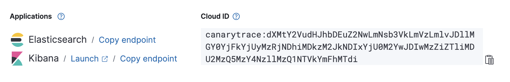
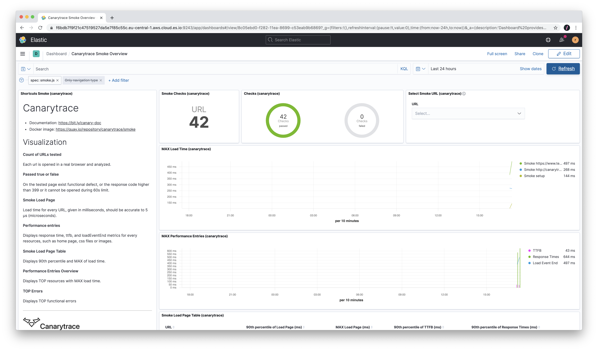

> ### What you’ll learn
- You will know how to run Canarytrace Smoke on cloud
- You will know how to setup [Elasticsearch cloud](https://www.elastic.co/)
- You will know how to start [Kubernetes](https://kubernetes.io/) on [DigitalOcean](https://www.digitalocean.com/)
- You will be know how to prepare the [cronjob](https://kubernetes.io/docs/concepts/workloads/controllers/cron-jobs/) for deploy and rotate Canarytrace Smoke 
- Basic of working with the [Lens](https://k8slens.dev/) application

## Canarytrace on cloud

This tutorial introduces you to the essentials of Canarytrace community edition by walking you through run first smoke in Kubernetes on cloud.


## Step-by-step
We will go step by step to build your Canarytrace infrastructure based on Kubernetes and Elasticsearch in cloud.

- Create deployment (Elasticsearch and Kibana) on [https://www.elastic.co/](https://www.elastic.co/)
- Create Kubernetes cluster on [https://www.digitalocean.com/](https://www.digitalocean.com/)
- Setup Elasticsearch and Kibana via [Canarytrace Installer](/docs/features/installer)
- Prepare and deploy Canarytace Smoke to Kubernetes

### Create deployment on Elastic cloud
---

- Create account on [https://cloud.elastic.co/registration](https://cloud.elastic.co/registration)
- Create Elasticsearch and Kibana deployment, see below on screencast

<video poster="https://canarytrace.com/src/screencast/kibana-smoke-pro.png" preload autoplay controls className="screencast">
  <source type="video/mp4" src="https://canarytrace.com/src/screencast/create-elastic-cloud.mp4"></source>
</video>

- save your Elasticsearch endpoint e.g. `https://9e0f4b1db5234c48b0933bd421b543f0.us-central1.gcp.cloud.es.io:9243`
- save your Kibana endpoint e.g. `https://2036be9b05634936879e34555dbaa17b.us-central1.gcp.cloud.es.io:9243`



- save your credentials e.g. username: `elastic` and password: `GnkOwVswOkGqHRKuXzCBbwUE` 


### Create Kubernetes cluster on DigitalOcean
---

- Create account on [https://cloud.digitalocean.com/registrations/new](https://cloud.digitalocean.com/registrations/new)
- Create Kubernetes cluster, see below on screencast

<video poster="https://canarytrace.com/src/screencast/kibana-smoke-pro.png" preload autoplay controls className="screencast">
  <source type="video/mp4" src="https://canarytrace.com/src/screencast/digitalocean-create-k8s.mp4"></source>
</video>

- Download config `Action > Download Config` into download directory `canarytrace-kubeconfig.yaml`

### Setup Elasticsearch and Kibana
---
- For setup use our [Canarytrace Installer in a docker compose](/docs/features/installer#example-with-docker-compose-and-elasticco)


```yaml
version: "3.8"
services:
  installer:
    image: quay.io/canarytrace/installer:7.10.0
    environment:
      ELASTIC_ENDPOINT: 'https://9e0f4b1db5234c48b0933bd421b543f0.us-central1.gcp.cloud.es.io'
      ELASTIC_PORT: 9243
      ELASTIC_INDEX_PREFIX: 'c.'
      ELASTIC_USER: 'elastic'
      ELASTIC_PASS: 'GnkOwVswOkGqHRKuXzCBbwUE'
      KIBANA_ENDPOINT: 'https://2036be9b05634936879e34555dbaa17b.us-central1.gcp.cloud.es.io'
      KIBANA_PORT: 9243
      KIBANA_USER: 'elastic'
      KIBANA_PASS: 'GnkOwVswOkGqHRKuXzCBbwUE'
```

- save the code to a file `docker-compose.yaml` and run `docker-compose up`

```bash title="Installer result"
installer_1  | ┌─────────────────────────┬────────────────────┬────────────────────┐
installer_1  | │                         │           executed │             failed │
installer_1  | ├─────────────────────────┼────────────────────┼────────────────────┤
installer_1  | │              iterations │                  1 │                  0 │
installer_1  | ├─────────────────────────┼────────────────────┼────────────────────┤
installer_1  | │                requests │                  9 │                  0 │
installer_1  | ├─────────────────────────┼────────────────────┼────────────────────┤
installer_1  | │            test-scripts │                 18 │                  0 │
installer_1  | ├─────────────────────────┼────────────────────┼────────────────────┤
installer_1  | │      prerequest-scripts │                  9 │                  0 │
installer_1  | ├─────────────────────────┼────────────────────┼────────────────────┤
installer_1  | │              assertions │                 18 │                  0 │
installer_1  | ├─────────────────────────┴────────────────────┴────────────────────┤
installer_1  | │ total run duration: 8.6s                                          │
installer_1  | ├───────────────────────────────────────────────────────────────────┤
installer_1  | │ total data received: 2.64KB (approx)                              │
installer_1  | ├───────────────────────────────────────────────────────────────────┤
installer_1  | │ average response time: 901ms [min: 154ms, max: 2.5s, s.d.: 794ms] │
installer_1  | └───────────────────────────────────────────────────────────────────┘
```


### Prepare deployment script / CronJob
---

Open Cronjob in your editor and edit labels in `env`:

- `BASE_URL` add your landing pages separated by semicolon
- `ELASTIC_CLUSTER` add your Elasticsearch endpoint
- `ELASTIC_HTTP_AUTH` add your Elasticsearch credentials in a format `username:password`

```yaml title="CronJob with Canarytrace smoke"
apiVersion: batch/v1beta1
kind: CronJob
metadata:
  name: smoke-mobile
  namespace: canarytrace
spec:
  concurrencyPolicy: Replace
  failedJobsHistoryLimit: 2
  schedule: "*/3 * * * *"
  jobTemplate:
    spec:
      template:
        spec:
          containers:
          - name: canarytrace
            image: quay.io/canarytrace/canarytrace-pub:4.2.16-pro-20210618063207-9
            env:
            - name: BASE_URL
              value: "https://the-internet.herokuapp.com/login"
            - name: PT_AUDIT
              value: "allow"
            - name: PT_AUDIT_THROTTLING
              value: "mobileRegular3G"
            - name: LABELS
              value: "mobile, smoke"
            - name: LICENSE
              value: "XXXXX-YYYYY-Z4WG5-5363C-CF0CB-A8647"
            - name: ELASTIC_CLUSTER
              value: "https://9e0f4b1db5234c48b0933bd421b543f0.us-central1.gcp.cloud.es.io:9243"
            - name: ELASTIC_HTTP_AUTH
              value: "elastic:GnkOwVswOkGqHRKuXzCBbwUE"
            resources:
              requests:
                memory: "300Mi"
                cpu: "200m"
              limits:
                memory: "400Mi"
                cpu: "300m"
            imagePullPolicy: "IfNotPresent"
          - name: selenium
            image: selenium/standalone-chrome:4.0.0-beta-4-prerelease-20210517
            ports:
              - containerPort: 4444
            resources:
              requests:
                memory: "2000Mi"
                cpu: "2000m"
              limits:
                memory: "4000Mi"
                cpu: "4000m"
            imagePullPolicy: "IfNotPresent"
            volumeMounts:
              - mountPath: "/dev/shm"
                name: "dshm"
            livenessProbe:
              httpGet:
                path: /status
                port: 4444
              initialDelaySeconds: 10
              timeoutSeconds: 5
            readinessProbe:
              httpGet:
                path: /status
                port: 4444
              initialDelaySeconds: 10
              timeoutSeconds: 5
          restartPolicy: "Never"
          terminationGracePeriodSeconds: 5
          volumes:
            - name: "dshm"
              emptyDir:
                medium: "Memory"
```

### Lens | The Kubernetes IDE
---

Lens is open-source and multi-platform IDE for controll Kubernetes cluster.

**Last steps for run Canarytrace Smoke in Kubernetes**

- [Download](https://github.com/lensapp/lens/releases/tag/v4.0.8) and install Lens. Please select correct platform (Linux, MacOS or Windows)
- Drag and drop your `canarytrace-kubeconfig.yaml` file to Lens and use it to add your Kubernetes cluster. See below on screencast.
- Copy your `CronJob` with Canarytrace for create resource and deploy to Kubernetes. See below on screencast.

<video poster="https://canarytrace.com/src/screencast/kibana-smoke-pro.png" preload autoplay controls className="screencast">
  <source type="video/mp4" src="https://canarytrace.com/src/screencast/lens-add-cluster-add-cronjob.mp4"></source>
</video>


### View the result in Kibana
---

That's all 🎉 Now wait a **few minutes** and you can explore dashboard and visualizations in Kibana. Open your Kibana endpoint `https://2036be9b05634936879e34555dbaa17b.us-central1.gcp.cloud.es.io:9243` in your browser and navigate to `Dashboard / Canarytrace Smoke Overview`



---

- Do you find mistake or have any questions? Please [create issue](https://github.com/canarytrace/documentation/issues/new/choose), thanks 👍
- Have more questions? [Contact us](/docs/support/contactus).