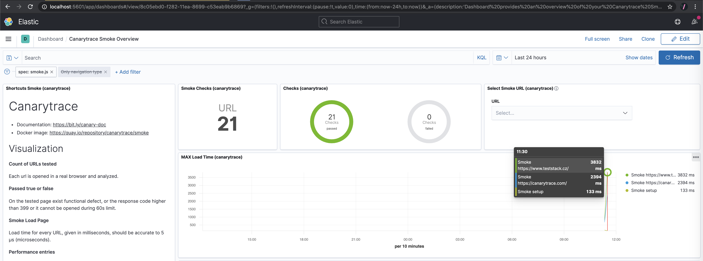

> ### What you’ll learn
- You will know how to run Canarytrace Smoke
- You will know what data it collects
- You will be know how to prepare the environment for data storage and visualization
- You get a dashboards with visualizations

## Welcome to Canarytrace

This tutorial introduces you to the essentials of Canarytrace community edition by walking you through run first smoke on your localhost.

Canarytrace is a Plug’n'Play stack for testing, monitoring availability  and measuring the loading speed your web application from user perspective. The canarytrace design is designed to be easy to run and maintenance-free. So you **only need 5 minutes** 👌

## Prerequisites

Only [Docker](https://www.docker.com/). If you don't know the docker, take a look at our examples.

- [How to run Canarytrace on Windows 10 Pro](/docs/guides/windows)
- [How to run Canarytrace on Linux](/docs/guides/linux)

## Step-by-step
We will go step by step to start testing successfully.

### Run Elasticsearch in a Docker
Data from Canarytrace are continuously stored to Elasticsearch.

**Create a user-defined bridges**
```bash
docker network create canary
```

- [Elasticsearch](/docs/guides/elasticsearch#what-is-elasticsearch) is the distributed search and analytics engine at the heart of the Elastic Stack.

```bash
docker run --name elasticsearch --net canary --rm -d -p 9200:9200 -e "discovery.type=single-node" docker.elastic.co/elasticsearch/elasticsearch:7.10.0 bin/elasticsearch -Enetwork.host=0.0.0.0
```

### Run Kibana in a Docker
[Kibana](/docs/guides/elasticsearch#what-is-kibana) is a web application with GUI for viewing data stored in Elasticsearch.

```bash
docker run --name kibana --net canary --rm -d -p 5601:5601 docker.elastic.co/kibana/kibana:7.10.0
```

### Setup Elasticsearch and Kibana

- [Canarytrace Installer](/docs/features/installer) prepare Elasticsearch and Kibana for Canarytrace use.

```bash
docker run --name installer --net canary --rm quay.io/canarytrace/installer:7.3
```

### Prepare script for run Canarytrace Smoke
For this demo we use [docker-compose](https://docs.docker.com/compose/). Create file with name `docker-compose.yaml` with code:

```bash
version: "3.8"
services:
  browser:
    image: selenium/standalone-chrome:3.141.59-20200730
    ports:
      - "4444:4444"
    network_mode: "host"
    volumes:
      - /dev/shm:/dev/shm
  canarytrace:
    image: quay.io/canarytrace/smoke:3.0.5
    depends_on:
      - browser
    network_mode: "host"
    environment:
      BASE_URL: 'https://canarytrace.com/;https://www.teststack.cz/'
      ELASTIC_CLUSTER: http://localhost:9200
```

### Run Canarytrace Smoke. Run our first smoke with two URLs.

In this same location where is your `docker-compose.yaml` run docker compose 

```bash
docker-compose up
```

### What data is stored into Elasticsearch

Canarytrace Smoke is community edition collect these data

- `c.report-*` index with test step name and function result `passed / false`
- `c.performance-entries-*` index with collected list of all [PerformanceEntry](https://developer.mozilla.org/en-US/docs/Web/API/PerformanceEntry) objects for the tested page.
- `c.smoke-title-*` index with `entryURL`, `responseUrl`, `title`, `responseStatus` and `responseStatusText`

### View the result in Kibana

That's all 🎉 Now you can explore dashboard and visualizations in Kibana. Open `http://localhost:5601/` in your browser and navigate to `Dashboard / Canarytrace Smoke Overview`



For real use or for production use start your Canarytrace Smoke on cloud in Kubernetes.

---

- Do you find mistake or have any questions? Please [create issue](https://github.com/canarytrace/documentation/issues/new/choose), thanks 👍
- Have more questions? [Contact us](/docs/support/contactus).