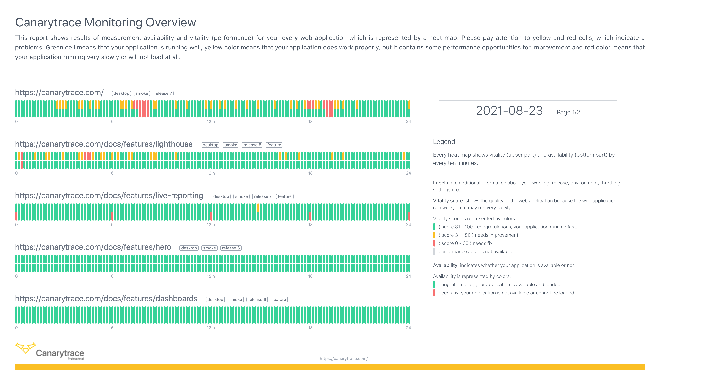

> ### What you’ll learn
- What is a Daily Report
- For whom is the report intended?

Daily Report is highlevel overview on availability and vitality of your a web pages. Are you a manager or administrator, you don't want to know the technical details, but do you need of see of a traffic light on the timeline to know the availability of a web application during whole a day?
Get into your email an automatic report for the previous day every morning.

---

- Do you find mistake or have any questions? Please [create issue](https://github.com/canarytrace/documentation/issues/new/choose), thanks 👍
- Have more questions? [Contact us](/docs/support/contactus).