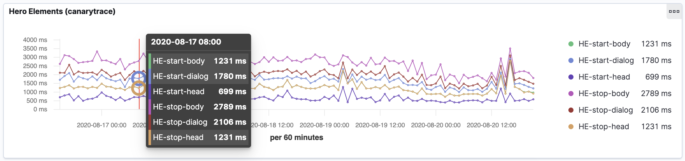

<a href="/docs/why/edition#canarytrace-pro"><span class="canaryBadge">Canarytrace Pro</span></a>

### Your business probably has these questions:
 
- When exactly does the user see the car?
- When exactly does the user see information about acceleration on earth?
- When exactly does the user see the button ORDER NOW?


### The only way to find out are Hero Elements.

Add measure marks into your code / HTML template. When measure mark passes through the parser, Canarytrace stores the exact render time. After that, you can see individual phases in the graph.

HTML snippets (texts, menu, images etc) are always parsed from top to bottom and because of that the render time is a very accurate metric.

Thanks to render time, you can then very accurately measure the time when certain parts of the web page were displayed. With this information can business team, frontend development team or product owner, make some important decisions backed up with hard data.

### User-centred non-functional requirements

Thanks to Hero Elements you can specify the exact requirements for the rendering time of the whole page as well as its part. For example:

- The main image with the car must be displayed within 1.000 ms on a desktop computer.
- After each release, the button ORDER NOW must be displayed within 1.300 ms.
- All scripts in the header must be evaluated and executed within 500 ms.

### How to use measure code

To measure Hero Elements, add javascript marks into your HTML template.

```html
<html>
  <script>performance.mark('HE-start-head')</script>
  <head>
  ...  
  </head>
  <script>performance.mark('HE-stop-head')</script>
  <script>performance.mark('HE-start-body')</script>
  <body>
    <div id="navigaiton">
      <script>performance.mark('HE-start-dialog')</script>
      <div id="dialog">
      ...
      </div>
      <script>performance.mark('HE-stop-dialog')</script>
    </div>
  </body>
  <script>performance.mark('HE-stop-body')</script>
</html>
```

### Instantly observe the impact of your changes in the template

After tweaking performance of your website, the change is visible in just three minutes. This is useful for all environments such as `production`, `pre-production`, `test` etc.



### Hero Elements are very strong and accurate method on measuring what and when was displayed to the user.

For accurate measurements we use [DOMHighResTimeStamp](https://developer.mozilla.org/en-US/docs/Web/API/DOMHighResTimeStamp) with precision from 5 µs (microseconds) to a millisecond. You can mark every part of your web site - there are no limitations!

**Elasticsearch index**

- Hero Elements are automatically stored into `c.performance-entries-*` index with [performance entries](/docs/features/live-reporting#cperformance-entries-).

### How to make it work

Your developers must add start mark `<script>performance.mark('HE-start-main-menu')</script>` before each element, that you want to be measured and add stop mark `<script>performance.mark('HE-stop-main-menu')</script>` after it. That’s all. Canarytrace will automatically collect all hero elements that start with prefix `HE-`

### Hero Elements injector
<a href="/docs/why/edition#canarytrace-professional"><span class="canaryBadge">Professional</span></a>

If all your developers are busy and you don’t know, how to add start mark in the code, you can use Hero Elements Injector. Inject this snippet before all `it` methods with open a new page or [navigate page](/docs/references/glosary#entrytype-navigation). Choose this approach only when you don't have the ability to change the HTML template.

> - It’s not recommended to use other measurement methods of Canarytrace with this method, because it could increase time of other metrics. E.g. `PERFORMANCE_ENTRIES_INTERCEPT` or `PT_AUDIT` etc.

```javascript title="Example, how to inject Hero Element marks"
it('inject hero element measurement', function () {

  // configuration
  const configuration = {
    patterns: [{
      urlPattern: 'https://gm.ifortuna.cz*',
      resourceType: 'Document',
      requestStage: 'Response'
    }]
  }

  // rules
  const rules = [
    ['<head>', '<script>performance.mark(\'HE-start-head\')</script>\n<head>'], // before <head>
    ['</head>', '<head>\n<script>performance.mark(\'HE-stop-head\')</script>'], // after </head>
    ['<body', '<script>performance.mark(\'HE-start-body\')</script><body'], // before <body>
    ['</body>', '</body>\n<script>performance.mark(\'HE-stop-body\')</script>'], // after </body>
  ]

  browser.InjectHeroElements(configuration, rules)

});
```

### Recommendation

- It’s always better to cooperate with your developers and avoid injecting Hero Elements mark
- If you have HTML template with Hero Elements mark from your developer, you can use combination `HERO_ELEMENTS`, `PERFORMANCE_ENTRIES_INTERCEPT` and `PT_AUDIT`
- If you combine `InjectHeroElements`, `PERFORMANCE_ENTRIES_INTERCEPT` and `PT_AUDIT` it's better to run two instance of your monitor script.
  - Firstly, run the script collecting only `PERFORMANCE_ENTRIES_INTERCEPT`, `PT_AUDIT` 
  - Secondly, run with injector method `InjectHeroElements` and `HERO_ELEMENTS` to collect Hero Elements 

---

- Do you find mistake or have any questions? Please [create issue](https://github.com/canarytrace/documentation/issues/new/choose), thanks 👍
- Have more questions? [Contact us](/docs/support/contactus).