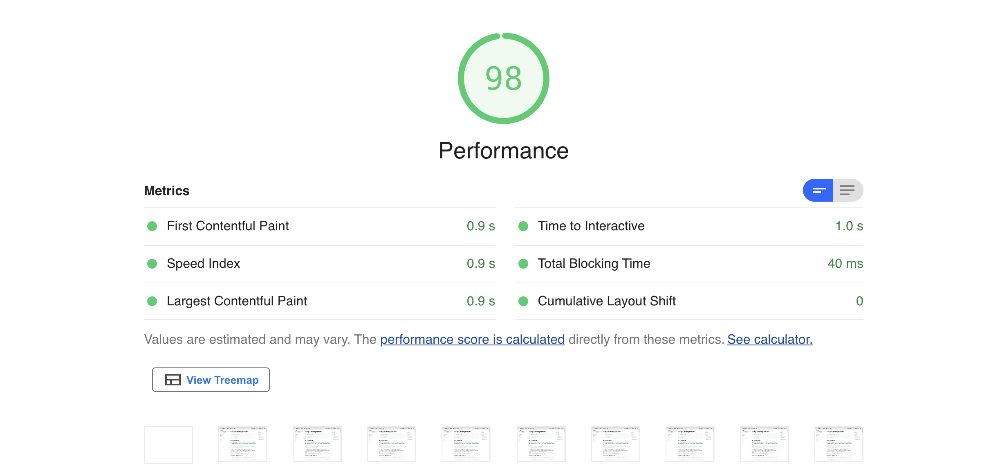
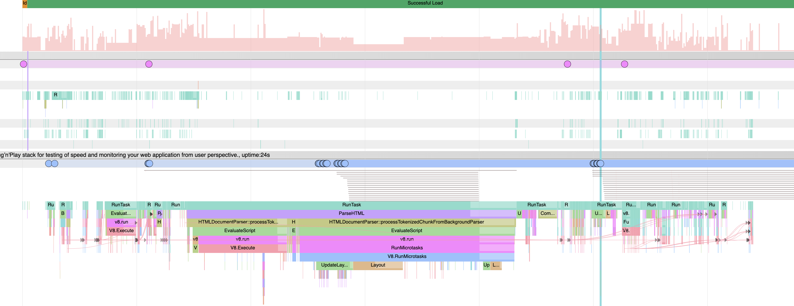

> ### What you’ll learn
- What is Performance Audit
- What metrics are stored in a Elasticsearch
- What is a form factor

<a href="/docs/why/edition#canarytrace-pro"><span class="canaryBadge">Canarytrace Pro</span></a>

[Canarytrace Pro](http://localhost:3000/docs/why/edition#canarytrace-pro) use [Lighthouse 8](https://developers.google.com/web/tools/lighthouse) for performance audit and for obtaining metrics such as [Web Vitals](https://web.dev/vitals/) and more.

## How to run performance audit

> Performance audit is available in [Canarytrace Pro](http://localhost:3000/docs/why/edition#canarytrace-pro) edition

### smoke

[Canarytrace Pro](http://localhost:3000/docs/why/edition#canarytrace-pro) in `smoke` mode automatically run performance audit on every URL and rusults ( [lhr](https://github.com/GoogleChrome/lighthouse/blob/4d3bda1f14540266eb37f7e2ba8cabbc668db11d/docs/understanding-results.md) object ) is stored to Elasticsearch. 

### user-journey

If you use [Canarytrace Pro](http://localhost:3000/docs/why/edition#canarytrace-pro) in `user-journey` mode, you can run performance audit on every page via `browser.performAudit()` function.

```javascript title="run performance audit in your test case"
// run performance audit
it('performance audit', async () => {
  await browser.performAudit(targetUrl, formFactor)
})
```

- `targetUrl` e.g. https://canarytrace.com/
- [`formFactor`](/docs/features/lighthouse#formfactor) is emulation performance profile ( e.g. [desktop](/docs/features/lighthouse#pt_audit_throttlingdesktopdense4g) or [mobile](/docs/features/lighthouse#pt_audit_throttlingmobileregular3g) )


## Reporting

**Live reporting**

Canarytrace send result of performance audit into [Elasticsearch](/docs/guides/elasticsearch) into `c.audit-*` index. Read below for more information and a description of metrics.

**Lighthouse HTML report**

Canarytraces save full [Lighthouse](https://developers.google.com/web/tools/lighthouse) HTML report.
  - open example HTML report: [03bbc6dac05072c42859-0f920da3db03fefb7cae-lighthouse-report.html](https://canarytrace.com/examples/03bbc6dac05072c42859-0f920da3db03fefb7cae-lighthouse-report.html)



**Trace**

Canarytrace records of activity in Chrome's processes for the [Trace Event Profiling Tool ](https://www.chromium.org/developers/how-tos/trace-event-profiling-tool)

- download JSON example: [03bbc6dac05072c42859-0f920da3db03fefb7cae-traces.json](https://canarytrace.com/examples/03bbc6dac05072c42859-0f920da3db03fefb7cae-traces.json)
- open `chrome://tracing` in your Google Chrome and click on Load button.



## Metrics, Opportunities and Audits

Result of performance audit is stored into `c.audit-*` index and contains many metrics, opportunities a diagnostics information.

### Performance score

```performance.score``` In general, only metrics contribute to your Lighthouse Performance score, not the results of Opportunities or Diagnostics. https://web.dev/performance-scoring/

  - [Why score fluctuates?](https://web.dev/performance-scoring/#fluctuations)
  - [How the Performance score is weighted](https://web.dev/performance-scoring/#weightings)
  - [Lighthouse Scoring Calculator](https://googlechrome.github.io/lighthouse/scorecalc/#FCP=3000&SI=5800&FMP=4000&TTI=7300&FCI=6500&LCP=4000&TBT=600&CLS=0.25&device=desktop&version=8)


### Metrics

- ```first-contentful-paint```
First Contentful Paint (FCP) is one of six metrics tracked in the Performance section of the Lighthouse report. Each metric captures some aspect of page load speed. https://web.dev/first-contentful-paint/ 

- ```speed-index``` Speed Index measures how quickly content is visually displayed during page load. Lighthouse first captures a video of the page loading in the browser and computes the visual progression between frames. Lighthouse then uses the Speedline Node.js module to generate the Speed Index score. https://web.dev/speed-index/

- ```interactive``` Measuring TTI is important because some sites optimize content visibility at the expense of interactivity. This can create a frustrating user experience: the site appears to be ready, but when the user tries to interact with it, nothing happens. https://web.dev/interactive/ 

- ```total-blocking-time``` The Total Blocking Time (TBT) metric measures the total amount of time between First Contentful Paint (FCP) and Time to Interactive (TTI) where the main thread was blocked for long enough to prevent input responsiveness. https://web.dev/tbt/ 

- ```largest-contentful-paint``` Largest Contentful Paint (LCP) is an important, user-centric metric for measuring perceived load speed because it marks the point in the page load timeline when the page's main content has likely loaded—a fast LCP helps reassure the user that the page is useful. https://web.dev/lcp/ 

- ```cumulative-layout-shift``` CLS measures the sum total of all individual layout shift scores for every unexpected layout shift that occurs during the entire lifespan of the page.
A layout shift occurs any time a visible element changes its position from one rendered frame to the next. https://web.dev/cls/ 

> ### Audits	and weight
- `Total Blocking Time`	30%
- `Largest Contentful Paint`	25%
- `Cumulative Layout Shift`	15%
- `First Contentful Paint`	10%
- `Speed Index`	10%
- `Time to Interactive`	10%

### Opportunities and audits

- ```max-potential-fid``` Max Potential FID measures the worst-case First Input Delay that your users might experience. First Input Delay measures the time from when a user first interacts with your site, such as clicking a button, to the time when the browser is actually able to respond to that interaction. https://web.dev/lighthouse-max-potential-fid/ 

- ```first-meaningful-paint``` 
FMP measures when the primary content of a page is visible to the user. The raw score for FMP is the time in seconds between the user initiating the page load and the page rendering the primary above-the-fold content. FMP essentially shows the timing of the paint after which the biggest above-the-fold layout change happens. Learn more about the technical details of FMP in Google's Time to First Meaningful Paint: a layout-based approach. https://web.dev/first-meaningful-paint/
  - This metric is [deprecated in Lighthouse 6.0](https://web.dev/first-meaningful-paint/)

- ```server-response-time``` This audit fails when the browser waits more than 600 ms for the server to respond to the main document request. Users dislike when pages take a long time to load. Slow server response times are one possible cause for long page loads.
When users navigate to a URL in their web browser, the browser makes a network request to fetch that content. Your server receives the request and returns the page content. https://web.dev/time-to-first-byte/ 


- ```critical-request-chains``` Critical request chains are series of dependent network requests important for page rendering. The greater the length of the chains and the larger the download sizes, the more significant the impact on page load performance. https://web.dev/critical-request-chains/ 

- ```redirects``` Redirects slow down your page load speed. https://web.dev/redirects/ 

- ```mainthread-work-breakdown``` The browser's renderer process is what turns your code into a web page that your users can interact with. By default, the main thread of the renderer process typically handles most code: it parses the HTML and builds the DOM, parses the CSS and applies the specified styles, and parses, evaluates, and executes the JavaScript. https://web.dev/mainthread-work-breakdown/ 

- ```bootup-time``` When your JavaScript takes a long time to execute, it slows down your page performance. https://web.dev/bootup-time/ 

- ```uses-rel-preload``` Potential savings ms. Prioritize fetching resources that are currently requested later in page load. https://web.dev/uses-rel-preload/ 

- ```uses-rel-preconnect``` Potential savings ms. Prioritize fetching resources that are currently requested later in page load. https://web.dev/uses-rel-preconnect/ 

- ```network-rtt```
Round-trip time (RTT) is the duration in milliseconds (ms) it takes for a network request to go from a starting point to a destination and back again to the starting point. RTT is an important metric in determining the health of a connection on a local network or the larger Internet, and is commonly utilized by network administrators to diagnose the speed and reliability of network connections.

- ```third-party-summary``` A third-party script is any script hosted on a domain that's different than the domain of the URL that you audited with Lighthouse. As the page loads, Lighthouse calculates how long each of the third-party scripts blocks the main thread. If the total blocking time is greater than 250 ms the audit fails. https://web.dev/third-party-summary/ 

- ```long-tasks``` A Long Task is JavaScript code that monopolizes the main thread for extended periods of time, causing the UI to "freeze". https://web.dev/long-tasks-devtools/ 

- ```non-composited-animations``` Non-composited animations can appear janky (i.e. not smooth) on low-end phones or when performance-heavy tasks are running on the main thread. Janky animations can increase the Cumulative Layout Shift (CLS) of your page. Reducing CLS will improve your Lighthouse Performance score. https://web.dev/non-composited-animations/ 

- ```unsized-images``` Image elements do not have explicit width and height. Set an explicit width and height on image elements to reduce layout shifts and improve CLS. https://web.dev/optimize-cls/?utm_source=lighthouse&utm_medium=node#images-without-dimensions 

- ```uses-long-cache-ttl``` When a browser requests a resource, the server providing the resource can tell the browser how long it should temporarily store or cache the resource. For any subsequent request for that resource, the browser uses its local copy rather than getting it from the network. https://web.dev/uses-long-cache-ttl/ 

- ```offscreen-image``` Consider lazy-loading offscreen and hidden images after all critical resources have finished loading to lower time to interactive. https://web.dev/offscreen-images/ 

- ```render-blocking-resources``` The Opportunities section of your Lighthouse report lists all URLs blocking the first paint of your page. The goal is to reduce the impact of these render-blocking URLs by inlining critical resources, deferring non-critical resources, and removing anything unused. https://web.dev/render-blocking-resources/ 

- ```unminified-css``` Minifying CSS files can improve your page load performance. CSS files are often larger than they need to be. https://web.dev/unminified-css/ 

- ```unminified-javascript``` Minifying JavaScript files can reduce payload sizes and script parse time. Minification is the process of removing whitespace and any code that is not necessary to create a smaller but perfectly valid code file. https://web.dev/unminified-javascript/ 

- ```unused-css-rules``` Remove unused CSS. https://web.dev/unused-css-rules

- ```unused-javascript``` Unused JavaScript can slow down your page load speed. https://web.dev/unused-javascript/ 

- ```uses-optimized-images``` Lists all unoptimized images, with potential savings in kibibytes (KiB). https://web.dev/uses-optimized-images/#optimize-images-using-gui-tools 

- ```uses-text-compression``` Text-based resources should be served with compression to minimize total network bytes. https://web.dev/uses-text-compression/ 

- ```uses-responsive-images``` Lists all images in your page that aren't appropriately sized, along with the potential savings in kibibytes (KiB). https://web.dev/uses-responsive-images/

- ```efficient-animated-content``` Lists all animated GIFs, along with estimated savings in seconds achieved by converting GIFs to video format. Large GIFs are inefficient for delivering animated content. https://web.dev/efficient-animated-content/ 

- ```duplicated-javascript``` Remove large, duplicate JavaScript modules from bundles to reduce unnecessary bytes consumed by network activity.

- ```legacy-javascript``` Legacy JavaScript is typically around 20% larger and slower than equivalent modern code. https://web.dev/publish-modern-javascript/#legacy-javascript 

- ```dom-size``` A large DOM tree can slow down your page performance. https://web.dev/dom-size/ 

- ```no-document-write``` For users on slow connections, external scripts dynamically injected via `document.write()` can delay page load by tens of seconds. https://web.dev/no-document-write/ 

- ```uses-http2``` HTTP/2 offers many benefits over HTTP/1.1, including binary headers, multiplexing, and server push. https://web.dev/uses-http2/ 

- ```uses-passive-event-listeners``` Consider marking your touch and wheel event listeners as `passive` to improve your page's scroll performance. https://web.dev/uses-passive-event-listeners/ 

- `diagnostics` 

```json

{
  "numRequests": 29,
  "numScripts": 13,
  "numStylesheets": 3,
  "numFonts": 2,
  "numTasks": 533,
  "numTasksOver10ms": 9,
  "numTasksOver25ms": 6,
  "numTasksOver50ms": 6,
  "numTasksOver100ms": 0,
  "numTasksOver500ms": 0,
  "rtt": 0.08685,
  "throughput": 19116436.34372206,
  "maxRtt": 0.8162,
  "maxServerLatency": 66.7778,
  "totalByteWeight": 1118431,
  "totalTaskTime": 669.4620000000001,
  "mainDocumentTransferSize": 3514
}
```

- `resource-summary` Keep request counts low and transfer sizes small

```json
{
  "Total": {
    "resourceType": "total",
    "requestCount": 27,
    "transferSize": 1118431
  },
  "Image": {
    "resourceType": "image",
    "requestCount": 3,
    "transferSize": 902953
  },
  "Script": {
    "resourceType": "script",
    "requestCount": 13,
    "transferSize": 117368
  },
  "Other": {
    "resourceType": "other",
    "requestCount": 5,
    "transferSize": 70552
  },
  "Font": {
    "resourceType": "font",
    "requestCount": 2,
    "transferSize": 22170
  },
  "Document": {
    "resourceType": "document",
    "requestCount": 1,
    "transferSize": 3514
  },
  "Stylesheet": {
    "resourceType": "stylesheet",
    "requestCount": 3,
    "transferSize": 1874
  },
  "Media": {
    "resourceType": "media",
    "requestCount": 0,
    "transferSize": 0
  },
  "Third-party": {
    "resourceType": "third-party",
    "requestCount": 3,
    "transferSize": 23008
  }
}
```

- `metrics`
```json
{
  "firstContentfulPaint": 775,
  "firstMeaningfulPaint": 775,
  "largestContentfulPaint": 905,
  "interactive": 808,
  "speedIndex": 843,
  "totalBlockingTime": 65,
  "maxPotentialFID": 57,
  "cumulativeLayoutShift": 0.33013888888888887,
  "cumulativeLayoutShiftMainFrame": 0.33013888888888887,
  "totalCumulativeLayoutShift": 0.33013888888888887,
  "observedTimeOrigin": 0,
  "observedTimeOriginTs": 7410953153958,
  "observedNavigationStart": 0,
  "observedNavigationStartTs": 7410953153958,
  "observedFirstPaint": 362,
  "observedFirstPaintTs": 7410953516422,
  "observedFirstContentfulPaint": 362,
  "observedFirstContentfulPaintTs": 7410953516422,
  "observedFirstContentfulPaintAllFrames": 362,
  "observedFirstContentfulPaintAllFramesTs": 7410953516422,
  "observedFirstMeaningfulPaint": 362,
  "observedFirstMeaningfulPaintTs": 7410953516422,
  "observedLargestContentfulPaint": 362,
  "observedLargestContentfulPaintTs": 7410953516422,
  "observedLargestContentfulPaintAllFrames": 362,
  "observedLargestContentfulPaintAllFramesTs": 7410953516422,
  "observedTraceEnd": 3060,
  "observedTraceEndTs": 7410956214107,
  "observedLoad": 650,
  "observedLoadTs": 7410953803763,
  "observedDomContentLoaded": 89,
  "observedDomContentLoadedTs": 7410953242631,
  "observedCumulativeLayoutShift": 0.33013888888888887,
  "observedCumulativeLayoutShiftMainFrame": 0.33013888888888887,
  "observedTotalCumulativeLayoutShift": 0.33013888888888887,
  "observedFirstVisualChange": 279,
  "observedFirstVisualChangeTs": 7410953432958,
  "observedLastVisualChange": 879,
  "observedLastVisualChangeTs": 7410954032958,
  "observedSpeedIndex": 710,
  "observedSpeedIndexTs": 7410953863987
}
```

- `user-timings` User Timing marks and measures [Hero Elements](/docs/features/hero) / https://web.dev/user-timings/

- `font-display` All text remains visible during webfont loads. https://web.dev/font-display/

- `total-byte-weight` Avoids enormous network payloads. https://web.dev/total-byte-weight/

- `modern-image-formats` Serve images in next-gen formats. https://web.dev/uses-webp-images/

- `network-server-latency` Server Backend Latencies. https://web.dev/time-to-first-byte/

- `third-party-facades` Lazy load third-party resources with facades. https://web.dev/third-party-facades/

### Configuration

- `maxWaitForFcp` Wait on render the first piece of DOM content.

- `maxWaitForLoad` Wait on full load page.

- `formFactor` Determines how performance metrics are scored. [You can set performance profile](/docs/features/lighthouse#formfactor) for desktop or mobile.

- `throttling.rttMs` Controls simulated network RTT (TCP layer).

- `throttling.throughputKbps` Controls simulated network download throughput.

- `throttling.requestLatencyMs` Controls emulated network RTT (HTTP layer).

- `throttling.downloadThroughputKbps` Controls emulated network download throughput.

- `throttling.uploadThroughputKbps` Controls emulated network upload throughput.

- `throttling.cpuSlowdownMultiplier` Controls simulated + emulated CPU throttling.

- `emulatedUserAgent` - e.g.`Mozilla/5.0 (Macintosh; Intel Mac OS X 10_14_6) AppleWebKit/537.36 (KHTML, like Gecko) Chrome/90.0.4420.0 Safari/537.36 Chrome-Lighthouse`

- `lighthouseReport` - name of HTML Lighthouse report, e.g. `03bbc6dac05072c42859-0f920da3db03fefb7cae-lighthouse-report.html`

- `traceReport` - records of activity in Chrome's processes for the [Trace Event Profiling Tool ](https://www.chromium.org/developers/how-tos/trace-event-profiling-tool) e.g. `03bbc6dac05072c42859-0f920da3db03fefb7cae-traces.json`

Trace Event Profiling Tool
But there’s a lot that DevTools can’t tell you.

### Other

- `benchmarkIndex` (CPU/Memory Power) e.g. `1,720`, `1,590.5`, `1,717.5` etc. depends on your hardware and available [resources for browser](/docs/guides/kubernetes#required-resources-for-one-instance). Read more below in [Benchmarking CPU](/docs/features/lighthouse#benchmarking-cpu).

- `requestedUrl` is entered url and `finalUrl` is url after last  redirect. They usually are the same.

- `labels` Canarytrace metainformation 
```
"edition=canarytrace-smoke-pro-4.2.16-alpha",
"engine=wdio",
"smoke-desktop, fra1, spot",
"pt.audit=desktopDense4G",
```

- `uuidAction` is unique id for test step / for `it` method. This is useful for searching in Kibana. The same uuidAction is stored in other Elasticsearch indices, so by this uuidAction is possible pairing data from `c.report` index.

- `uuid` is unique id of one running instance of Canarytrace runner. This same uuid is stored in other Elasticsearch indices, so by this uuid is possible pairing data from c.report index and from c.audit index.

- `timestamp` Time stamp when the audit was performed.

- `preload-lcp-image` Preloading the Largest Contentful Paint (LCP) image can display your hero image or website banner much earlier in the page load. https://gtmetrix.com/preload-largest-contentful-paint-image.html

- `performance-budget` https://web.dev/use-lighthouse-for-performance-budgets/

## Configuration

Canarytrace has build-in latest version of Lighthouse and you can set behavior of Lighthouse via environment variables. If you use [smoke](/docs/why/edition) mode, the Lighthouse will be launched automatically for each landing page.

- `PT_AUDIT` use `allow` for run performance audit / Lighthouse
- `PT_AUDIT_LOG_LEVEL` available options are `info`, `silent`, `error` and `verbose`. Default is `error`.
- `PT_AUDIT_MAX_WAIT_FCP` e.g. `90000` in ms and default value is `30000` ms
- `PT_AUDIT_MAX_WAIT_LOAD` e.g. `90000` in ms and default value is `45000` ms
- `PT_AUDIT_THROTTLING` is formFactor and has available options `mobileSlow4G`, `mobileRegular3G` and `desktopDense4G`. Default is `desktopDense4G`.
- `PT_AUDIT_REPORT` use `always` for generate Lighthouse HTML report. Report will be save into `/assets` directory. You can download [Lighthouse HTML report](/docs/guides/cli#volumes) or use [Canarytrace Shipper](/docs/features/shipper).
  - e.g. `03bbc6dac05072c42859-0f920da3db03fefb7cae-lighthouse-report.html`
  - format: `uuid-uuidAction-lighthouse-report.html`

- `PT_AUDIT_TRACE` use `always` for generate json with records of activity in Chrome's processes. Report will be save into `/assets` directory. You can download [records in a JSON](/docs/guides/cli#volumes) or use [Canarytrace Shipper](/docs/features/shipper).
  - e.g. `03bbc6dac05072c42859-0f920da3db03fefb7cae-traces.json`
  - format: `uuid-uuidAction-traces.json`

**Conditions for generate report**

You can generate reports (Lighthouse HTML report and Trace records) only if any of the metrics has a low score. E.g. generate report if metric `total-blocking-time` has score lower than 50%. Available metrics:
 - `total-blocking-time` for Total Blocking Time (TBT) 
 - `first-contentful-paint` for First Contentful Paint (FCP)
 - `largest-contentful-paint` for Largest Contentful Paint (LCP)
 - `cumulative-layout-shift` for Cumulative Layout Shift (CLS)
 - `speed-index` for Speed Index (SI)
 - `interactive` for Time to Interactive (TTI)

And how to use: `PT_AUDIT_REPORT=total-blocking-time<50` or `PT_AUDIT_TRACE=interactive<70`


If you use option `PT_AUDIT_REPORT` or `PT_AUDIT_TRACE` or both, generated reports will be printed to logs after end of the run.
```bash
...
Saved assets
total 3.4M
drwxrwxrwx 2 root root 4.0K Jun 27 18:58 .
drwxr-xr-x 1 node node 4.0K Jun 26 15:12 ..
-rw-r--r-- 1 node node 977K Jun 27 18:58 f215600090abf0e2be01-07ae6e9629983f323a44-lighthouse-report.html
-rw-r--r-- 1 node node 1.1M Jun 27 18:58 f215600090abf0e2be01-18321a953f6d44dc6823-lighthouse-report.html
-rw-r--r-- 1 node node 744K Jun 27 18:57 f215600090abf0e2be01-60cfcdd9709f1343e335-lighthouse-report.html
-rw-r--r-- 1 node node 563K Jun 27 18:58 f215600090abf0e2be01-c29ed4c40e384bcc42cd-lighthouse-report.html
```


### Network throttling preset

You can run multiple instances of Canarytrace and via option `PT_AUDIT_THROTTLING` set different formFactor for each of them. This is useful for create work load model by your production profile and by devices used your clients.

Simulated throttling, which Lighthouse uses by default, uses a simulation of a page load, based on the data observed in the initial unthrottled load. This approach makes it both very fast and deterministic.

#### `PT_AUDIT_THROTTLING="desktopDense4G"`
Lighthouse will be run with this configuration

```json
"formFactor": "desktop",
"throttling": {
  "rttMs": 40,
  "throughputKbps": 10240,
  "requestLatencyMs": 0,
  "downloadThroughputKbps": 0,
  "uploadThroughputKbps": 0,
  "cpuSlowdownMultiplier": 1
},
"throttlingMethod": "simulate",
"screenEmulation": {
  "mobile": false,
  "width": 1350,
  "height": 940,
  "deviceScaleFactor": 1,
  "disabled": false
},
```

#### `PT_AUDIT_THROTTLING="mobileRegular3G"`
Lighthouse will be run with this configuration

```json
"formFactor": "mobile",
"throttling": {
  "rttMs": 300,
  "throughputKbps": 700,
  "requestLatencyMs": 1125,
  "downloadThroughputKbps": 630,
  "uploadThroughputKbps": 630,
  "cpuSlowdownMultiplier": 4
},
"throttlingMethod": "simulate",
"screenEmulation": {
  "mobile": true,
  "width": 360,
  "height": 640,
  "deviceScaleFactor": 2.625,
  "disabled": false
},
```

#### `PT_AUDIT_THROTTLING="mobileSlow4G"`
Lighthouse will be run with this configuration

```json
"formFactor": "mobile",
"throttling": {
  "rttMs": 150,
  "throughputKbps": 1638.4,
  "requestLatencyMs": 562.5,
  "downloadThroughputKbps": 1474.5600000000002,
  "uploadThroughputKbps": 675,
  "cpuSlowdownMultiplier": 4
},
"throttlingMethod": "simulate",
"screenEmulation": {
  "mobile": true,
  "width": 360,
  "height": 640,
  "deviceScaleFactor": 2.625,
  "disabled": false
}
```

### Benchmarking CPU

Unlike network throttling where objective criteria like RTT and throughput allow targeting of a specific environment, CPU throttling is expressed relative to the performance of the host device. This poses challenges to [variability in results](https://github.com/GoogleChrome/lighthouse/blob/master/docs/variability.md) across devices and this is reason, why Canarytrace [measures in a closed environment](/docs/guides/kubernetes) with fixed resources for each run.

Canarytrace set resource for `benchmarkIndex` around 1.600

| - | High-End Desktop | Low-End Desktop | High-End Mobile | Mid-Tier Mobile | Low-End Mobile |
|-|-|-|-|-|-|
| Example Device | 16" Macbook Pro | Intel NUC i3 | Samsung S10 | Moto G4 | Samsung Galaxy J2 |
| **Lighthouse BenchmarkIndex** | 1500-2000 | 1000-1500 | 800-1200 | 125-800 | <125 |

### Visualizations of performance audit results


> **Dashboard documentation** <br/><br/>
> You can visit our [visual documentation](/docs/features/dashboards) with all dashboards. 


### Sources

- Architecture https://github.com/GoogleChrome/lighthouse/blob/4d3bda1f14540266eb37f7e2ba8cabbc668db11d/docs/architecture.md
- Metrics https://web.dev/lighthouse-performance/#metrics
- Lighthouse Scoring Calculator https://googlechrome.github.io/lighthouse/scorecalc/

---

- Do you find mistake or have any questions? Please [create issue](https://github.com/canarytrace/documentation/issues/new/choose), thanks 👍
- Have more questions? [Contact us](/docs/support/contactus).