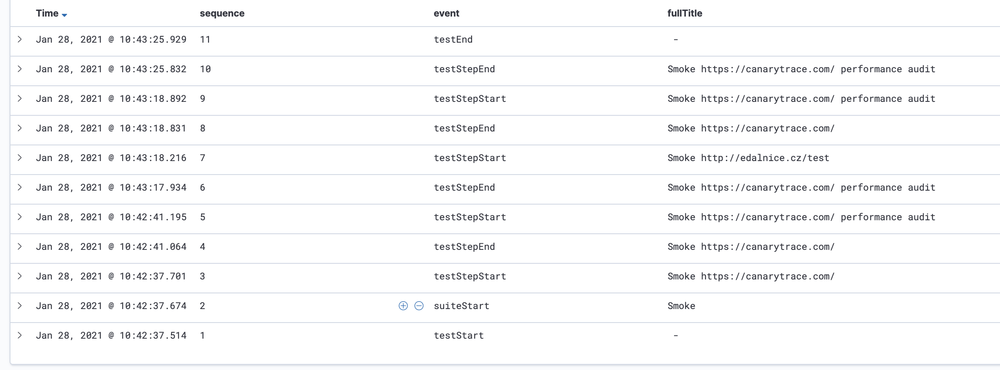
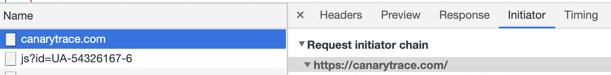
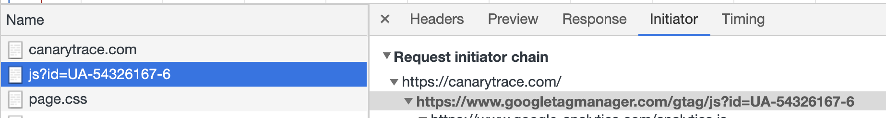
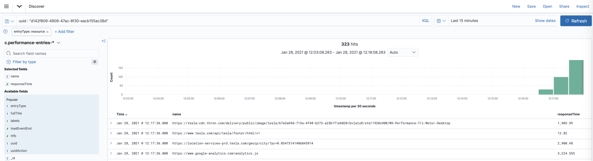

> ### What you’ll learn
- What data are stored in which index


Canarytrace stores a lof of data to Elasticsearch indices. Elasticsearch index is in a simple analogous form something like a table in a SQL databases. For better work with data stores by Canarytrace runner it's necessary to [setup Elasticsearch](/docs/features/installer). 

## Indices

Canarytrace save continuously  data to indices by type of data. Performance Audit, JS Heap, function test step report, all responses, performance entries etc. 

- `c.report-*` contains test report data.

- `c.performance-entries-*` contains data from performance entries API.

- `c.request-log-*` contains all requests and responses called between browser and server.

- `c.memory-*` contains continuously stores data about total and usage JS Heap.

- `c.console-*` contains all messages from browser console.

- `c.audit-*` contains data from [Performance Audit](/docs/features/lighthouse) (ligthhouse).

- `c.coverage-audit-*` contains data from usage and unused resources loaded during parsing a web application.

- `c.env-*` contains environment variables.

- `c.smoke-title-*` contains URI with title content


### `c.report-*`
---
Every action of Canarytrace runner fired event, which stored data about Canarytrace runner, tested app, and data from browser to Elasticsearch.


1. Search input with syntax for searching data in c.report-* index by uuid label

2. Time-range controll. Always use smaller range e.g. last 15min, or last 12 hour. The biggest range may affect the performance of the elasticsearch.

3. Selected index c.report-* and list of available labels in this index.

4. The bar graph with the occurence and amount of data received over time. If this graph is empty in your selected time range, probably Canarytrace runner is not running or your search input contains some search data, which aren't contains in this index. Next interesing information is count of records.

5. Table with received data from Canarytrace runner.

#### Events
---



> formated `c-report-*` index in Kibana, where's events name in event column

- `testStart` - Start Canarytrace runner, test case was successfully loaded, elasticsearch cluster is available, Canarytrace has enough resources to run.

- `suiteStart` - This event corresponds with describe with name HomePage method and contains data available in this time. This event can be fired more times.

- `testStepStart` - This event corresponds with it with name open method and contains data available in this time. This event can be fired more times.

- `testStepEnd` - This event is fired when it is end and contains data with result of this test step. This event can be fired more times.

- `testEnd` - This event is fired when is test case done.

**event: testStart**

```json
{
	"uuid": "f256d6f6-d290-4da2-b224-220cd374c772",
	"seleniumCluster": "127.0.0.1",
	"baseUrl": "http://edalnice.cz;http://edalnice.cz/test",
	"capabilities": {
		"maxInstances": 1,
		"browserName": "chrome",
		"goog:chromeOptions": {
			"args": [
				"--remote-debugging-port=9222",
				"--remote-debugging-host=0.0.0.0",
				"--start-fullscreen",
				"--disable-notifications",
				"--window-size=1920,1080"
			]
		}
	},
	"event": "testStart",
	"sessionId": "52811f1333175d2a484a61a5d2bb5e86",
	"sequence": 1,
	"labels": [
		"canary=smoke-pro",
		"canary-labs"
	],
	"spec": "smoke.js",
	"timestamp": "2021-01-28T09:42:37.514Z"
}
```

- `uuid` is unique id of one running instance of Canarytrace runner. This id is the same for all events e.g. suiteStart, testStepStart etc. By uuid is possible search all events from one running test. The same uuid is stored in other Elasticsearch indices, so by this uuid is possible pairing data from c.report index and from c.performance-audit index.

- `event` name of event which was fired.

- `sequence` for every events, that is fired is assigned sequence, that is always incremented. It's useful for ordering stored events. E.g.

- `testStart` has sequence 1

- `suiteStart` has sequence 2

- `testStepStart` has sequence 3

- `labels` your optional labels, e.g. `canary=smoke-pro`, `pt.audit=desktopDense4G` etc.

- `spec` path and name file with your test case, for Canarytrace Smoke Pro is spec always smoke.js

- `timestamp` is created in time, when Canarytrace fired event.

Labels `seleniumCluster`, `maxInstances` and `goog:chromeOptions` are variables events and depends on your setup.


**event: suiteStart**

```json
{
	"uuid": "f256d6f6-d290-4da2-b224-220cd374c772",
	"event": "suiteStart",
	"title": "Smoke",
	"fullTitle": "Smoke",
	"sequence": 2,
	"labels": [
		"canary=smoke-pro",
		"canary-labs"
	],
	"spec": "smoke.js",
	"timestamp": "2021-01-28T09:42:37.674Z"
}
```

- `title` and `fullTitle` are value from describe methods e.g.

```javascript
describe('First level', () => {
  describe('Second level', () => {
    it('test step', () => {
      
    });
  });
});
```
`Describe` and `it` methods can tester change only for [Canarytrace Professional](/docs/why/edition#canarytrace-smoke-pro#canarytrace-professional), not in [Canarytrace Smoke Pro](/docs/why/edition#canarytrace-smoke-pro)


**event: testStepStart**

```json
{
	"uuid": "f256d6f6-d290-4da2-b224-220cd374c772",
	"event": "testStepStart",
	"title": "https://canarytrace.com/",
	"fullTitle": "Smoke https://canarytrace.com/",
	"parent": "Smoke",
	"uuidAction": "223effd6-5e0f-496a-b800-f22ddf851c8b",
	"sequence": 3,
	"labels": [
		"canary=smoke-pro",
		"canary-labs"
	],
	"spec": "smoke.js",
	"timestamp": "2021-01-28T09:42:37.701Z"
}
```

- `uuidAction` is unique id for test step / for `it` method. Again, this is useful for searching in Kibana. The same uuidAction is stored in other Elasticsearch indices, so by this uuidAction is possible pairing data from `c.report` index and test step with name open and with e.g. `c.performance-entries` index with record with the same uuidAction.

- It's useful for answer the question: Which performance.entries was loaded during open page?

- `title` is name of the `it` method

- `fullTitle` is name of the parent `describe` method 

**event: testStepEnd**

```json
{
	"uuid": "f256d6f6-d290-4da2-b224-220cd374c772",
	"timestamp": "2021-01-28T09:43:25.832Z",
	"event": "testStepEnd",
	"testStepDuration": 6940,
	"title": "https://canarytrace.com/ performance audit",
	"fullTitle": "Smoke https://canarytrace.com/ performance audit",
	"parent": "Smoke",
	"uuidAction": "387503cc-e110-4bb4-b8ff-7962418fe0ff",
	"passed": true,
	"sequence": 10,
	"labels": [
		"canary=smoke-pro",
		"canary-labs",
		"pt.audit=desktopDense4G"
	],
	"spec": "smoke.js",
	"attachments": "no"
}
```

- `testStepDuration` is time from fired `testStepStart` to fired `testStepend` in ms.

- `errMessage` is description of error in case error or bug in test step. It can contains some critical error or value of assertation method e.g. `expect(titleElm.waitForExist({timeoutMsg: "Element title not found. The page couldn't be loaded in time."})).to.be.true`

- `errType` is type of error.

- `passed` can contains value passed or false

- `attachments` in case error and if is option `ATTACHMENTS=allow` is screenshot of web site stored on local storage and on AWS S3 storage. In this case this label contains path to screenshot.


**event: testEnd**

```json
{
	"uuid": "f256d6f6-d290-4da2-b224-220cd374c772",
	"timestamp": "2021-01-28T09:43:25.929Z",
	"event": "testEnd",
	"totalRunnerDuration": 56514,
	"totalTestStepsDuration": 47661,
	"sequence": 11,
	"labels": [
		"canary=smoke-pro",
		"canary-labs",
		"pt.audit=desktopDense4G",
		"pt.audit=desktopDense4G"
	],
	"spec": "smoke.js"
}
```

- `totalTestStepsDuration` is sum all `testStepDuration` in ms

- `totalRunnerDuration` is total duration from Canarytrace runner inicializing to fired event `testEnd`

> - `totalTestStepsDuration` and `totalRunnerDuration` can contains time with performance audit if you use this option.

### `c.performance-entries-*`
---

[Performance Entry](https://developer.mozilla.org/en-US/docs/Web/API/PerformanceEntry) is interface of Web APIs and provides access to performance-related information for the loaded/tested page. You can check how long does a file load e.g. your css, javascript, image, font or resources third-party e.g. Google Ads, Facebook pixel etc. 

**Canarytrace uses these API**

- Performance Time API
- Navigation Timing API
- User Timing API
- Resource Timing API

and downloads performance [entry type](https://developer.mozilla.org/en-US/docs/Web/API/PerformanceEntry/entryType) `navigation` and `resources`

- `navigation` is always first init call from browser to infrastructure. For example, this method return how much time it takes to load or unload a document.
  - [Performance Navigation Timing](https://developer.mozilla.org/en-US/docs/Web/API/PerformanceNavigationTiming)

- `resource` are further requests and their initiator is a parser. Is useful for analysis of detailed network timing data regarding the loading of an application's resources. An application can use the timing metrics to determine, for example, the length of time it takes to fetch a specific resource, such as an `XMLHttpRequest`, `<SVG>`, image, or script. 
  - [Performance Resource Timing](https://developer.mozilla.org/en-US/docs/Web/API/PerformanceResourceTiming)


For example, open web site https://canarytrace.com/ and when is page loaded you can open DevTools > Network. You can se that navigation is `canarytrace.com` and resource is some `js` file.

**First request is navigate type**



**Second request is resource type**


Canarytrace downloads these collection after action open page, click or reload page in the monitor script. For one page can exists a lot of more performance entries in one collection. E.g. for home page of web site https://canarytrace.com/ contains performance entries collection 27 objects.

> - Performance entries is automatically stores when is used PERFORMANCE_ENTRIES_INTERCEPT option and when is your Elasticsearch available. For more information go to [CLI Options](/docs/guides/cli)

Performance entries are intercepted by browser and Canarytrace downloads collection with performance entries when is fired event `testStepEnd`. All performance entries intercepted between `testStepStart` and `testStepEnd` have the same `uuidAction` such as `testStepStart` and `testStepEnd`. This is useful for searching what and how long it took during testStep open home page. E.g. what was downloaded to the browser and how long it took during opening home page tesla.com.

```javascript title="one test step"
it('open home page', () => { # Canarytrace create unique uuidAction
...
});
```

**How to filter by entry type in Kibana**

- `uuid : "d142f809-4909-47ac-8f30-eacb155ac38d"` is unique identificator for downloaded performance entries during test step.
- `entryType: resource` is type of performance entry 



**entryType: navigation**

```json
{
	"connectEnd": 0.705000000380096,
	"connectStart": 0.705000000380096,
	"decodedBodySize": 47630,
	"domComplete": 3257.92999999976,
	"domContentLoadedEventEnd": 1943.2600000000093,
	"domContentLoadedEventStart": 1177.2750000000087,
	"domInteractive": 1177.240000000893,
	"domainLookupEnd": 0.705000000380096,
	"domainLookupStart": 0.705000000380096,
	"duration": 3259.425000000192,
	"encodedBodySize": 47630,
	"entryType": "navigation",
	"fetchStart": 0.705000000380096,
	"initiatorType": "navigation",
	"loadEventEnd": 3259.425000000192,
	"loadEventStart": 3257.9750000004424,
	"name": "https://canarytrace.com/",
	"nextHopProtocol": "",
	"redirectCount": 0,
	"redirectEnd": 0,
	"redirectStart": 0,
	"requestStart": 0,
	"responseEnd": 155.0600000009581,
	"responseStart": 155.0550000010844,
	"secureConnectionStart": 0,
	"serverTiming": [],
	"startTime": 0,
	"transferSize": 47647,
	"type": "navigate",
	"unloadEventEnd": 0,
	"unloadEventStart": 0,
	"workerStart": 0,
	"workerTiming": [],
	"uuid": "d142f809-4909-47ac-8f30-eacb155ac38d",
	"uuidAction": "c01f158a-f58d-4373-9e06-7382a82b6472",
	"sequence": 1,
	"timestamp": "2021-01-28T11:16:52.541Z",
	"labels": [
		"canary=professional"
	],
	"spec": "smoke.js",
	"fullTitle": "Smoke https://canarytrace.com/",
	"responseTime": 155.0600000009581,
	"ttfb": 155.0550000010844
}
```

Canarytrace added additional properties

- `sequence` is the order in the performance entries collection.

- `labels` your optional labels, e.g. `canary=smoke-pro`, `pt.audit=desktopDense4G` etc.

- `spec` path and name file with your test case, for Canarytrace Smoke Pro is spec always smoke.js

- `timestamp` is created in time, when Canarytrace fired event `testStepEnd`

- `fullTitle` is name of method describe + it

- `responseTime` is calculated from `responseEnd` - `requestStart`

- `ttfb` is calculated from `responseStart` - `requestStart`

**entryType: resource**

```json
{
	"connectEnd": 0,
	"connectStart": 0,
	"decodedBodySize": 0,
	"domainLookupEnd": 0,
	"domainLookupStart": 0,
	"duration": 1.8799999998009298,
	"encodedBodySize": 0,
	"entryType": "resource",
	"fetchStart": 3222.6749999990716,
	"initiatorType": "script",
	"name": "https://www.google-analytics.com/analytics.js",
	"nextHopProtocol": "h2",
	"redirectEnd": 0,
	"redirectStart": 0,
	"requestStart": 0,
	"responseEnd": 3224.5549999988725,
	"responseStart": 0,
	"secureConnectionStart": 0,
	"serverTiming": [],
	"startTime": 3222.6749999990716,
	"transferSize": 0,
	"workerStart": 0,
	"workerTiming": [],
	"uuid": "d142f809-4909-47ac-8f30-eacb155ac38d",
	"uuidAction": "1f379549-29fc-459f-9e30-43c7d8fdc146",
	"sequence": 32,
	"timestamp": "2021-01-28T11:17:36.800Z",
	"labels": [
		"canary=professional",
		"",
		"pt.audit=desktopDefault"
	],
	"spec": "smoke.js",
	"fullTitle": "examples test config",
	"responseTime": 3224.5549999988725,
	"ttfb": 0
}
```

### `c.request-log-*`
---
Requests and responses are collected from devTools.

> Read more info about [RequestLog](/docs/features/request-log) service.

Request and response are paired by unique `requestId` and `sequence` is order of the request.

```json title="One paired request and response"
{
  "_index": "c.request-log-2022.02.20",
  "_type": "_doc",
  "_id": "X-HoFn8BhWv6tXOb7DrR",
  "_version": 1,
  "_score": null,
  "_source": {
    "requestId": "91434.4",
    "timestamp": "2022-02-20T11:33:52.264Z",
    "labels": [
      "mode=canarytrace-smoke-pro-4.21.4",
      "engine=wdio",
      "develop123348"
    ],
    "spec": "smoke.js",
    "context": "Smoke https://webperf.canarytrace.com/",
    "uuidAction": "d7125348302e71655e84",
    "uuid": "25dd8dbc461658bd9f9257592818154e",
    "sequence": 4,
    "url": "https://webperf.canarytrace.com/img/webperf.webp",
    "request": {
      "requestId": "91434.4",
      "timestamp": 368000.022,
      "initiator": "parser",
      "redirectHasExtraInfo": false,
      "type": "Image",
      "method": "GET",
      "headers": {
        "sec-ch-ua": "\" Not A;Brand\";v=\"99\", \"Chromium\";v=\"98\", \"Google Chrome\";v=\"98\"",
        "Referer": "https://webperf.canarytrace.com/",
        "sec-ch-ua-mobile": "?0",
        "canary-trace-id": "25dd8dbc461658bd9f9257592818154e",
        "User-Agent": "Mozilla/5.0 (Macintosh; Intel Mac OS X 10_15_7) AppleWebKit/537.36 (KHTML, like Gecko) Chrome/98.0.4758.102 Safari/537.36",
        "sec-ch-ua-platform": "\"macOS\""
      },
      "initialPriority": "Low",
      "postDataParsed": ""
    },
    "response": {
      "status": 200,
      "statusText": "",
      "headers": {
        "content-security-policy": "upgrade-insecure-requests",
        "last-modified": "Mon, 27 Sep 2021 12:53:38 GMT",
        "server": "nginx",
        "etag": "\"a044-5ccf995f42b3e\"",
        "content-type": "image/webp",
        "date": "Sun, 20 Feb 2022 11:33:52 GMT",
        "accept-ranges": "bytes",
        "content-length": "41028"
      },
      "mimeType": "image/webp",
      "connectionReused": true,
      "connectionId": 30,
      "remoteIPAddress": "178.238.37.215",
      "remotePort": 443,
      "fromDiskCache": false,
      "fromServiceWorker": false,
      "fromPrefetchCache": false,
      "encodedDataLength": 166,
      "timing": {
        "requestTime": 368000.0435,
        "proxyStart": -1,
        "proxyEnd": -1,
        "dnsStart": -1,
        "dnsEnd": -1,
        "connectStart": -1,
        "connectEnd": -1,
        "sslStart": -1,
        "sslEnd": -1,
        "workerStart": -1,
        "workerReady": -1,
        "workerFetchStart": -1,
        "workerRespondWithSettled": -1,
        "sendStart": 0.125,
        "sendEnd": 0.25,
        "pushStart": 0,
        "pushEnd": 0,
        "receiveHeadersEnd": 24.625
      },
      "responseTime": 1645356832310.141,
      "protocol": "h2",
      "securityState": "secure",
      "requestId": "91434.4",
      "timestamp": 368000.068625,
      "totalEncodedDataLength": 41257,
      "shouldReportCorbBlocking": false
    }
  },
  "fields": {
    "rt": [
      0.03125
    ],
    "timestamp": [
      "2022-02-20T11:33:52.264Z"
    ]
  },
  "highlight": {
    "labels": [
      "@kibana-highlighted-field@develop123348@/kibana-highlighted-field@"
    ]
  },
  "sort": [
    1645356832264
  ]
}
```

### `c.memory-*`
---

Memory is collected from `performance.memory` api.

> - More info about [Memory Intercept](/docs/features/memory)

- `jsHeapSizeLimit` The maximum size of the heap, in bytes, that is available to the context.
- `totalJSHeapSize` The total allocated heap size, in bytes.
- `usedJSHeapSize` The currently active segment of JS heap, in bytes.

```json
{
	"data": {
		"jsHeapSizeLimit": 2172649472,
		"totalJSHeapSize": 22392549,
		"usedJSHeapSize": 12161453
	},
	"sequence": 44,
	"labels": [
		"canary=professional"
		"pt.audit=desktopDefault"
	],
	"spec": "smoke.js",
	"uuidAction": "08f419b4-9841-4035-ba86-f58962ea9b41",
	"uuid": "8aa20200-0d69-423d-8292-91b530f35da0",
	"testStep": "Smoke monitoring on tesla.com examples save tesla showcase sections",
	"timestamp": "2021-01-28T11:49:10.632Z"
}
```

### `c.console-*`
---

Console events are collected directly from devTools.

> - More info about [Console Intercept](/docs/features/console)

```json
{
    "source": "network",
    "level": "error",
    "text": "Failed to load resource: the server responded with a status of 404 ()",
    "timestamp": "2021-01-25T02:08:46.733Z",
    "url": "https://www.tesla.com/api/tesla/footer/html/v1",
    "networkRequestId": "133.219",
    "sequence": 2,
    "labels": [
      "canary=professional",
      "pt.audit=desktopDefault"
    ],
    "spec": "smoke.js",
    "uuidAction": "0d53aa19-6f47-4257-a023-4981955e26da",
    "uuid": "e245f666-0a49-40f8-88c5-d74cb9043449"
  }
```

Type error of domain

- `xml`, `javascript`, `network`, `storage`, `appcache`, `rendering`, `security`, `deprecation`, `worker`, `violation`, `intervention`, `recommendation`, `other`


### `c.audit-*`
---

This index contains data from [Lighthouse performance audit](/docs/features/lighthouse)

### `c.coverage-audit-*`
---

Collect coverage / used and unused of javascript code downloaded to browser. 

> - More info about [Profiler.takePreciseCoverage](https://chromedevtools.github.io/devtools-protocol/tot/Profiler/)

```json
{
	"total": 2979,
	"unused": 903,
	"percentUnused": 30,
	"url": "https://canarytrace.com/",
	"labels": [
		"canary=professional"
	],
	"spec": "smoke.js",
	"testStep": "Smoke https://canarytrace.com/",
	"uuidAction": "69d6ddf8-1277-41ca-9c12-4d79807bb637",
	"uuid": "b1a262f4-50fe-44c7-87aa-c395499f8efe",
	"timestamp": "2021-01-28T12:08:49.330Z"
}
```

### `c.env-*`
---

Collect all environment variables from POD before start Canarytrace. 

:::danger
 Print and store all environment variables including sensitive data if exist. You must use `ENV_PRINT=allow` option for collect environment variable.
:::

```json
{
  "KUBERNETES_SERVICE_PORT_HTTPS": "443",
  "WAIT_FOR_TIMEOUT": "60000",
  "HERO_ELEMENTS": "allow",
  "KUBERNETES_SERVICE_PORT": "443",
  "BASE_URL": "https://canarytrace.com/",
  "LOG_LEVEL": "error",
  "HOSTNAME": "tesla-professional-1611835920-xg22q",
  "MEMORY_INTERCEPT": "allow",
  "PT_AUDIT": "allow",
  "SSH_AUTH_SOCK": "/tmp/ssh-4mev9lp8SKMT/agent.8",
  "AT_DRIVER_HOST_NAME": "localhost",
  "GIT_REPOSITORY": "git@github.com:canarytrace/demo-tests.git",
  "REQUEST_INTERCEPT": "allow",
  "SSH_AGENT_PID": "9",
  "YARN_VERSION": "1.22.5",
  "ELASTIC_CLUSTER": "https://XYZ.eu-central-1.aws.cloud.es.io:9243",
  "ENV": "aws",
  "PWD": "/opt/canary",
  "HOME": "/home/node",
  "TESTS_PATH": "/tmp/canary-tests",
  "KUBERNETES_PORT_443_TCP": "tcp://10.245.1.10:443",
  "COVERAGE_AUDIT": "allow",
  "RESPONSE_INTERCEPT": "allow",
  "SPEC": "tesla/smoke.js",
  "AWS_S3_BUCKET": "canary-attachments",
  "AWS_S3_REGION": "eu-central-1",
  "USER": "",
  "GIT_REPOSITORY_HOST": "github.com",
  "PASS": "",
  "SHLVL": "1",
  "APP_DIR": "/opt/canary/",
  "KUBERNETES_PORT_443_TCP_PROTO": "tcp",
  "GIT_REVISION": "fd29508",
  "KUBERNETES_PORT_443_TCP_ADDR": "10.245.1.10",
  "ATTACHMENTS": "allow",
  "CONSOLE_INTERCEPT": "allow",
  "KUBERNETES_SERVICE_HOST": "10.245.1.10",
  "KUBERNETES_PORT": "tcp://10.245.1.10:443",
  "KUBERNETES_PORT_443_TCP_PORT": "443",
  "CANARY_VERSION": "professional",
  "PATH": "/opt/canary/node_modules/.bin:/usr/local/sbin:/usr/local/bin:/usr/sbin:/usr/bin:/sbin:/bin",
  "ENV_PRINT": "allow",
  "ELASTIC_HTTP_AUTH": "elastic:S7Ratu3kg...",
  "PERFORMANCE_ENTRIES_INTERCEPT": "allow",
  "NODE_VERSION": "12.20.0",
  "AWS_S3_ACCESS_KEY": "AKIAY...",
  "GIT_REPOSITORY_PORT": "22",
  "AWS_S3_SECRET_KEY": "wrZ7LG6vGVkRoZ....",
  "_": "/usr/local/bin/npx",
  "NODE_ENV": "test",
  "WDIO_LOG_LEVEL": "error",
  "FORCE_COLOR": "0",
  "WDIO_WORKER": "true",
  "labels": "canary=professional,",
  "spec": "smoke.js",
  "uuid": "b1a262f4-50fe-44c7-87aa-c395499f8efe",
  "timestamp": "2021-01-28T12:12:44.538Z"
}
```

### `c.smoke-title-*`
---

This index is created only via [Canarytrace Smoke Pro](/docs/why/edition#canarytrace-smoke-pro) and store reponse labels in check response phase  from navigate request.

```json
{
	"url": "http://edalnice.cz/test",
	"title": "404 Not Found",
	"responseStatus": 0,
	"responseStatusText": "",
	"labels": [
		"canary=smoke-pro",
		"canary-labs",
		"pt.audit=desktopDense4G"
	],
	"spec": "smoke.js",
	"uuidAction": "c3accb1a-0081-4105-bdf9-cd99581dd13f",
	"uuid": "05ea2065-a51e-47a8-86d2-57636e0adb48",
	"timestamp": "2021-01-28T12:25:04.616Z"
}
```


---

- Do you find mistake or have any questions? Please [create issue](https://github.com/canarytrace/documentation/issues/new/choose), thanks 👍
- Have more questions? [Contact us](/docs/support/contactus).