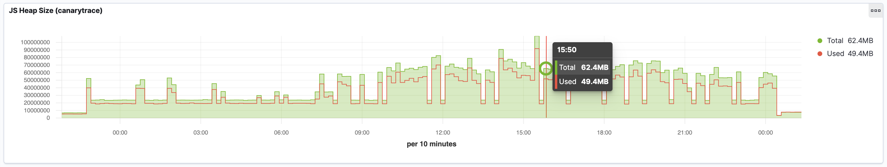

> ### What you’ll learn
- What is Memory Intercept

<a href="/docs/why/edition#canarytrace-pro">Canarytrace Pro</a>

[Canarytrace Pro](http://localhost:3000/docs/why/edition#canarytrace-pro) continuously collects information about used and available memory during test of the page.
Web application use resources such as CPU and Memory for every opened tabs. One web application runs in one tab. If a web application consumes a large amount of memory in the browser, they may not work properly, because missing resources. Canarytrace continuously collects information about used and available memory.

- [Live reporting memory intercept](/docs/features/live-reporting/#cmemory-)
---

- Do you find mistake or have any questions? Please [create issue](https://github.com/canarytrace/documentation/issues/new/choose), thanks 👍
- Have more questions? [Contact us](/docs/support/contactus).