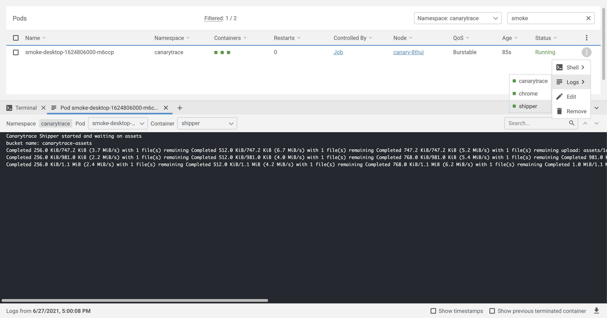

> ### What you’ll learn
- What is a Canarytrace Shipper?
- How this work?
 
Shipper is a third [Docker image](/docs/features/docker) in a Canarytrace stack which send all static files into [AWS S3](https://aws.amazon.com/s3/) such as [Lighthouse HTML report](/docs/features/lighthouse#reporting) or [records of activity in Chrome's processes](/docs/features/lighthouse#reporting) in stored a JSON format. Canarytrace save all static file into `/assets` directory and this directory is mounted between Docker images with Canarytrace and Shipper. All new files are push to AWS S3.



## How to work

Canarytrace Shipper run every 1s in a loop synchronization with your AWS S3 bucket `aws s3 sync assets/ s3://${AWS_BUCKET_NAME} --acl public-read`

```bash title="Shipper log"
Canarytrace Shipper started and waiting on assets
bucket name: canarytrace-reports

Completed 256.0 KiB/741.5 KiB (2.5 MiB/s) with 1 file(s) remaining Completed 512.0 KiB/741.5 KiB (3.7 MiB/s) with 1 file(s) remaining Completed 741.5 KiB/741.5 KiB (2.9 MiB/s) with 1 file(s) remaining upload: reports/92a10aac80f565388e91-27dbaa8bebf3469a07d3-lighthouse-report.html to s3://canarytrace-reports/92a10aac80f565388e91-27dbaa8bebf3469a07d3-lighthouse-report.html
Completed 256.0 KiB/981.1 KiB (5.6 MiB/s) with 1 file(s) remaining Completed 512.0 KiB/981.1 KiB (8.5 MiB/s) with 1 file(s) remaining Completed 768.0 KiB/981.1 KiB (12.3 MiB/s) with 1 file(s) remaining Completed 981.1 KiB/981.1 KiB (7.2 MiB/s) with 1 file(s) remaining upload: reports/92a10aac80f565388e91-caa39632252dfbff4ec0-lighthouse-report.html to s3://canarytrace-reports/92a10aac80f565388e91-caa39632252dfbff4ec0-lighthouse-report.html
Completed 256.0 KiB/1.1 MiB (3.2 MiB/s) with 1 file(s) remaining Completed 512.0 KiB/1.1 MiB (5.8 MiB/s) with 1 file(s) remaining Completed 768.0 KiB/1.1 MiB (8.3 MiB/s) with 1 file(s) remaining Completed 1.0 MiB/1.1 MiB (10.7 MiB/s) with 1 file(s) remaining Completed 1.1 MiB/1.1 MiB (5.4 MiB/s) with 1 file(s) remaining upload: reports/92a10aac80f565388e91-3e018a4987b240d250c1-lighthouse-report.html to s3://canarytrace-reports/92a10aac80f565388e91-3e018a4987b240d250c1-lighthouse-report.html
Completed 256.0 KiB/540.5 KiB (3.3 MiB/s) with 1 file(s) remaining Completed 512.0 KiB/540.5 KiB (5.6 MiB/s) with 1 file(s) remaining Completed 540.5 KiB/540.5 KiB (3.7 MiB/s) with 1 file(s) remaining upload: reports/92a10aac80f565388e91-3599d21cefd8b7077b8e-lighthouse-report.html to s3://canarytrace-reports/92a10aac80f565388e91-3599d21cefd8b7077b8e-lighthouse-report.html
```

## How to run

Canarytrace Shipper is a part of Canarytrace stack and you can add them into POD with Docker images Canarytrace and Browser.

- [How to get a deployment scripts](/docs/guides/kubernetes#how-to-get-a-deployment-scripts)

## Configuration

- `AWS_S3_BUCKET_NAME` - e.g. `monitoring-assets`.
- `AWS_ACCESS_KEY_ID` - your access key.
- `AWS_SECRET_ACCESS_KEY` - you secret access key.

### Optional
- `ENV_PRINT` - `allow` for print all environment variables.
- `AWS_DEFAULT_REGION` - default is `eu-central-1`.

## Example

You can create your own shipper, just binding properly `/opt/canary/assets` directory in Canarytrace Docker image and directory in your Docker image.

- [Download full Cronjob](/docs/guides/kubernetes#how-to-get-a-deployment-scripts)

```yaml title="Kubernetes CronJob"
containers:
- name: canarytrace
  image: quay.io/canarytrace/canarytrace-pub:4.3.5-pro-20210626074508-73
  volumeMounts:
  - name: assets
    mountPath: /opt/canary/assets
...
- name: shipper
  image: quay.io/canarytrace/shipper:1.4
  volumeMounts:
  - name: assets
    mountPath: /opt/shipper/assets
  env:
  - name: ENV_PRINT
    value: "no"
  - name: AWS_S3_BUCKET_NAME
    value: "XXXXX"
  - name: AWS_ACCESS_KEY_ID
    value: "XXXXX"
  - name: AWS_SECRET_ACCESS_KEY
    value: "XXXXX"
...
volumes:
  - name: "assets"
    emptyDir: {}
```

---

- Do you find mistake or have any questions? Please [create issue](https://github.com/canarytrace/documentation/issues/new/choose), thanks 👍
- Have more questions? [Contact us](/docs/support/contactus).