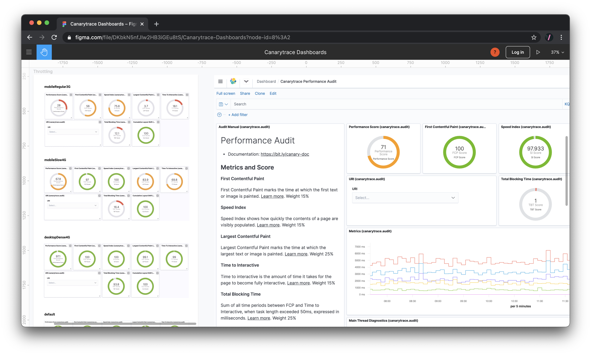
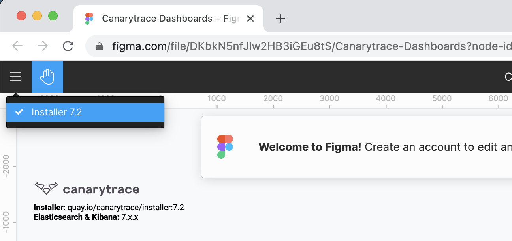
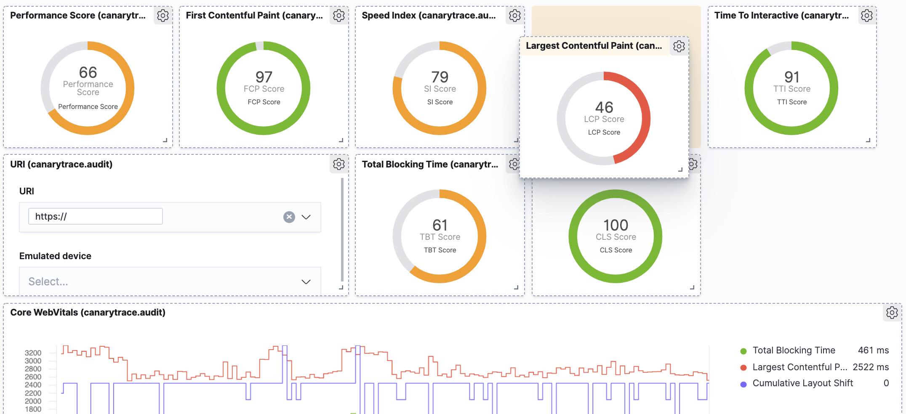
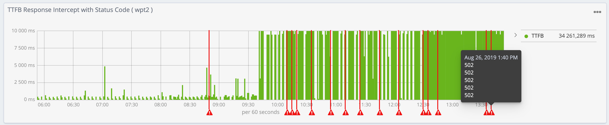
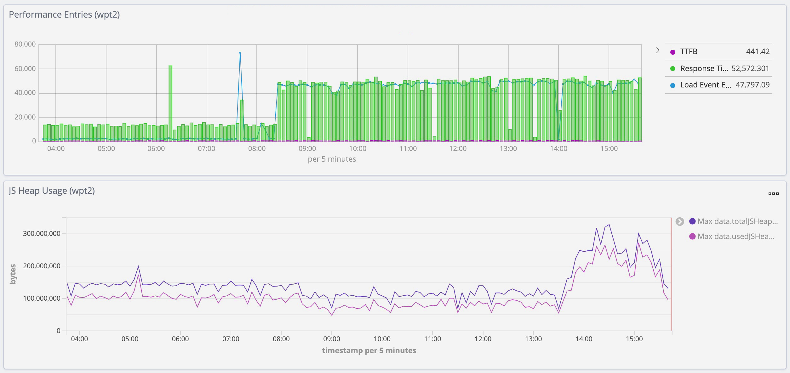
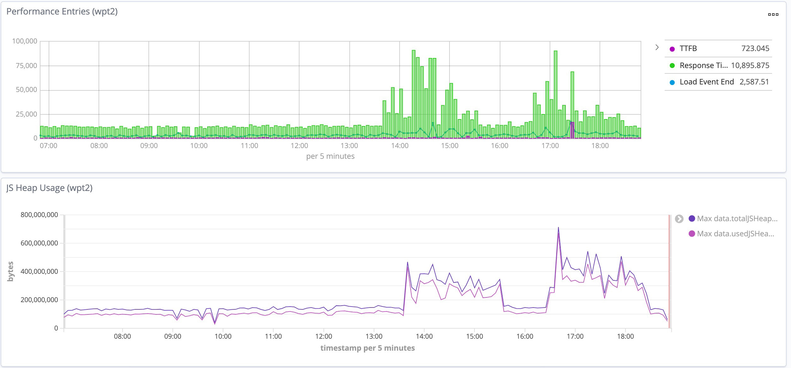
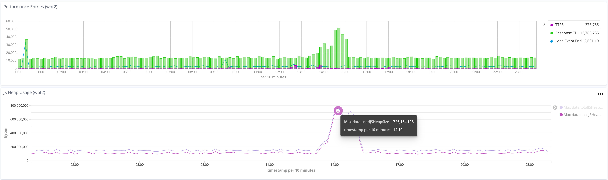
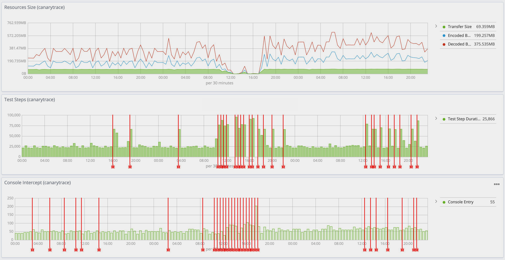
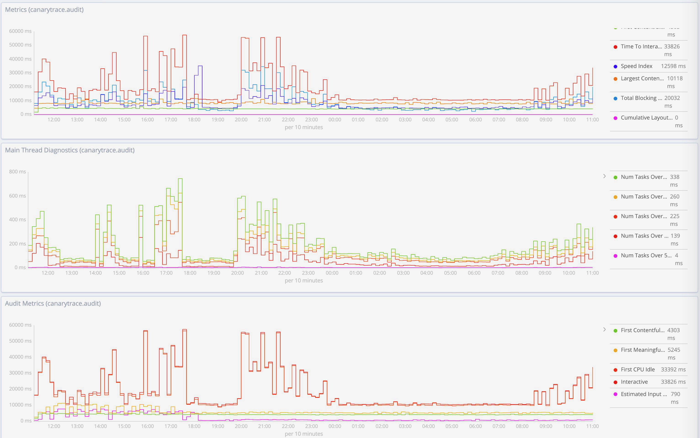
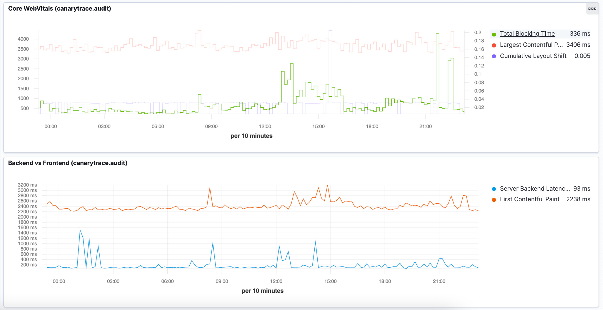

> ### What you’ll learn
- What is a Canarytrace Shipper?
- How this work?
 
All data collected by Canarytrace are stored into Elasticsearch and are displayed in [Kibana](https://www.elastic.co/kibana) in the form of visualizations which are grouped into dashboards.

## How to get Canarytrace dashboards
---

This dashboards are automaticaly installed via [Canarytrace Installer](/docs/features/installer). Select supported version of Elasticsearch and Kibana.

## Type of dashboards
---

### Monitoring Overview

This dashboard show visualizations with useful information about the loading speed of resources such as images, JS or CSS files, time makr of [HeroElements](/docs/features/hero), JS HeapSize, TestStep durations or Resources size etc.

### Performance Audit

Performance Audit is dashboard which contains information known from tools such as [PageSpeed Insights](https://developers.google.com/speed/pagespeed/insights) or [Lighthouse](https://developers.google.com/web/tools/lighthouse).
On the top this dashboard are chevrons with important performance metrics and their score. Your goal is for all scores to be over 90.

In the same dashboard are additional graphs with metrics and their values on timeline.

Scores are color-coded by [score calculator](https://googlechrome.github.io/lighthouse/scorecalc/).
The metrics scores and the perf score are colored according to these ranges:

- 0 to 49 (grey/red): Poor
- 50 to 89 (orange): Needs Improvement
- 90 to 100 (green): Good

> [More info](/docs/features/lighthouse) about collected metrics of Lighthouse.

### Canarytrace Smoke Overview

This dashboard is very simple and allows you to get an overview of the availability of a web application and the loading speed of resources such as images, JS or CSS files. Contains visualizations from data, which are collected from [Canarytrace](/docs/why/edition) in `smoke` edition.

## Dashboard versioning
---

Version of dashboards with additional setup for Elasticsearch and Kibana are installed via [Canarytrace Installer](/docs/features/installer). We continue on upgrades of dashboards, add new improvements and fixing a bugs. 
You can see via versioning on changes for newer or older version of Kibana, but is important select for installation correct version of Canarytrace Installer.

E.g. For Kibana `7.2.0` select docker image with [Canarytrace Installer](/docs/features/installer) with tag `7.2.0` e.g. `quay.io/canarytrace/installer:7.2.0` etc.

## Create your own or change exist dashboard
---

If you need to create your own dashboard with a different visualization composition - no problem 👌

## Examples
---

We're happy when the applications we monitor work properly and load quickly. When a problem occurs, we'll display it in a graph and alert you. Let's look at the samples.

---

Increasing response times and then the server started returning response code 500 and the application was unavailable.
With proper monitoring and timely notification, the application can still be saved.

---

In the morning there was increase response times and later there was an increase in memory consumption by web application in the browser

--- 

Two performance tests in a row on a lower test environment - the infrastructure under load via performance tests has a negative effect on the front-end and negative effect on end user.

It's good to know, so it's important to measure during performance tests or during peak on production.

--- 

This graph show peak on production and negative impact on end user. Increased memory usage in the browser and increased response times for all requests.

--- 

This graph shows the unavailability of the environment from the user's perspective.

--- 

We perform a performance audit every 3 minutes and thanks to that we see details and exact values every moment.
This is very a important for debugging a front-end and for a realistic view of how fast your application is at any time of the day.

--- 

If you occasionally have problems with the loading speed of a web application, so it's good to know where the problem starts, whether on the backend or frontend. 
Graph with title Backend vs Frontend shows difference between metrics `Time To First Byte` a `First Contenful Paint`. 

---

- Do you find mistake or have any questions? Please [create issue](https://github.com/canarytrace/documentation/issues/new/choose), thanks 👍
- Have more questions? [Contact us](/docs/support/contactus).