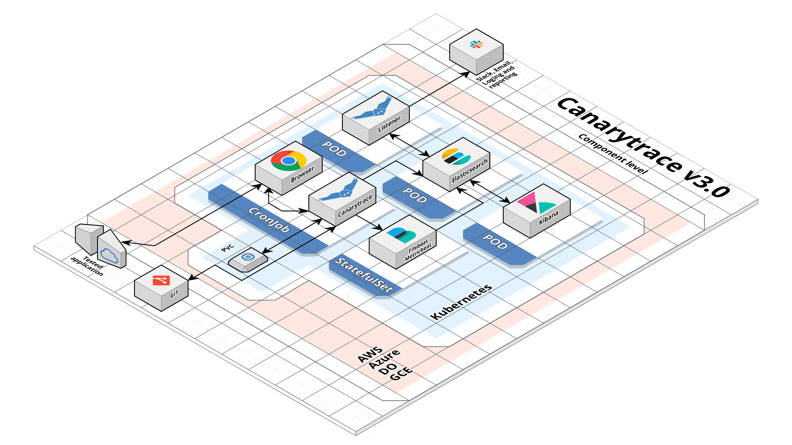

> ### What you’ll learn
- You will get a basic overview of architecture

The architecture of Canarytrace is based on dockerized components, which are orchestrated in [Kubernetes](https://kubernetes.io/) or [OpenShift](https://www.openshift.com/). Thanks to this approach is easy deploy Canarytrace to in the cloud e.g. [AWS](https://aws.amazon.com/), [Google Cloud Engine](https://cloud.google.com/), [DigitalOcean](https://www.digitalocean.com/), [Azure Cloud](https://azure.microsoft.com/) etc. or in your own datacenter where is possible install of Kubernetes.

### What is Canarytrace?
<a href="/docs/why/edition#canarytrace-professional">Professional</a>
<a href="/docs/why/edition#canarytrace-smoke-pro">Smoke Pro</a>

Canarytrace is a stack based on [Webdriver.io](https://webdriver.io/) and uses a hybrid approach to testing of the web application. We use combination of a webdriver and [devTools](https://developers.google.com/web/tools/chrome-devtools) for full control on a web browser during monitoring and measure.
Canarytrace isn't a substitute for monitoring tools of lower level e.g. Zabbix or Nagios but complement each other. 
So, Canarytrace control browser and perform measure and monitoring on top level (E2E) and provides real information about the vitality of the web application and what is about impact on the client.

Canarytrace rotates on very short intervals via Kubernetes and thanks to can run on multiple instances, which is isolated from each other and every instance has fixed resources for reliable results.

Every run Canarytrace starts of cloning monitor script from git repository directly to Canarytrace container. 

### Main responsibilities

Every part of architecture has own responsibility.

- Cloning git repository with monitor scripts directly to container with Canarytrace.

- Run selected monitor script.

- Access to browser via webdriver and devTools during monitoring and measure non-functional metrics and collect additional telemetrics data from browser API.

- Assertation function requirements.

- Continuously sending all data from Canarytrace to Elasticsearch.

> - Canarytrace doesn't measure anything, this is responsibility on a web browser and its embedded tools. In this moment is a web browser quarantor of reliability data.
> - Canarytrace has internal algorithms for collect data from browser, filtering and sending data to analysis to Elasticsearch.
> - Canarytrace never run two instances in a single browser, but uses a 1: 1: 1 
> - Parallelization is performed on lower level of this architecture. We use Kubernetes for parallelization, izolation of monitorin and for set exactly resources for every runned a web browser.
> - Canarytrace didn't sending any notifications. This is a responsibility of Canarytrace Listener.

### Browser instance

Browser is separated from Canarytrace and has fixed setup of resources. Is very important so that the browser has enough resources. Práce s webovou aplikací nesmí být ovlivněna externími procesy.

Canarytrace and a browser are in the POD on localhost and thanks to we controll browser via devTools and use his API. The advantage is that the canarytration has access to all browser activities.

**Main responsibility**

- Open and render web applications, call requests, and provide data telemetry.

### Elasticsearch

Elasticsearch is distributed search and analytics engine and is the centerpiece of Canarytrace stack. Canarytrace stores a large amount of data in elasticsearch collected from browser, from Web API, from performance audit and other log records.

This is a big advantage because elasticsearch is powerful and a lot of people know it. It allows access to data via rest api and other tools can work with data collected from Canarytrace

Data from Elasticsearch are used by Kibana for visualize them and by Canarytrace Listener for automatically analyses of incidentes, bugs, trigering alert by thresholds and for generate reports.

**Main responsibility**

- Saving data from Canarytrace
- Saving data from other components such as filebeat or metric beat
- Provide collected data to other components
- Secure storage for collected data
- Backing up collected telemetry data

### Kibana

Kibana is used to view and visualize data stored in Elasticsearch. You can data search and filter, save searches, create reports, graphs, spreadsheets and visualizations with your own company graphics.

**Main responsibility**

- GUI accesible via web browser.
- Access to raw data stored to Elasticsearch
- Provide visualizations and dashboards

### Filebeat & Metricbeat

Filebeat a Metricbeat are lightweight data shippers. Their tasks is collect logs from (stdout/stderr) and metrics from docker containers.

**Main responsibility**

- Send logs and metrics from docker containers to elaticsearch.

### Canarytrace Listener

Canarytrace Listener is a component, which automatically analyse data from Elasticsearch and fired notification by threshold on output reporters e.g. slack.
Compares type of errors, their frequency, examines incoming resources to the browser, their headers etc.
Canarytrace Listener work also an observer and monitoring work of Canarytrace collectors.

**Main responsibility**

- Continualy analyse collected data from Canarytrace collectors (Canarytrace Professional, Canarytrace Smoke Pro)
- Trigger alert when is some thresholds exceeded.

### GIT

In the git are stored monitor scripts and configuration of Canarytrace stack (IaC). When started, the Git repository is cloned directly to Docker container and monitoring and measure can start.

### Persistent storage

Canarytrace store attachments in a persistent storage,e.g. screenshots, HAR files, copy of DOM for later analyse.

---

- Do you find mistake or have any questions? Please [create issue](https://github.com/canarytrace/documentation/issues/new/choose), thanks 👍
- Have more questions? [Contact us](/docs/support/contactus).