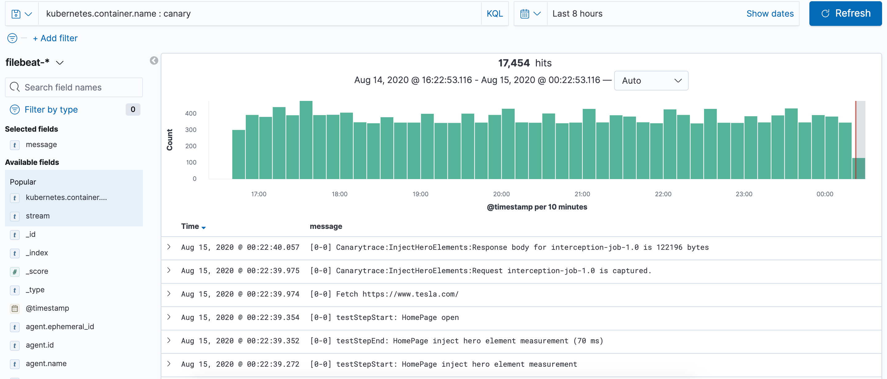
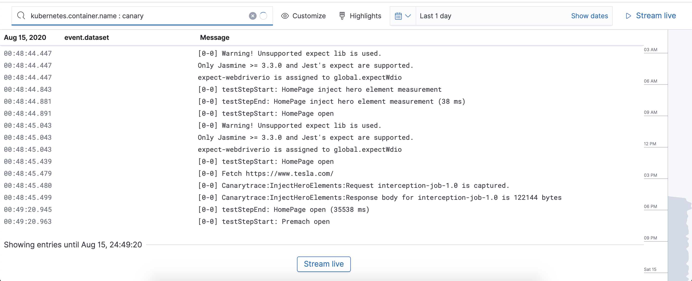

> ### What you’ll learn
- What is Kubernetes
- Why we use Kubernetes
- What are the recommendation on resources requirements

Canarytrace is designed for use in Kubernetes and this has many advantages:

- Canarytrace isn't testing framework, but complete test stack with additional components.
- Designed for pattern 1:1:1 (= 1 monitor script, 1 Canarytrace runner, 1 instance of a browser) - due to strict isolation and predictable resource allocation for each run, the results are credible and comparable.
- Many tasks are delegated to a lower level, on Kubernetes. It's a better approach than to solve all tasks on the testing framework level. Each Canarytrace component has its own responsibility. E.g.
  - Canarytrace runner (WDIO + services) only loads, runs of test scripts and live reporting
  - [Elasticsearch stack](https://www.elastic.co/elastic-stack) for storing all data from Canarytrace runner and such as engine for agregate data for test report, backups, trends etc.
  - [Beats](https://www.elastic.co/beats/) are small datashippers and we use Beats for collect all logs from our docker containers.
  - [Kibana](https://www.elastic.co/kibana) for data analysis and visualizations from Canarytrace runner, for the preparation of a test report in many forms e.g. report for testers, architect, devops or test manager.
  - [Canarytrace Listener](/docs/guides/listener) for automatically analyzing many types of data scanned from a browser, alerting by thresholds to many services such as slack or email, simplification of the test result for integration with other tools such as Zabbix.
  - Kubernetes parallelizes, guarantees, manages and isolates each instance of the Canarytrace runner. Every instance of Canarytrace starts on the same conditions. This is an advantage because the tests don't affect each other.
  - We no longer need tools like Jenkins or Selenium cluster.
  - Thanks to Kubernetes you are not vendor locked and at the same time Canarytrace can be run on AWS, DigitalOcean, Azure Cloud, GCE or on your VPS.

## Required resources for one instance

Requirements on resource will be higher if you will be perform a performance audit. Without performance audit will be perform availability check and download information about network trafic in a browser.

> ### Recommended requirements for performance audit
> - Loading web pages into a modern browser is not an easy task. The measurement results may be skewed by insufficient resources and therefore the following settings are recommended for performance audit.
> - Minimum 2 dedicated cores (4 recommended)
> - Minimum 2GB RAM (4-8GB recommended)

- One instance = one monitor script
- [Resource units in Kubernetes](https://kubernetes.io/docs/concepts/configuration/manage-resources-containers/#resource-units-in-kubernetes)

| Resources | CPU requests | CPU limits | Memory requests | Memory limits |
|-|-|-|-|-|
| Canarytrace Runner | `200m` | `300m` | `300Mi` | `400Mi` |
| Browser | `2000m` | `4000m` | `2000Mi` | `4000Mi` |
| Total | `2200m` | `4300m` | `4300Mi` | `4400Mi` |


**Check resource quota on all nodes**

```bash
kubectl get nodes --no-headers | awk '{print $1}' | xargs -I {} sh -c 'echo {}; kubectl describe node {} | grep Allocated -A 5 | grep -ve Event -ve Allocated -ve percent -ve -- ; echo'

# output
canary-3bcb1
  Resource           Requests      Limits
  cpu                2302m (57%)   2102m (52%)
  memory             3415Mi (51%)  3840Mi (57%)
```

## How to get a deployment scripts

All deployment scripts are distributed with [Canarytrace](/docs/why/edition) docker images.

```bash
# Download deployments scripts from docker image
docker run --rm -it --entrypoint /bin/mv -v $(pwd):/deployments quay.io/canarytrace/canarytrace-pub:4.2.17-pro-20210618073421-28 /opt/canary/deployments/ /deployments/

# deployments folder is transferred from the docker image to localhost
ᐰ ls -lah deployments/
drwxr-xr-x@ 6 rdpanek  staff   192B 18 Jun 09:24 .
drwxr-xr-x  3 rdpanek  staff    96B 18 Jun 10:19 ..
-rw-r--r--  1 rdpanek  staff   365B 18 Jun 09:24 README.md
-rw-r--r--  1 rdpanek  staff   3.4K 18 Jun 09:24 filebeat.yaml
-rw-r--r--  1 rdpanek  staff   2.2K 18 Jun 09:24 smoke-desktop.yaml
-rw-r--r--  1 rdpanek  staff   2.2K 18 Jun 09:24 smoke-mobile.yaml

```

- [filebeat](https://www.elastic.co/beats/filebeat) logging stdout and stderr streams from all Canarytrace components

- `smoke-desktop.yaml` Canarytrace Smoke CronJob with desktop settings

- `smoke-mobile.yaml` Canarytrace Smoke CronJob with mobile settings

> - [Elasticsearch & Kibana](/docs/guides/elasticsearch) and [Canarytrace Installer](/docs/features/installer) are required for successful Canarytrace startup


## RBAC and how to connect to Kubernetes
> - ### You got from us
> - `xxx.kubeconfig.yaml` e.g. `operator-kanarek-kubeconfig.yaml`
> - `client-certificate` e.g. `kanarek.crt`
> - `client-key` e.g. `kanarek.key`

**Prepare**

1. Create a directory on your localhost e.g. `~/canary` and move `client-certificate`, `client-key` and `xxx.kubeconfig.yaml` there.
2. Edit your `xxx.kubeconfig.yaml` and setup absolute path to your `client-certificate` a `client-key`

```yaml title="example xxx.kubeconfig.yaml" {18,19}
apiVersion: v1
clusters:
- cluster:
    certificate-authority-data: LS0tLS1CRUdJTiBDR...
    server: https://1ba1e227-xxx-43c1-yyy-f6458f37a083.k8s.ondigitalocean.com
  name: do-fra1-ko-canary
contexts:
- context:
    cluster: do-fra1-ko-canary
    user: kanarek
  name: do-fra1-ko-canary
current-context: do-fra1-ko-canary
kind: Config
preferences: {}
users:
- name: kanarek
  user:
    client-certificate: ~/canary/kanarek.crt
    client-key: ~/canary/kanarek.key
```
2. Test, than SSL/TLS connection was successful and user has authorization to list pods resources.

```bash
kubectl --kubeconfig=~/canary/xxx.kubeconfig.yaml auth can-i get pods

# output
yes
```

**How to edit list of landing pages**
<a href="/docs/why/edition#canarytrace-smoke-pro"><span class="canaryBadge">Smoke Pro</span></a>

1. Get list of CronJobs

```bash
kubectl --kubeconfig=~/canary/xxx.kubeconfig.yaml get cronjobs

# output
NAME                          SCHEDULE      SUSPEND   ACTIVE   LAST SCHEDULE   AGE
canarytrace-xxx-1-desktop   */5 * * * *   False     1        66s             17d
canarytrace-xxx-1-mobile    */5 * * * *   False     1        66s             17d
```

2. Edit CronJob and scroll down to BASE_URL

```bash
kubectl --kubeconfig=~/canary/xxx.kubeconfig.yaml edit cronjob canarytrace-xxx-1-desktop

# output
 27           containers:
 28           - env:
 29             - name: BASE_URL
 30               value: https://canarytrace.com/;https://www.teststack.cz/
```
3. Edit collection of landing pages in BASE_URL and save changes

**You can display your Canarytrace instances**

- `kubectl --kubeconfig=~/canary/xxx.kubeconfig.yaml get pods`

## Filebeat

[Filebeat](/docs/features/filebeat) logging all stdout and stderr streams from all Canarytrace docker containers in your cluster.

> - All data from Filebeat are stored to `filebeat-*` index

### Manually debuging Canarytrace

For manually debuging Canarytrace runner and other components in a docker containers - you can use command line tool [kubectl](https://kubernetes.io/docs/tasks/tools/install-kubectl/) for tail stdout and stderr streams from all containers in your Kubernetes cluster or [Lens](https://k8slens.dev/)

```bash title="Get logs from Canarytrace pod from your localhost"
kubectl -n canary logs -f tesla-1597447320-2gg4r -c canary
```
This is easy for learning and maintanance Canarytrace containers, but not but not effective. 

#### Filebeat provides

- Show all logs in a Kibana in real time - access to logos without knowledge with kubectl tool
- Searching events, errors and other strings in a streams
- Filtering by name of docker container 
- Create visualizations from events
- Create alerting from events in a log by conditions

### How to run Filebeat

- [Download deployment script for Filebeat](/docs/guides/kubernetes#how-to-get-a-deployment-scripts) `deployments/beats/filebeat-logging.yaml` from Canarytrace Professional and Canarytrace Smoke Pro docker container
- Edit elasticsearch connection params

```yaml title="deployments/beats/filebeat-logging.yaml"
env:
- name: ELASTICSEARCH_HOST
  value: "https://elasticsearch-host"
- name: ELASTICSEARCH_PORT
  value: "9243"
- name: ELASTICSEARCH_USERNAME
  value: "elastic"
- name: ELASTICSEARCH_PASSWORD
  value: "pass"
```

- Deploy `kubectl apply -f deployments/beats/filebeat-logging.yaml`

**You can check filebeat logs, that it doesn't contain any error messages**

```bash
kubectl -n kube-system get pods

// outpu
...
filebeat-cznq9                    1/1     Running   0          9h
kube-proxy-gjp6p                  1/1     Running   0          12d
```

**Get logs from container with filebeat**

```bash
kubectl -n kube-system logs -f filebeat-cznq9
```

### Filebeat data browsing

- Open your Kibana > Discover and index `filebeat-*`



**Search input**

- `kubernetes.container.name : canary` display stdout and stderr streams from Canarytrace runner docker container.
- `message: "testStepStart: HomePage open"` for display all record which contains this string.

### Filebeat log viewer

> - Kibana contains a built-in log viewer
> - Open your Kibana > Observability > Logs



---

- Do you find mistake or have any questions? Please [create issue](https://github.com/canarytrace/documentation/issues/new/choose), thanks 👍
- Have more questions? [Contact us](/docs/support/contactus).