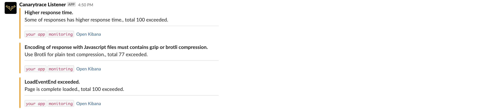
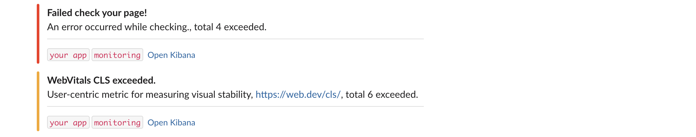
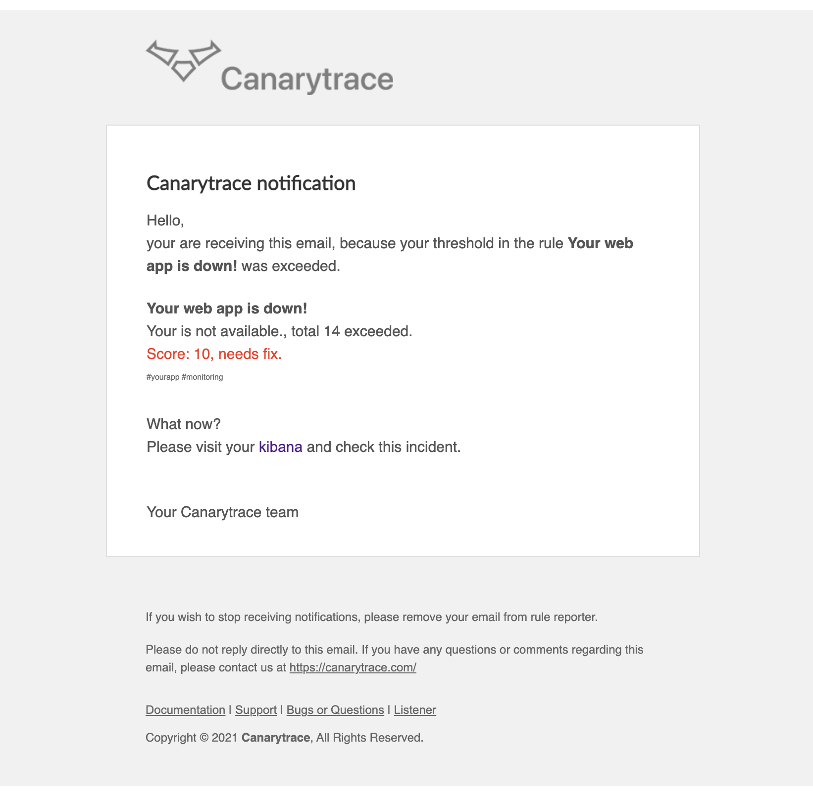
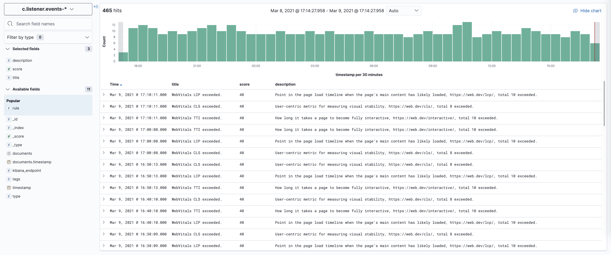

> ### What you’ll learn
- What is a Canarytrace Listener
- How Listener work

Canarytrace Listener is an additional component that helps to select incidents or exceeded of thresholds from a lot of data that Canarytrace collects.
You have graphs, dashboards and a lot of data that canarytrace has collected, but thanks to tunnel vision, an incident or threshold crossing can easily be overlooked.

## How does it work?

- Listener brings automated monitoring of thresholds exceedances and alerts according set of rules.
- Listener provides a set of built-in rules with recommended values for metrics such as ResponseTimes, LoadEventEnd, LongTasks, Web Vitals, sizing and format of images, and etc.
- Listener evaluates problems that the browser downloads from the server, such as downloading javascript or css files without compression.
- Listener works with a list of rules, each rule has a set threshold, reporter and score. If the threshold is exceeded, Listener send alert by the selected reporter.
- Each threshold has set of score. The table of score allows you to finely define very softly the severity of the incident. The score has a range from 0 to 100. The lower the better.

## Rule example

Send notification into our slack channel, when any response has responseTime is greater than 3000ms.

```yaml
    - type: range
      title: "Higher response time."
      index: c.performance-entries
      timeRange: now-1h
      field: responseTime
      operator: gte
      value: 3000
      min: 10
      reportLabels:
      - 'name'
      - 'responseTime'
      - 'timestamp'
      reporters:
      - type: slack
        score: 40
        message: "Some of responses has higher response time."
```

## Score table

| Description | Score | Color |
|-|-|-|
| needs fix! | 0-30 | red | 
| needs improvement! | 31-70 | orange |
| good job! | 71-100 | green |

## Rules

Rules are the cornerstone of the Canarytrace Listener and there are three types: 

- `Internal rules` - are built-in healthchecks for canarytrace and elasticsearch.
- `Default rules` - built-in rules for monitoring thresholds of metrics  and recommendations.
- `Client rules` - we are preparing - the user will be able to set rules, thresholds and reporters himself.

### Rule `match`

> - Search exactly value in a label
> - Condition: index `c.report` in the last hour must contains `false` in the label `passed` and minimal `2` finds.
> - If the condition is met, send the report to `slack` and `events` reporters.
> - You can use operator `must` and `must_not`.

- `min` is optional.
- `reporters` can be one or more.

```yaml
- type: match
  title: "Failed check your page!"
  index: c.report
  timeRange: now-1h
  field: passed
  operator: must
  expected: false
  min: 2
  reportLabels:
  - 'fullTitle'
  - 'timestamp'
  reporters:
  - type: slack
    score: 10
    message: "An error occurred while checking."
  - type: events
    score: 10
    message: "An error occurred while checking."
```

### Rule `contains`

> - First condition: get a group of data by `field` and `value` and second condition: search exactly `expression.field` and `expression.values`
> - Condition: index `c.response` in the last hour with label `headers.content-type` which contains `javascript` not contains `gzip` or `br` in the field `headers.content-encoding` and minimal `10` finds.
> - If the condition is met, send the report to `slack` and `events` reporters.
> - You can use operator `must` and `must_not`.

- `min` is optional.
- `expression.value` can be one or more.
- `reporters` can be one or more.

```yaml
- type: contains
  title: "Encoding of response with Javascript files must contains gzip or brotli compression."
  index: c.response
  timeRange: now-1h
  field: headers.content-type
  value: 'javascript'
  expression:
    c: 'headers.content-encoding'
    operator: must_not
    values:
    - 'gzip'
    - 'br'
  min: 10
  reportLabels:
  - 'url'
  - 'timestamp'
  reporters:
  - type: slack
    score: 40
    message: "Use Brotli for plain text compression."
  - type: events
    score: 40
    message: "Use Brotli for plain text compression."
```

### Rule `range`

> - Search greater or less value
> - Condition: index `c.performance-entries` in the last hour must be `responseTime` greater than `3000` and minimal `10` finds.
> - If the condition is met, send the report to `slack` and `events` reporters.
> - You can use operator `gte` and `lte`.

- `min` is optional.
- `reporters` can be one or more.

```yaml
- type: range
  title: "Higher response time."
  index: c.performance-entries
  timeRange: now-1h
  field: responseTime
  operator: gte
  value: 3000
  min: 10
  reportLabels:
  - 'name'
  - 'responseTime'
  - 'timestamp'
  reporters:
  - type: slack
    score: 40
    message: "Some of responses has higher response time."
  - type: events
    score: 40
    message: "Some of responses has higher response time."
```


### Default rules

> - Latest version is `1.6`
> - This table of rules is still under development

**Latest version of Listener contains these built-in rules**

| # | title | Index | Condition | Min count /hour | Score |
|-|:-:|:-:|:-:|-|-|
| 1 | Failed check your page! | c.report | test step failed | 2 | 10 |
| 2 | Encoding of response with Javascript files must contains gzip or brotli compression. | c.response | gzip or br missing in headers.content-encoding | 10 | 40 |
| 3 | Encoding of response with CSS files must contains gzip or brotli compression. | c.response | gzip or br missing in headers.content-encoding | 10 | 40 |
| 4 | Higher response time. | c.performance-entries | > 3000ms | 10 | 40 |
| 5 | WebVitals LCP exceeded. | c.audit | > 2500ms | 5 | 40 |
| 6 | WebVitals TTI exceeded. | c.audit | > 5000ms | 5 | 40 |
| 7 | WebVitals CLS exceeded. | c.audit | > 0.1 | 5 | 40 |
| 8 | LoadEventEnd exceeded. | c.performance-entries | > 4000ms | 5 | 40 |

- `title` name of rule
- `index` where Listener is looking for incidents
- `condition` if the condition is met, an report will be sent
- `min count / hour` an report will be sent, if is min count of incidents found
- `score` reporter ma priznak a barvu podle score 

### Internal rules

| Internal check | Score | Description |
|-|-|-|
| ⚙️ Canarytrace is down | 0 | Canarytrace did not send data to `c.report-*` index |
| ⚙️ Elasticsearch health is yellow | 50 | Need improvements |
| ⚙️ Elasticsearch health is red | 0 | Elasticsearch is probably down |
| ⚙️ Java Heap is higher than 70% | 50 | Is close to overloaded and need improvements |
| ⚙️ Java Heap is higher than 85% | 50 | Elasticsearch nodes is overloaded |

- `canaryIsLive` canarytrace run
- `healthCheck` elasticsearch status and pending tasks
- `nodesCheck` elasticsearch java heap, max ram, max disk used, max cpu

## Reporters

> - You can use on or more reporters

```yaml
reporters:
- type: slack
  score: 10
  message: "An error occurred while checking."
- type: events
  score: 10
  message: "An error occurred while checking."
- type: email
  score: 10
  message: "An error occurred while checking."
  recipients:
  - 'rdpanek@canarytrace.com'
  - 'support@company.com'
```

### Slack reporter






### Email reporter



### Events reporter




```yaml title='sdasddasd'
{
  "type": "events",
  "rule": "cldr",
  "tags": [
    "webApp",
    "monitoring"
  ],
  "kibana_endpoint": "https://abc.gcp.cloud.es.io:9243",
  "score": 40,
  "title": "WebVitals LCP exceeded.",
  "description": "Point in the page load timeline when the page's main content has likely loaded, https://web.dev/lcp/, total 10 exceeded.",
  "documents": [
    {
      "_index": "c.audit-2021.03.09",
      "_id": "15K_F3gBTSVqKz9Gc_EY",
      "timestamp": "2021-03-09T16:08:45.962Z"
    },
    {
      "_index": "c.audit-2021.03.09",
      "_id": "cZK-F3gBTSVqKz9G8fFp",
      "timestamp": "2021-03-09T16:08:12.763Z"
    },
    {
      "_index": "c.audit-2021.03.09",
      "_id": "u5K-F3gBTSVqKz9GUvAc",
      "timestamp": "2021-03-09T16:07:32.057Z"
    },
    {
      "_index": "c.audit-2021.03.09",
      "_id": "FpK9F3gBTSVqKz9GxvCt",
      "timestamp": "2021-03-09T16:06:56.359Z"
    },
    {
      "_index": "c.audit-2021.03.09",
      "_id": "YJK9F3gBTSVqKz9GJ--j",
      "timestamp": "2021-03-09T16:06:15.564Z"
    },
    {
      "_index": "c.audit-2021.03.09",
      "_id": "eJK6F3gBTSVqKz9Gqu7h",
      "timestamp": "2021-03-09T16:03:32.563Z"
    },
    {
      "_index": "c.audit-2021.03.09",
      "_id": "df-6F3gB48LFUj19I2XP",
      "timestamp": "2021-03-09T16:02:58.065Z"
    },
    {
      "_index": "c.audit-2021.03.09",
      "_id": "Iv-5F3gB48LFUj19omXh",
      "timestamp": "2021-03-09T16:02:25.057Z"
    },
    {
      "_index": "c.audit-2021.03.09",
      "_id": "iP-5F3gB48LFUj19I2SC",
      "timestamp": "2021-03-09T16:01:52.453Z"
    },
    {
      "_index": "c.audit-2021.03.09",
      "_id": "o5K4F3gBTSVqKz9Ggu2f",
      "timestamp": "2021-03-09T16:01:11.254Z"
    }
  ],
  "timestamp": "2021-03-09T16:10:11+00:00"
},
"fields": {
  "documents.timestamp": [
    "2021-03-09T16:08:45.962Z",
    "2021-03-09T16:08:12.763Z",
    "2021-03-09T16:07:32.057Z",
    "2021-03-09T16:06:56.359Z",
    "2021-03-09T16:06:15.564Z",
    "2021-03-09T16:03:32.563Z",
    "2021-03-09T16:02:58.065Z",
    "2021-03-09T16:02:25.057Z",
    "2021-03-09T16:01:52.453Z",
    "2021-03-09T16:01:11.254Z"
  ],
  "timestamp": [
    "2021-03-09T16:10:11.000Z"
  ]
}
```

## CLI

> - Canarytrace Listener settings by environment variables

**Elasticsearch**
- `ELASTIC_REQUEST_TIMEOUT` default `1000`ms
- `ELASTIC_CLUSTER` default `http://localhost:9200`
- `ELASTIC_HTTP_AUTH` default no
- `INDEX_PREFIX` default is `c.`
- `QUERY_SIZE` default is `20`, lower is better for performance
- `KIBANA_ENDPOINT` link to kibana

**Slack**
- `SLACK_WEBHOOK_URL` for clients slack

**Email**
All params are required
- `EMAIL_SMTP_SERVER`
- `EMAIL_SMTP_PORT` default `465`
- `EMAIL_SMTP_USER`
- `EMAIL_SMTP_PASS`

**Healthcheck**
- `CANARY_HEALTHCHECK` default `allow`
- `ELASTIC_HEALTHCHECK` default `allow`
- `ELASTIC_NODES_HEALTHCHECK` default `allow`

**Tags**
- `TAGS` example `eshop;monitoring`

## How to run Canarytrace Listener

> - Canarytrace is dockerized component with complete Kubernetes objects.
> - Kubernetes deployments are not public.

- `namespace.yaml` - create a `canarytrace` namespace.
- `config-rules.yaml` - collection of rules.
- `secret.yaml` - contains all sensitive configuration (elasticsearch, slack webhook, smtp user etc.)
- `listener.yaml` - main deployment script of Canarytrace Listener / CronJob.

---

- Do you find mistake or have any questions? Please [create issue](https://github.com/canarytrace/documentation/issues/new/choose), thanks 👍
- Have more questions? [Contact us](/docs/support/contactus).