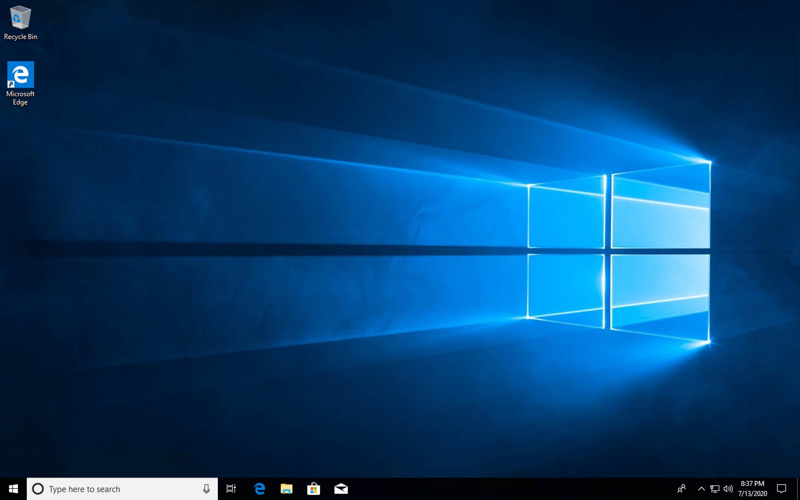
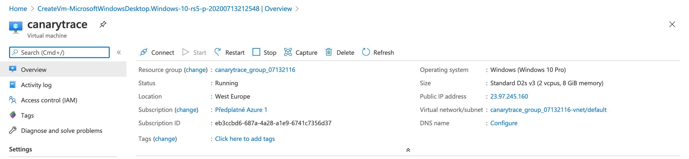
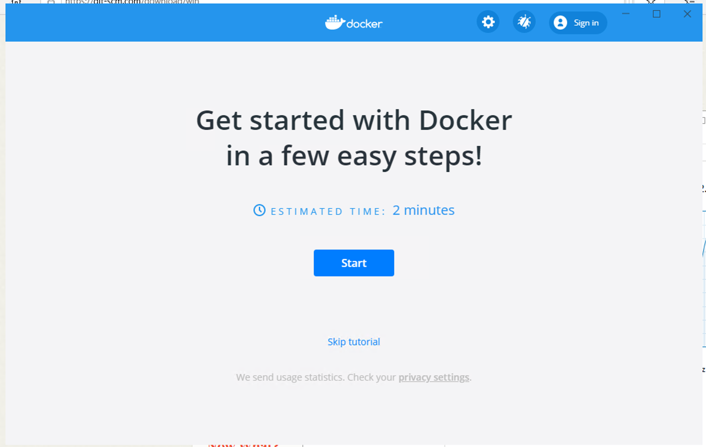
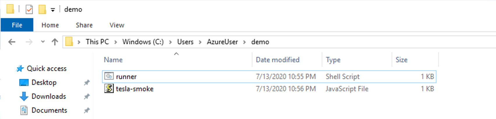

If you have Windows with Docker Desktop installed, skip the first and second step

## Prepare Windows on Azure

**Create and sign in to virtual machine on Azure Cloud**

In this first step we create a virtual machine with Windows 10 Pro and install Docker.

- Start on [https://portal.azure.com/](https://portal.azure.com/) and sign up
- [Create a virtual machine](https://portal.azure.com/?l=en.en-us#blade/HubsExtension/BrowseResourceBlade/resourceType/Microsoft.Compute%2FVirtualMachines)
- Click on `+ Add` button
- Select or create a new subscription and select this options
  - Virtual machine name `canarytrace`
  - Region `Germany West Central`
  - Image  `Windows 10 Pro`
  - Size `2 vcpus, 8GiB memory`
  - Username `AzureUser`
  - Password `AzureUser123`
  - Select inbount port `RDP`
- Click on `Review + create` button and next click on `Create` button

> Wait for validation passed message 

- Click on `Create` button and wait on Your deployment is complete message

- Show detail of deploy and click on `Connect` button. 
- Select RDP and download configuration file. Use the configuration file for your favorite RDP client application.
- To login form username `AzureUser` and password `AzureUser123` 
- Your Windows 10 Pro is ready 👏🏻





## Install Docker CE Desktop for Windows

- Download and install Docker from this page [https://hub.docker.com/editions/community/docker-ce-desktop-windows/](https://hub.docker.com/editions/community/docker-ce-desktop-windows/) the operation requires restart Windows.
- Docker is starting after Windows restart. 
- Wait for Docker is launched. 




## Work with Docker

- Open Windows PowerShell as admin (not Windows PowerShell ISE)
- or [install](https://git-scm.com/download/win) git and open program Git Bash
- check if Docker is ready

```bash
# run this command
docker run hello-world

# this is how the output should look like
...
Hello from Docker!
This message shows that your installation appears to be working correctly.
...
```

> - In case you get `AH0058: apache2: Could not reliably determine the server’s fully ……` do not care about that.

## Create docker network

> User-defined bridges provide automatic DNS resolution between containers

```bash
docker network create canary
```

Canarytrace and selenium will be created in the same network and they will recognize each other by their container name.

## Run Selenium Standalone

```bash
docker run --name selen --net canary -d -p 5902:5900 -p 4444:4444 -p 0.0.0.0:9222:9222 -v /dev/shm:/dev/shm selenium/standalone-chrome-debug:3.141.59-20200730
```

- [Open documentation](https://github.com/SeleniumHQ/docker-selenium) for more information.
- Open url `localhost:4444` in your browser, for example `http://localhost:4444` and you should see message `Selenium Standalone v.3.141.59`

## Create your first easy test case

Go to your home directory and create directory with name demo

```bash
C:\Users\AzureUser\demo
```

- Create a new file `smoke.js` and open it.
- Paste text bellow into file `smoke.js` and save it.

```bash
describe('Smoke monitoring on tesla.com', () => { 
  describe('HomePage', () => {
    it('open', () => {
      browser.url('https://www.tesla.com/')
      const title = 'Electric Cars, Solar & Clean Energy | Tesla'
      const titleElm = $(`//title[contains(text(),"${title}")]`)
      browser.waitForloadEventEnd()
      expect(titleElm.waitForExist({timeoutMsg: "Element title not found. The page couldn't be loaded in time."})).to.be.true
    });
  });
})
```

- this test script is based on [Webdriver.io v6](https://webdriver.io/docs/api.html) and you can extend the test script.

## Create bash script runner

- This file simplifies startup of Canarytrace runner.
- Create a new file `runner.sh` and open it.
- Paste text bellow into file `runner.sh` and save it.

```bash
# Save this script to runner.sh

#!/bin/bash

docker run --name canary --rm -i \
-e SPEC=smoke.js \
-e AT_DRIVER_HOST_NAME=selen \
--net canary \
-v C:/Users/AzureUser/demo:/tmp/canary-tests \
quay.io/canarytrace/developer:c.2.12.2
```

> - In some cases when you are not using TTY replace `-i` to `ti` in first line like `docker run --name canary --rm -ti \`

Your directory now looks like



**Explanation**

- docker run --name canary --rm -ti run a docker container with the name canary, output will be printed to stdout and the container will be deleted at the end of the test.
- `-e SPEC=smoke.js` define your test case.
- `-e AT_DRIVER_HOST_NAME=selen` name container with selenium standalone
- `--net canary` network name
- `-v C:/Users/AzureUser/demo:/tmp/canary-tests` mount place when I have the test case (=smoke.js) and the runner (=runner.sh) to the path in the docker container
- `quay.io/canarytrace/developer:c.2.12.2` container image in format `maintainer/name_docker_image:version`. Check out repository for latest docker image [https://quay.io/organization/canarytrace](https://quay.io/organization/canarytrace)


## Run your first test case

Run Canarytrace with test case

**either** via built-in PowerShell as admin (preferred way):

```bash
PS C:\Users\AzureUser\demo> .\runner.sh
```

**or** via Git Bash

```bash
$ ./runner.sh
```

> allow sharing of C:\Users\AzureUser\demo directory when asked for

Output from Canarytrace ends as follows
```bash
...
[chrome 76.0.3809.87 linux #0-0] Spec: /tmp/canary-tests/
smoke.js
[chrome 76.0.3809.87 linux #0-0] Running: chrome (v76.0.3809.87) on linux
[chrome 76.0.3809.87 linux #0-0] Session ID: 3d6139ff33294d71664603e6613c3a05
[chrome 76.0.3809.87 linux #0-0]
[chrome 76.0.3809.87 linux #0-0] Smoke monitoring on tesla.com
[chrome 76.0.3809.87 linux #0-0]     HomePage
[chrome 76.0.3809.87 linux #0-0]        ✓ open
[chrome 76.0.3809.87 linux #0-0]
[chrome 76.0.3809.87 linux #0-0] 1 passing (2.2s)


Spec Files:	 1 passed, 1 total (100% completed) in 00:00:04
```

**When you are done using Canarytrace**

```bash
# stop selen container
$ docker container stop selen
 
# remove docker network
$ docker network rm canary
```

> - This demo is available in a git repository [https://github.com/canarytrace/canary-tests.git](https://github.com/canarytrace/canary-tests.git) - Can't find link you can checkout on `aaa2790`revision
> - **Don't forget to delete the virtual machine with windows when no longer needed**

---

- Do you find mistake or have any questions? Please [create issue](https://github.com/canarytrace/documentation/issues/new/choose), thanks 👍
- Have more questions? [Contact us](/docs/support/contactus).