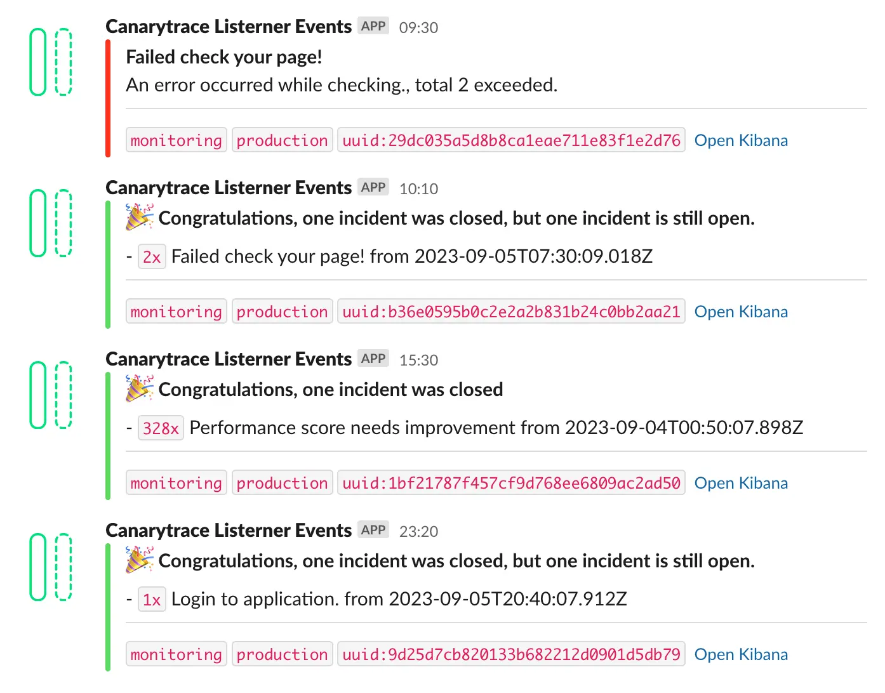

# Listener Agent

The Listener Agent is a Dockerized component that evaluates data from Canarytrace [RUM](../rum/introduction) and Canarytrace Synthetic, which are stored in Elasticsearch.

## Lifecycle

After running the Listener agent, three phases are executed:


### First phase, internal checks
The Listener Agent contains built-in internal checks which verify that Canarytrace is functioning correctly, that Elasticsearch is available, and that it's possible to store data in Elasticsearch. 
- [Go to the list of internal checks](#internal-checks).

### Second phase, rule checking, analysis phase
The Listener Agent contains built-in rules, like a checklist for the quality of the web application. The Listener Agent checks stored data from the Canarytrace Synthetic and Canarytrace RUM against these rules. Thanks to these rules, you do not need know how the web application works properly.
During the analysis phase, rules are evaluated, notifications for critical problems are sent out, and new errors are added to the error queue.

- [Go to the list rules](#rules--checklists).

This phase also includes bug watchers.

### Third phase, overview phase
This phase creates an overview.

import LicenseInfo from '../../src/components/LicenseInfo';

<LicenseInfo app="Canarytrace Listener" />


## Docker image

The Listener Agent is distributed as a [Docker](https://quay.io/repository/canarytrace/listener-agent?tab=tags) image and we recommend running it in a Kubernetes cluster.


:::tip Please always use a latest Docker image
- List of Docker image tags https://quay.io/repository/canarytrace/listener-agent?tab=tags
:::

The [Docker](https://quay.io/repository/canarytrace/listener-agent?tab=tags) image contains not only the Listener engine itself but also built-in rules and the necessary Kubernetes deployment objects.

Upon launching the Docker image with the Listener Agent, the creation of service indices in Elasticsearch happens automatically, followed by the start of individual phases. Once the final phase ends, the Docker image stops and re-run. Thanks to this, the Listener Agent evaluates current data from Canarytrace RUM and Canarytrace Synthetic.

For optimal operation, it's necessary to run the Listener Agent in a Kubernetes cluster. More information can be found in the [Kubernetes](#kubernetes) section.


## Kubernetes

To run the Listener Agent, you need a Kubernetes deployment that includes the Docker image, resources, configurations, and additional parameters. We provide a deployment that you can use as is or modify to your preferences.

### Resources

- To deploy the Listener Agent Server on Kubernetes, several requirements need to be met, including specifying the appropriate resource requests and limits.
- In most cases, one instance of the Listener Agent will be sufficient.

|Resources|CPU Request|CPU Limits|Memory requests|Memory limits|
|-|-|-|-|-|
|One instance of the Listener Agent|`50m`|`200m`|`50Mi`|`300Mi`|


### Deployment

All deployment objects necessary for running the RUM Server are packaged and distributed inside the Docker image. This includes any required configuration files, scripts, and dependencies needed for the deployment process.

#### Download the deployments scripts from the Docker image

```bash title="Download deployments scripts from docker image"
docker run --rm -it --entrypoint /bin/mv -v $(pwd):/k8s quay.io/canarytrace/listener-agent:1.42 /opt/canary-listener/k8s/ /k8s/
```

```bash title="Print directory k8s"
ls -lah k8s 
-rw-r--r--@ 1 rdpanek  staff   788B 31 pro  2022 config-custom-rules.yaml
-rw-r--r--@ 1 rdpanek  staff   9,8K 31 pro  2022 config-internal-rules.yaml
-rw-r--r--@ 1 rdpanek  staff   4,7K 31 pro  2022 config-rum-rules.yaml
-rw-r--r--@ 1 rdpanek  staff   3,9K 31 pro  2022 deployment.yaml
-rw-r--r--@ 1 rdpanek  staff   357B 31 pro  2022 secret.yml
```

- `k8s/config-rum-rules.yaml` - contains configuration of rules for [Canarytrace RUM](../rum/rumClient), more information in the [Rules](#rules) section.
- `k8s/config-internal-rules.yaml` - contains configuration of internal rules for Canarytrace Synthetic, more information in the [Rules](#rules) section.
- `k8s/config-custom-rules.yaml` - contains configuration of your custom business rules. More information in the [Rules](#rules) section.
- `k8s/secret.yaml` - contains Listener configuration, more information in the [Configuration](#configuration) section.
- `k8s/listener.yaml` - contains deployment of Listener Agent, more information in the [Configuration](#configuration) section.

Before deploying the Listener Agent to your Kubernetes cluster, please:
- update the `secret.yaml` and `deployment.yaml` files and their configurations.
- additionally, you may choose to edit the rules in one or more of these files:" `k8s/config-custom-rules.yaml`, `k8s/config-internal-rules.yaml`, and `k8s/config-rum-rules.yaml`. Learn more about the syntax of the rules in the [Rules](#rules) section.

:::tip
Configuration files with rules are in the YAML format. You don't need to edit these files or values if the default configuration meets your requirements.
:::


Deploy these objects to Kubernetes in this order:

1. `k8s/secret.yaml`
2. `k8s/config-custom-rules.yaml`
3. `k8s/config-internal-rules.yaml`
4. `k8s/config-rum-rules.yaml`
5. `k8s/deployment.yaml`

All Kubernetes objects can be deployed using the `kubectl -n` command, followed by the name of the namespace and the `create` option. For example, to deploy a `secret.yaml` file, you would use the command `kubectl -n canarytrace create -f secret.yaml`.

### Check the deployment

Please check, that the Canarytrace Listerer Agent is deployed and running.

Secrects contains configuration of Listener Agent such as connection to Elasticsearch, Slack webhook, etc. More information in the [Configuration](#configuration) section.
```bash title="Check Secrects"
kubectl -n canarytrace get secrets

// result
NAME                               TYPE                                  DATA   AGE
listener-agent-secret              Opaque                                10     451d
```


ConfigMaps contains configuration of rules for [Canarytrace RUM](../rum/rumClient), more information in the [Rules](#rules) section.
```bash title="Check ConfigMaps"
kubectl -n canarytrace get configmaps

// result
NAME                            DATA   AGE
listener-agent-custom-rules     1      213d
listener-agent-internal-rules   1      213d
listener-agent-rum-rules        1      213d
```

The CronJob configuration includes settings for the Listener Agent, such as the version of the Docker image and Kubernetes deployment settings, etc. More information can be found in the [Configuration](#configuration) section.
Thanks to [CronJob](https://kubernetes.io/docs/concepts/workloads/controllers/cron-jobs/), the Listener Agent starts every 10 minutes to check new data from Canarytrace RUM and Canarytrace Synthetic. The ten-minute interval is a default value, which can be modified in the `k8s/deployment.yaml` file.
```bash title="Check CronJobs"
kubectl -n canarytrace get cronjob

// result
NAME                          SCHEDULE       SUSPEND   ACTIVE   LAST SCHEDULE   AGE
listener-agent                */10 * * * *   False     0        6m15s           199d
```

Pods run the Listener Agent instances. Every 10 minutes, the CronJob creates a [Pod](https://kubernetes.io/docs/concepts/workloads/pods/pod/) with the Listener Agent.
But in this example, you see three Pods of the Listener Agent. This means that you're seeing the three most recent instances of the Listener Agent. Therefore, the latest run was 7 minutes ago, the previous run was 17 minutes ago and the first run was 26 minutes ago. 

You can read logs from the three most recent instances of the Listener Agent. More information can be found in the [Log](#log) section.
```bash title="Check Pods"
kubectl -n canarytrace get pods

// result
NAME                                         READY   STATUS      RESTARTS   AGE
listener-agent-28161260-grp2f                0/1     Completed   0          27m
listener-agent-28161270-84pwc                0/1     Completed   0          17m
listener-agent-28161280-2d6df                0/1     Completed   0          7m21s
```

In other cases, you may see a state of pods where one of them has the STATUS `Running`. This means that the Listener Agent is currently executing.
```bash title="Check Pods with running the Listener Agent"
kubectl -n canarytrace get pods

// result
NAME                                         READY   STATUS      RESTARTS   AGE
listener-agent-28161400-f4sjv                0/1     Completed   0          30m
listener-agent-28161410-8tnvn                0/1     Completed   0          20m
listener-agent-28161420-l94gv                0/1     Completed   0          10m
listener-agent-28161430-bnrkl                1/1     Running     0          2s
```

### Log

You can access the log of the Listener Agent from the three most recent instances. To retrieve these logs, you'll need to know the name of the Pod. You can determine the Pod's name from the previous step.


With this Kubernetes command `logs`, you will be able to see the log.
```bash title="Get logs"
kubectl -n canarytrace logs listener-agent-28161280-2d6df
```

#### First phase, internal checks

The first phase is the initiation of internal checks. The Listener Agent examines the health of Elasticsearch, Canarytrace RUM, and Canarytrace Synthetic.

The internal checks are the most important phase, which verifies the health of the Canarytrace toolset and Elasticsearch.

```bash title="The Listener Agent start internal checks"
    __    _      __                      
   / /   (______/ /____  ____  ___  _____
  / /   / / ___/ __/ _ \/ __ \/ _ \/ ___/
 / /___/ (__  / /_/  __/ / / /  __/ /    
/_____/_/____/\__/\___/_/ /_/\___/_/     
                                         
Listener agent: 1 https://canarytrace.com
Node.js: v18.7.0
Listener:lastRuleCheck used is: 2023-07-18T13:10:05.247Z
Listener:rule-analyzer:start
Elasticsearch health check: green, pending: 0
Elasticsearch nodes: 4, max heap: 53%, max ram: 97%, max disk used 2.37%, max cpu 7%, node with highest heap tiebreaker-0000000018
Canarytrace health check: running
Canarytrace lifecycle: OK
DataManager exist: OK
Datamanager: last run before 13 hours
...
```

#### Second phase, analysis phase

The second phase, marked as the analysis phase, is when the Listener Agent loads and evaluates rules, and prepares data for the final phase, known as the overview phase. During the analysis phase, rules are evaluated, notifications for critical problems are sent out, and new errors are added to the error queue.

```bash title="The Listener Agent evaluate rules"
...
Listener: load internal rules.
Listener: loaded 20x internal rules from ./rules/internal.yaml
Listener: load custom rules from ./rules/custom.yaml
Listener: loaded 1x custom rules.
Listener: load RUM rules from ./rules/rum.yaml
Listener: loaded 10x RUM rules.
Listener agent: evaluate 31 rules
---------------------------------

Load time needs improvement, filter: (loadEventEnd gte 3000),(loadEventEnd lt 5000),
analyzers: incidents 0

Load time is poor, filter: (loadEventEnd gte 5000),
analyzers: incidents 0
...
```

Next, the Listener Agent evaluates the error queue, for instance, updating the status of the errors or closing old errors.

```bash title="The Listener Agent evaluate incidents"
...
errors-queue:queue size 1
errors-queue:closing: 1 incidents older 30 minutes.
errors-queue:how long:9min: Performance score needs improvement
errors-queue:not closed
...
```

#### Third phase, Overview phase

The Overview phase is the final phase of the Listener Agent. In this phase, the Listener Agent generates reports and sends them to the configured reporters. It evaluates numerous parameters such as the age of errors and their score, available reporters, appropriate time for sending the report, sentence preparation for improved explanation, and so on.

```bash title="The Listener Agent create reports"
...
Listener:overview:lastEmergencyOverview: check after 60 minutes
Listener:overview:lastEmergencyOverview: last emergency check has taken place before 50 minutes
Listener:overview:stage1: check after 180 minutes
Listener:overview:stage1: stage1 check has taken place before 170 minutes

-------------------------------
Listener aget: uuid: d55bdef17866afdb8e62fddfca3c7a98
Start: Tue Jul 18 13:20:01 UTC 2023
End: Tue Jul 18 13:20:09 UTC 2023
...
```
## Score

All processes in the Listener Agent are governed by a score, which represents the severity of the problem. Each type of defect (Internal checks, Rules/Checklist) has its own score, and the Listener Agent considers this score when deciding what to do with the discovered defect.

**Canarytrace toolkit uses these score tables**

Description | Score | Color
-- | -- | --
needs fix! | 0-30 | red
needs improvement! | 31-70 | orange
good job! | 71-100 | green

- This score table is used in rule definitions, for color coding reporters, and for overview reports. The score also controls alerting.
- The score defines the impact on a real user from 0 = very poor to 100 percent = excellent.

The default rule applies, that a score below 30 is an emergency problem, for example: Performance Score is poor, or Response code 500, or Elasticsearch nodes: java heap is higher than 85%. Events with such a low score represent a problem with the monitored application or an inability to monitor the application.

For instance, if you do not use Data Manager (event: DataManager exists: Not found.), it is not an emergency problem right now, so the score is higher than 30. But, if you do not clean data in Elasticsearch, you will receive a notification about the java heap in Elasticsearch filling up, with a low score.

## Internal checks

Internal checks verify everything necessary to ensure nothing prevents monitoring of web applications, such as whether Canarytrace is running, whether Elasticsearch is accessible, and whether it is not overloaded and does not require maintenance.


Title | Score
-- | --
Elasticsearch health check: yellow | 50
Elasticsearch health check: red | 0
Elasticsearch nodes: java heap is higher than 80% | 50
Elasticsearch nodes: java heap is higher than 85% | 0
Elasticsearch nodes: disk used percentage is higher than 85% | 30
Canarytrace health check: missing data | 0
Canarytrace lifecycle errors | 30
DataManager exist: Not found. | 31

- [Reporters](#reporters) `internal-slack`
- Internal checks are run when the Listener agent starts and before the rules check.

## Rules / Checklists

The Listener agent comes with pre-defined rules / checklist, so you don't necessarily have to intervene in the configuration from the beginning. However, you will likely want to modify certain rules, and for that, you can override the built-in rules. For this purpose, three files are used.

- `rules/internal.yaml` For the quality rules of web applications, especially for checking data from Canarytrace. [Go to the list of internal rules](#internal-rules).
- `rules/rum.yaml` Rules for monitoring data from the [Canarytrace RUM](../rum/introduction). [Go to the list of RUM rules](#rum-rules).
- `rules/custom.yaml` For your own custom business rules. [Go to the list of custom rules](#custom-rules).

All three files are deployed to Kubernetes as a ConfigMap, and you can modify their content during runtime. The changes will take effect upon the next start of the Listener agent.

Individual rules are defined in these files using the '[range](#type-range)', '[contains](#type-contains)', and '[match](#type-match)' types. Using these types, you can modify or construct a robust list of rules for your business thresholds.

The syntax in the rules is used to generate a query in Elasticsearch, so if the rule is true ⇒ the query in Elasticsearch found data corresponding to the rule ⇒ event creation ⇒ reporting.

### `rules/internal.yaml`


Title | Index | Condition | Count / hour | Score
-- | -- | -- | -- | --
Load time needs improvement | c.performance-entries | > 3000ms | 5 | 40
Load time is poor | c.performance-entries | > 5000ms | 5 | 20
Higher response time. | c.performance-entries | > 3000ms | 10 | 40
Performance Score is poor | c.audit | 0 - 49 | 3 | 20
Performance Score needs improvement | c.audit | 50 - 89 | 3 | 60
FCP needs improvement | c.audit | 1800 - 3000 | 3 | 40
FCP is poor | c.audit | > 3000 | 3 | 20
LCP needs improvement (CoreWebVitals). | c.audit | > 2500ms | 5 | 40
LCP is poor (CoreWebVitals). | c.audit | > 4000ms | 5 | 40
CLS needs improvement (CoreWebVitals) | c.audit | > 0.1 | 5 | 40
CLS is poor (CoreWebVitals) | c.audit | > 0.25 | 5 | 30
TBT needs improvement | c.audit | 200 - 600 | 3 | 40
TBT is poor | c.audit | > 600 | 3 | 20
TTI needs improvement | c.audit | > 3900ms | 5 | 40
TTI is poor | c.audit | > 7300ms | 5 | 20
Response with Javascript must contains gzip or brotli compression. | c.request-log | gzip or br missing in headers.content-encoding | 10 | 40
Responses with CSS files must contains gzip or brotli compression. | c.request-log | gzip or br missing in headers.content-encoding | 10 | 40
Response code 400 | r.request-log | >= 400 | 5 | 80
Response code 500 | r.request-log | >= 500 | 5 | 20
Failed check your page! | c.report | test step failed | 2 | 10

### `rules/rum.yaml`

Title | Index | Condition | Count / hour | Score
-- | -- | -- | -- | --
LCP needs improvement (RUM) | c.rum.metrics | 2500ms - 4000ms | 2 | 40
LCP is poor (RUM) | c.rum.metrics | >= 4000ms | 2 | 20
CLS needs improvement (RUM) | c.rum.metrics | 0.1 - 0.25 | 5 | 40
CLS is poor (RUM) | c.rum.metrics | >= 0.25 | 5 | 30
FID needs improvement (RUM) | c.rum.metrics | 100 - 300 | 2 | 20
FID is poor (RUM) | c.rum.metrics | >= 300 | 5 | 30
FCP needs improvement (RUM) | c.rum.metrics | 1800 - 3000 | 3 | 40
FCP is poor (RUM) | c.rum.metrics | >= 3000 | 3 | 20
TTFB needs improvement (RUM) | c.rum.metrics | 400 - 800 | 3 | 40
TTFB is poor (RUM) | c.rum.metrics | >= 800 | 3 | 20

### `rules/custom.yaml`

It contains only an example of a possible business rule (maximum time for user login to the application).

## Rule syntax

- The Listener Agent loads and parses rules from files `rules/internal.yaml`, `rules/rum.yaml`, and `rules/custom.yaml`. You can choose one of the three types of rules, each with a different syntax and use case.
- All these rule files are included inside the Docker image with the Listener Agent. If you wish to change a value, modify a rule, add a new rule, or delete a rule, you can override these files with your custom set of rules. Simply create a config-map and deploy it into Kubernetes.


**Example of one rule definition**
- This rule is of type `range`, searching for items with a label `loadEventEnd` and a value between `3000` and `5000` ms in the `c.performance-entries` index.
- If the Listener Agent finds a minimum of 5 items that match this condition, it automatically saves the event into the `c.listener.events` index and sends a [report](#reporters) to Slack.
- For creating the report body, additional labels `loadEventEnd` and `timestamp` are used.

```yaml
  - type: range
    title: "Load time needs improvement"
    index: c.performance-entries
    filter:
    - field: 'loadEventEnd'
      operator: 'gte'
      value: 3000
    - field: 'loadEventEnd'
      operator: 'lt'
      value: 5000
    min: 5
    score: 40
    reportLabels:
    - 'loadEventEnd'
    - 'timestamp'
    reporters:
    - type: slack
      message: "Page is complete loaded."
```

### type `range`
If the page load time is between 3 and 5 seconds, then create an event and send a report.

**Example rule**

- This rule evaluates if there are at least 5 items in the `c.performance-entries` index, and if these items have a label `loadEventEnd` with a value between `3000` and `5000` ms.

```yaml
rules:
  - type: range
    title: "Load time needs improvement"
    index: c.performance-entries
    filter:
    - field: 'loadEventEnd'
      operator: 'gte'
      value: 3000
    - field: 'loadEventEnd'
      operator: 'lt'
      value: 5000
    min: 5
    score: 40
    reportLabels:
    - 'loadEventEnd'
    - 'timestamp'
    reporters:
    - type: slack
      message: "Page is complete loaded."
```

**Mandatory parts**
- `title` rule name
- `index` Elasticsearch index
- `score` define score by score table, more info in chapter [Score table](#score)
- `reporters` are list of reporters type, which are you want use for sending notice about the rule exceeded. You must use at least one reporter type and you can combine them. E.g. only `slack` or ( `slack` and `email`  )

**Optional parts**
- `filter` is array of filters. Each filter must contains:
  - `field` name of field from Elasticsearch index
  - `operator` can contains value `lt`, `lte`, `gt` and `gte` and
  - `value`
 - `min` this rule will be true only in case, that was found minimal `min` items in Elasticsearch index. If is not `min` used, will be the Listener Agent report all findings.

### type `contains`

**Example rule**
Check if there are any CSS files in the web app responses without gzip or brotli compression. If yes, then create an event and send a report.

- This rule evaluate if exists minimal 10 items in `c.request-log` index and if these items has field `response.headers.content-type` with value `css` plus field `response.headers.content-encoding` must not have values `gzip` and `br`

```yaml
rules:
  - type: contains
    title: "Responses with CSS files must contains gzip or brotli compression."
    index: c.request-log
    field: response.headers.content-type
    value: 'css'
    expression:
      field: 'response.headers.content-encoding'
      operator: must_not
      values:
      - 'gzip'
      - 'br'
    min: 10
    score: 40
    reportLabels:
    - 'url'
    - 'timestamp'
    reporters:
    - type: slack
      message: "Use Brotli for plain text compression."
```

**Mandatory parts**
- `title` rule name
- `index` Elasticsearch index
- `score` define score by score table, more info in chapter [Score table](#score)
- `reporters` are list of reporters type, which are you want use for sending notice about the rule exceeded. You must use at least one reporter type and you can combine them. E.g. only `slack` or (`slack` and `email`)
- `field` items must contains this field
- `value` items with `field` must contains exactly value 
- `expression` is a subset of conditions
    - `operator` can contains `must` or `must_not`
    - `values` is an array with with strings. Each items are `and`.

**Optional parts**
- `filter` is array of filters. Each filter must contains:
  - `field` name of field from Elasticsearch index
  - `operator` can contains value `lt`, `lte`, `gt` and `gte` and
  - `value` 
 - `min` this rule will be true only in case, that was found minimal `min` items in Elasticsearch index. If is not `min` used, will be the listener-agent report all findings.

### type `match`

**Example rule**


- This rule evaluates if there are at least 2 items in the `c.report-* index`. Additionally, it checks if these items have the field `passed` with the value `false`.

```yaml
rules:
  - type: match
    title: "Failed check your page!"
    index: c.report
    field: passed
    operator: must
    expected: false
    min: 2
    score: 10
    reportLabels:
    - 'fullTitle'
    - 'timestamp'
    reporters:
    - type: slack
      message: "An error occurred while checking."
```

**Mandatory parts**
- `title` rule name
- `index` Elasticsearch index
- `score` define score by score table, more info in chapter [Score table](#score)
- `reporters` are list of reporters type, which are you want use for sending notice about the rule exceeded. You must use at least one reporter type and you can combine them. E.g. only `slack` or (`slack` and `email`)
- `field` items must contains this field
- `operator` you can use `must` or `must_not`
- `value` items with `field` must contains exactly value 

**Optional parts**
 - `min` this rule will be true only in case, that was found minimal `min` items in Elasticsearch index. If is not `min` used, will be the listener-agent report all findings.

## Elasticsearch
The Listener Agent autonomously creates and utilizes these indices in Elasticsearch:

- `c.lister-*` - A configuration index for the Listener Agent. This index contains time pointers for the reporting mechanism.
- `c.listener.events-*` - Contains all information and evaluations of rules, bugs, and other items. It serves as the source of truth and is the most interesting index for you. You can only observe this index, as the Listener Agent stores all information here. This index is useful for your subsequent tools, which can utilize this index to evaluate rules for your upcoming actions/flows, e.g., automatically creating an incident ticket in Jira.
- `c.listener.queue` - Contains all open and closed bugs. It's an interesting place for you to monitor current bugs and their statuses. This index also facilitates the reporting mechanism for sending notifications about bugs and their statuses.

#### Example

In our internal rules, this rule is defined:

Find entries with a `performance.score` value between `50` and `89` in the `c.audit` index. If the Listener Agent finds at least 3 such items, it creates an event in the `c.listener.events` index and sends a report to Slack.

```yaml title="./internal.yaml"
- type: range
  title: "Performance score needs improvement"
  index: c.audit
  filter:
  - field: 'categories.performance.score'
    operator: 'lte'
    value: 89
  - field: 'categories.performance.score'
    operator: 'gte'
    value: 50
  min: 3
  score: 60
  reportLabels:
  - 'categories.performance.score'
  - 'finalUrl'
  - 'timestamp'
  reporters:
  - type: slack
    message: "The Performance score is a weighted average of the metric scores. https://web.dev/performance-scoring/"
```

### Events

If the Listener Agent evaluates the rule and finds data that conforms to the definition of the rule described above, it will create an event in the `c.listener.events` index. This event will contain:
- `tag` - ok, a defect is in production
- `uuid` - a unique identifier of the Canarytrace Synthetic run. Using this identifier, you can find all other information about this run, e.g., response time, other performance metrics, etc.

The result is that the Listener Analytics found three items in the `c.audit` index that match the rule definition, and thanks to the `documents` array, you can view the identified items.

```json title="event in the c.listener.events index"
{
  "type": "events",
  "rule": "range",
  "tags": [
    "monitoring",
    "production",
    "uuid:cf3e728924301423c9b80b87498f2f82"
  ],
  "kibana_endpoint": "https://xyc.eu-central-1.aws.cloud.es.io:9243",
  "score": 60,
  "title": "Performance score needs improvement",
  "description": "The Performance score is a weighted average of the metric scores. https://web.dev/performance-scoring/, total 3 exceeded.",
  "documents": [
    {
      "_index": "c.audit-2023.09.05",
      "_id": "vl5jZYoBn60ExuFaYhmL",
      "categories.performance.score": 86,
      "finalUrl": "https://canarytrace.com/",
      "timestamp": "2023-09-05T12:48:46.529Z"
    },
    {
      "_index": "c.audit-2023.09.05",
      "_id": "K15fZYoBn60ExuFarxia",
      "categories.performance.score": 86,
      "finalUrl": "https://canarytrace.com/",
      "timestamp": "2023-09-05T12:44:44.111Z"
    },
    {
      "_index": "c.audit-2023.09.05",
      "_id": "nN5cZYoB5js_HTi8Bx-E",
      "categories.performance.score": 86,
      "finalUrl": "https://canarytrace.com/",
      "timestamp": "2023-09-05T12:40:44.492Z"
    }
  ],
  "timestamp": "2023-09-05T12:50:09.133Z"
}
```

### Error Queue

If the analyzer finds a match between the rule and the data from Canarytrace Synthetic or Canarytrace RUM, an item will be created in the `c.listener.queue` index.

If this item in `c.listener.queue` already exists, the analyzer updates this error with the count of repetitions and the last occurrence time.

- `score` represents the weight of the error and is defined in the corresponding rule. More info can be found in the chapter [Score Table](#score).
- `incidents` refer to the total number of item occurrences in your data that match the rule definition or exceed the threshold defined in the corresponding rule.
- `startTime` indicates the time of the first occurrence of the item in your data. The Listener agent can open and close the same error several times during one day. Therefore, the start time is the time of the first occurrence when the same type of error doesn't exist in the state `open`.
- `repetition` refers to the iterations of the Listener Agent reviewing your data. In other words, it indicates how many times the Listener Agent found the same error in your data.
- `open`: if the item is marked as `true`, it means that the error is valid and still exists in your web application. The Elasticsearch index `c.listener.queue` also contains closed errors, which is useful for reviewing how often the same error occurs in your web application and how long it exists before it disappears.

```json title="error in the c.listener.queue index"
{
  "lastTime": "2023-09-05T15:50:08.165Z",
  "score": 60,
  "incidents": 21,
  "description": "",
  "startTime": "2023-09-05T13:50:08.611Z",
  "title": "Performance score needs improvement",
  "repetition": 6,
  "open": true
}
```


## Reporting


The Listener Agent wants to send important notifications regarding the health of your web application to you, but only at appropriate times, when it makes sense. The reporting mechanisms are controlled by the score of errors and events, which dictate the severity of the incident and the timing of notifications.

Incidents with a very low score are marked as critical, and you will be notified about these types of incidents immediately and repeatedly until the incident is resolved. This critical stage will alert you to issues such as Elasticsearch being unavailable, Canarytrace not functioning, or our webpage being inaccessible, etc.

The Listener Agent has multiple stages, which ensure distributed notifications based on the score of the incident and the time. Therefore, do not worry; the Listener Agent will not spam you. Instead, you will be notified immediately about critical problems, and simultaneously receive an overview of less critical issues that still require your attention.

Please utilize all available reporting channels, such as Slack and Email. The Listener Agent determines which reporter use.

### Reporters

The Listener Agent supports the following reporters:

- `slack-internal` - Sends a message into Slack when there are problems with Elasticsearch or the Canarytrace toolset. We recommend that individuals from technical support, DevOps, or SRE monitor this channel.
- `slack` - Sends a message to Slack when a certain rule is mached and the score is lower than `30`.
- `email` - Sends an email when a rule is mached and the score is lower than `30`, or in the case of emergency issues.
- `events` - This reporter stores all events and other Listener Agent activities in the `c.listener.events` index. It is used to log instances where rules are mached, meaning that when the emergency reporter sends a notification to slack-internal, or if a rule is exceeded and a report is sent to slack or e-mail, a copy of the report will be saved in the `c.listener.events`. index.

#### Example
This example show events sends to Slack as result from analyzer which by rules checks data from Canarytrace Syntethic. 
1. `Failed check your page!` means, that the Listener Agent found at least 2 items in the `c.report` index, which have the field `passed` with the value `false`.
2. dfdf




## Configuration

Popsat konfiguraci

The Listener Agent can be configured using environment variables and these configuration you use `k8s/deployment.yaml` file.

- `ENV_PRINT`
- `TAGS`
- `ELASTIC_CLUSTER`
- `ELASTIC_HTTP_AUTH`
- `KIBANA_ENDPOINT`
- `SLACK_WEBHOOK_URL_INTERNAL`
- `SLACK_WEBHOOK_URL`
- `EMAIL_SMTP_SERVER`
- `EMAIL_SMTP_PORT`
- `EMAIL_SMTP_USER`
- `EMAIL_SMTP_PASS`
- `EMAIL_EMERGENCY`
- `LICENSE`


- `INTERNAL_RULES_PATH`, default './rules/internal.yaml'`
- `CUSTOM_RULES_PATH`, default './rules/custom.yaml'`
- `RUM_RULES_PATH`, default './rules/rum.yaml'`
- `PRINT_RULES='allow'`, default `no` print evaluated rules into stdout

overview
- `EMERGENCY_AFTER_MIN`
- `STAGE1_AFTER_MIN`
- `STAGE1_REPETETION`
- `KIBANA_ENDPOINT`
- `TAGS`


## Data Manager

Pro Listener DM udělat vlastní stránku


import FeedbackFooter from '../../src/components/FeedbackFooter';

<FeedbackFooter />