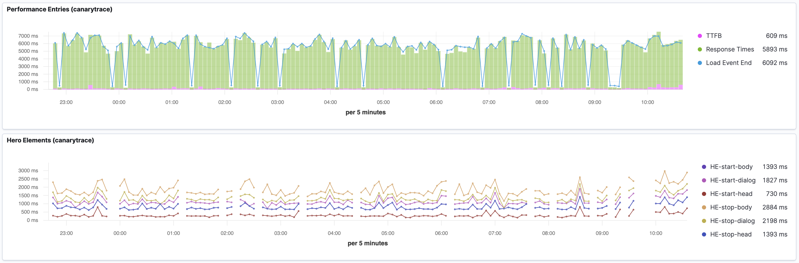

## Elasticsearch

### ResponseError: parse_exception

- `-e ELASTIC_REQUEST_COMPRESSION=allow`
- [CLI Options](/docs/guides/cli) 

Some version of elasticsearch return ResponseError: `parse_exception` in this case don't use compression.
```
[0-0] {
  root_cause: [ { type: 'parse_exception', reason: 'request body is required' } ],
  type: 'parse_exception',
  reason: 'request body is required'
}
```

### TimeoutError: Request timed out
- `-e ELASTIC_TIMEOUT=10000`
- [CLI Options](/docs/guides/cli) 

Default value of `ELASTIC_TIMEOUT` option is very small. You can set higher requestTimeout and pingTimeout e.g. `-e ELASTIC_TIMEOUT=10000` but even if the default value is not sufficient, consider upgrading the network or increasing the sizing of the elastic cluster.

```
# err message
on:response:err: requestId: 1
[0-0] TimeoutError: Request timed out
    at ClientRequest.<anonymous> (/Users/rdpanek/HTDOCS/teststack/canarytrace/node_modules/@elastic/elasticsearch/lib/Connection.js:89:18)
    at ClientRequest.emit (events.js:311:20)
...
```

### Live reporting debugging
- `-e ELASTIC_OBSERVABILITY=allow`
- [CLI Options](/docs/guides/cli) 

This print settings of elasticsearch connection, request and response events and payload to stdout.

```
# settings
[0-0] {
  node: 'http://localhost:9200',
  maxretries: 5,
  log: 'error',
  requestTimeout: '100',
  pingTimeout: '100',
  auth: { username: 'elastic', password: '1fKP17UklmiI14rekO6iCx9r' },
  ssl: { rejectUnauthorized: false }
}

# payload
[0-0] payload {
  uuid: '3018371a-0e53-4625-9f9a-ce50f0692892',
  seleniumCluster: 'localhost',
  baseUrl: 'https://www.tesla.com/',
  capabilities: {
    maxInstances: 1,
    browserName: 'chrome',
    'goog:chromeOptions': { args: [Array] }
  },
  event: 'testStart',
  sessionId: 'e299f9137aaac714ff68d35e357c8cf0',
  sequence: 1,
  env: 'localhost',
  spec: './tests/tesla/smoke.js',
  timestamp: '2020-07-31T11:39:24.076Z'
}

# request
[0-0] on:request: requestId: 1
[0-0] {
  body: null,
  statusCode: null,
  headers: null,
  warnings: null,
...

# response
[0-0] on:response: requestId: 1
[0-0] {
  body: {
    _index: 'c.report-2020.07.31',
    _type: '_doc',
    _id: 'W4KrpHMBFgRwPBhYah66',
    _version: 1,
    result: 'created',
    _shards: { total: 2, successful: 1, failed: 0 },
    _seq_no: 0,
    _primary_term: 1
  },
  statusCode: 201,
  headers: {
    location: '/c.report-2020.07.31/_doc/W4KrpHMBFgRwPBhYah66',
    'content-type': 'application/json; charset=UTF-8',
    'content-length': '186'
  },
...
```

Every request and response has the same requestId e.g. `[0-0] on:response: requestId: 1` each additional request creates an incremental requestId.


## Kibana

### Visualizations aren’t smoothly

There may be several reasons for this
- Your monitor script contains some errors. Please use `kubectl -n canary logs -f <name-of-pod> -c` canary for check logs, or you can check `.filebeat` index in a Kibana
- You don’t have sufficient resources on your k8s cluster for run Canarytrace instance.



## Canarytrace

### JavaScript heap out of memory

Sometimes a performance audit consumes more resources because individual audits can be more challenging.

```bash title="Canarytrace log from docker container"
...
[0-0] Tue, 29 Jun 2021 07:49:41 GMT status Auditing: Serve images in next-gen formats
[0-0] Tue, 29 Jun 2021 07:49:42 GMT status Auditing: Efficiently encode images
[0-0] Tue, 29 Jun 2021 07:49:42 GMT status Auditing: Enable text compression
[0-0] Tue, 29 Jun 2021 07:49:42 GMT status Auditing: Properly size images
[0-0] Tue, 29 Jun 2021 07:49:42 GMT status Auditing: Use video formats for animated content
[0-0] Tue, 29 Jun 2021 07:49:42 GMT status Auditing: Remove duplicate modules in JavaScript bundles
[0-0] 
[0-0] <--- Last few GCs --->
[0-0] 
[0-0] [17:0x7fee6af372c0]    87386 ms: Scavenge (reduce) 253.7 (256.1) -> 253.6 (257.8) MB, 90.5 / 0.0 ms  (average mu = 0.752, current mu = 0.603) allocation failure 
[0-0] [17:0x7fee6af372c0]    88691 ms: Mark-sweep (reduce) 254.3 (256.8) -> 253.8 (258.4) MB, 1301.8 / 0.0 ms  (+ 0.0 ms in 28 steps since start of marking, biggest step 0.0 ms, walltime since start of marking 1402 ms) (average mu = 0.551, current mu = 0.224) a
[0-0] 
[0-0] <--- JS stacktrace --->
[0-0] 
[0-0] FATAL ERROR: MarkCompactCollector: young object promotion failed Allocation failed - JavaScript heap out of memory
[0-0] FAILED in chrome - /smoke/smoke.js
2021-06-29T07:49:48.955Z INFO @wdio/cli:launcher: Run onComplete hook

Spec Files:	 0 passed, 1 failed, 1 total (100% completed) in 00:01:33 
```

**Solutions**

Please increase resource for Canarytrace docker image:

```bash title="CronJob with Canarytrace docker image" {7}
...
  - name: LICENSE
    value: XXXXX-XXXXX-XXXXX-XXXXX-XXXXX-XXXXX
resources:
  limits:
    cpu: 300m
    memory: 600Mi
  requests:
    cpu: 200m
    memory: 300Mi
```

---

Do you find mistake or have any questions? Please [create issue](https://github.com/canarytrace/documentation/issues/new/choose), thanks 👍