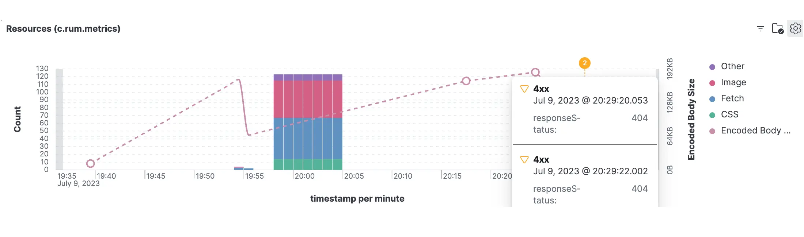

> ### What you’ll learn
- What is a Kibana?
- What interpret graphs?
- How to build custom visualizations?


## What is a Kibana?

[Kibana](https://www.elastic.co/what-is/kibana) Kibana is an free and open frontend application that sits on top of the Elastic Stack, providing search and data visualization capabilities for data indexed in [Elasticsearch](./elasticsearch).

We utilize Kibana as a powerful data visualization tool to interpret and analyze the data acquired from the [RUM Server](./rumServer) and stored in [Elasticsearch](./elasticsearch). Kibana enables us to gain valuable insights into the vitality and potential issues with the web pages monitored by Canarytrace on real client devices. By leveraging the capabilities of Kibana, we can effectively visualize and explore the data collected from Canarytrace RUM to identify performance patterns, diagnose problems, and make informed decisions for optimizing web performance.

:::info

Please read [Kibana documentation](https://www.elastic.co/what-is/kibana)

:::

Thanks to Kibana, you can monitor key health metrics (such as errors, performance, memory usage, etc.) and observe user behaviors (including user journeys, [actions](./rumClient#actions), context, visits, etc.) in your web application.


## Scenarios

You will certainly be interested in a wealth of information about the performance of your website on your users' devices, such as:

### User-Centric and Business Metrics

- The number of actual users interacting with your website.
- The number of visits every hour.
- The most visited pages.
- The length of time users spend on your product page.
- The pages users visit before they leave your website, and what their journey looks like.
- The most popular products.
- The behavior of your users on your website.
- The platforms, browsers, and devices used by your users.
- When users see your banner and when they click on it.

### Performance and Technical Metrics

- The 95th percentile of [LoadTime](../glossary/webperf#duration) and its trend for every page.
- The 95th percentile of [Core Web Vitals](../glossary/webperf#core-web-vitals) and its trend.
- The 95th percentile of [TTFB](../glossary/webperf#ttfb) and its trend.
- [Frontend errors](#browser-console).
- [Long Tasks](../glossary/webperf#long-task) and smoothness as measured by [FPS](../glossary/webperf#fps).
- [Actions](./rumClient#actions) and [Events](./rumClient#events).
- Whether the page is loaded in a hidden tab.
- [Web Performance Metrics](./rumClient#metrics).
- The slowest resources and those that are blocking.
- [Detailed information about user devices](./rumClient#attributes), including browsers, platforms, CPU, memory, network, etc.

:::tip How to observe quality of your website?
You can use:
- [Query	DSL](#query-dsl) directly in Kibana or 
- you can use [visualizations](#visualizations) for a better understanding and for a quick overview of the health of your website.

For both options, whether you use Query SQL or visualize the data, you're always working with data stored in indices within Elasticsearch. These indices contain more interesting information than what might even be displayed in the visualizations, e.g. you can see the exact [User Agent](./rumClient#attributes) of the user's device, or you can see the exact [URL](./rumClient#attributes) of the page that the user visited, protocols, request order, etc.

I recommend reading the [RUM Client](./rumClient) documentation to understand what data is collected and stored in Elasticsearch.

:::


## Query DSL

You can use Kibana > DevTools > Console to search for information, or you can use visualizations for a better understanding and for a quick overview of the health of your website.

Example: Find all sessions with [FPS](../glossary/webperf#fps) lower than 30, sorted by timestamp descending and display [FPS](../glossary/webperf#fps), timestamp, and labels.
```json title="Query DSL example"
GET c.rum.metrics-*/_search
{
  "_source": ["view.fps.fps","view.fps.timeStamp", "timestamp", "attributes.labels"],
  "query": { 
    "bool": { 
      "must": [
        {
          "range": {
            "view.fps.fps": {
              "lte": "30"
            }
          }
        }
      ]
    }
  },
  "sort": [{ "timestamp": "desc" }]
}
```
For more information about query DSL, please read [Elasticsearch documentation](https://www.elastic.co/guide/en/elasticsearch/reference/current/query-dsl.html).


## Visualizations
All data stored in Elasticsearch is organized in a timeline, so Kibana visualizations also display data on a timeline. In the visualizations below, you can see the timeline on the x-axis, while the y-axis displays the values of the metrics. The timeline can be adjusted to display data for a specific time period, such as the last 24 hours, last 7 days, or last 30 days. You can also zoom in on a specific time period by selecting a portion of the timeline. The data displayed in the visualizations will be updated to reflect the selected time period.

The data displayed in these visualizations is not truncated; what the [RUM Client](./rumClient) sends to the [RUM Server](./rumServer) is stored in Elasticsearch and displayed in Kibana.

### FPS and long tasks
One of the most useful visualizations for identifying a website's performance on a real device involves [Frames Per Second (FPS)](../glossary/webperf#fps) and [Long Task](../glossary/webperf#long-task) visualizations.

For your is important to know, that your web application run smoothly on the client device. The FPS and Long Tasks visualizations can help you identify performance issues that may be causing your web application to run slowly.

Lower is better.


This graph illustrates the FPS and Long Tasks for a specific page. The FPS is represented both as a line graph (actual) and as a bar graph (minimal), while the Long Tasks are depicted as red circles, each indicating the count of Long Tasks. FPS is measured in frames per second, whereas Long Tasks are measured in milliseconds. Both FPS and Long Tasks are plotted on a timeline, enabling a view of their changes over time.

This graph aggregate fields `view.fps.fps` and `view.longTasks.duration > 50` from `c.rum.metrics-*` index.
More information about [FPS](../glossary/webperf#fps) and [Long Tasks](../glossary/webperf#long-task).


### Active sessions
Easy view on active users which are currently work with your web application.


This graph aggregates all unique `session.id` fields from the `c.rum.metrics-*` index, as each user has a unique session id. If a user is inactive for a long period, the session is closed and a new one is created. Read more about the [session lifecycle](../rum/rumClient#session).

### Metrics
This graphs show all important metrics on timeline and you can follow the relationships between them. For more information about metrics in this graph, please read our glossary [webperf](../glossary/webperf).

These graphs display all important metrics on a timeline, allowing you to track the relationships between them. For more information about the metrics in these graphs, please refer to our [web performance glossary](../glossary/webperf).


This graph aggregate fields: [`percentile(metrics.fcp, percentile=95)`](../glossary/webperf#fcp), [`percentile(metrics.fid, percentile=95)`](../glossary/webperf#fid), [`percentile(metrics.cls, percentile=95)`](../glossary/webperf#cls), [`percentile(metrics.inp, percentile=95)`](../glossary/webperf#inp), [`percentile(metrics.lcp, percentile=95)`](../glossary/webperf#lcp), [`percentile(metrics.duration, percentile=95)`](../glossary/webperf#duration), [`percentile(metrics.domComplete, percentile=95)`](../glossary/webperf#domcomplete), [`percentile(metrics.domContentLoadedEventEnd, percentile=95)`](../glossary/webperf#domcontentloadedeventend)

from the `c.rum.metrics-*` index.

### Hero Elements
Thanks to [Hero Elements](./rumClient#heroelements), you will know what was displayed to the user in the viewport on their real device. This could include elements such as the menu, images, text, products, server responses, etc.


This graph aggregates fields `max(view.marks.startTime)` from the `c.rum.metrics-*` index. More information about Hero Elements can be found in the [RUM Client](./rumClient#heroelements) documentation.

### Actions
This graph shows the number of clicks on the page. 

It is very useful to know which buttons and other parts of the your web are most used by users and together with [Visits pages](#visits-pages) you can identify the most important user actions and user journeys.


This graph shows `max(view.actions.timeStamp)` from the `c.rum.metrics-*` index. More information about Actions can be found in the [RUM Client](./rumClient#actions) documentation.

### Visits pages

This graph helps you to identify the most visited pages, how long users stay on the page, and how smoothly and quickly the pages load. It provides an instant look at the most important pages.


This graph aggregates fields `view.id`, `unique_count(view.startTime)`, [`percentile(session.duration, percentile=95)`](./rumClient#session), [`percentile(view.fps.fps, percentile=95)`](../glossary/webperf#fps) and [`percentile(metrics.lcp, percentile=95)`](../glossary/webperf#lcp) from the `c.rum.metrics-*` index.

### Resources
This table shows the amount of resources transferred from your server and third-party servers to the client device. It's important for you to monitor how many resources are being transferred to the client device, ensure the resource size doesn't grow excessively, and identify which resources are larger and heavier.

Additionally, you can identify which resources are not available (e.g., those returning a '404 Not Found' error), so you can fix them. You can also see which resources are marked by the web browser as blocking for fast loading, determine their size, and identify which pages are loading them.




This table aggregate fields `max(view.resourceTypes.css.count)`, `max(view.resourceTypes.fetch.count)`, `max(view.resourceTypes.image.count)` and `max(view.resourceTypes.other.count)` from the `c.rum.metrics-*` index. If you need information about more resources, you can add those resources to the table or graph.

For more information about resources, please refer to [Browser Data Collected](./rumClient#browser-data-collected) and [data from view](./rumClient#view) sections.

### Browser console
This table helps you to identify errors and exceptions that occur in the web browser or your web application on the client device.


For this table are aggregated fields `view.console.type`, `view.console.value` and count(view.console.type) from the `c.rum.metrics-*` index.

### Content Security Policy
This graph shows amount of violations of [Content Security Policy](https://developer.mozilla.org/en-US/docs/Web/HTTP/CSP) on your web application. More information about CSP reporter you can find in the [RUM Server](./rumServer#content-security-policy) section.

This graph shows records about violation from the `c.rum.csp.reporting-*` index.


The CSP Report shows violations of the Content Security Policy in your web application, including the directive, blocked URI, and a sample of the problematic code if it is available.


This table aggregate fields `type`, `body.blockedURL`, `body.effectiveDirective` and `body.sample` from the `c.rum.csp.reporting-*` index.


### Others
You can find additional visualizations in our dashboard, such as: [LoadPage](../glossary/webperf#duration), [LCP](../glossary/webperf#lcp), types of violated CSP directives, types of user platforms, types of used web browsers, and many more.


This mini graphs aggregate fields from the `c.rum.metrics-*`, `c.rum.entries-*` and `c.rum.csp.reporting-*` indices.


## How to get visualizations?

If you wish, you can use our prepared visualizations that are stored within the Docker image with the [RUM Server](./rumServer). These can simply be exported for use. However, if you prefer, you have the option to create your own visualizations instead.

```bash title="Get Kibana visualizations and dashboard"

```bash title="Get visualizations"
docker run --rm -it --entrypoint /bin/mv -v $(pwd):/kibana quay.io/canarytrace/rum:latest /opt/canary-rum/kibana/ /kibana/
```

```bash title="Print directory kibana"
ls -lah kibana 
-rw-r--r--@ 1 rdp  staff    21K 12 čvc 04:22 dashboard.ndjson
-rw-r--r--@ 1 rdp  staff    61K 12 čvc 04:22 visualizations.ndjson
```

### Import
Importing visualizations and dashboards is not an easy process because Kibana does not offer ideal solutions for exporting and importing created objects such as visualizations. This process also depends on your version of Kibana.

Let's go step by step:

1). Start by using Canarytrace RUM to create the first [Elasticsearch indices](./elasticsearch#list-of-indices) with RUM data. These indices will be automatically created in your Elasticsearch.

2). To create a Data View, navigate to your Kibana Menu > Stack Management > Data Views. Create a data view for all [indices](./elasticsearch#list-of-indices). For example, Name = c.rum.entries-, Index pattern = c.rum.entries- and Timestamp field = timestamp.

3). To import Visualizations and Dashboards, go to your Kibana Menu > Stack Management > Saved Objects. Import the visualizations first and then the dashboard.

import FeedbackFooter from '../../src/components/FeedbackFooter';

<FeedbackFooter />