> ### What you’ll learn
- What is a Kibana?
- What interpret graphs?
- How to build custom visualizations?

## What is a Kibana?

[Kibana](https://www.elastic.co/what-is/kibana) Kibana is an free and open frontend application that sits on top of the Elastic Stack, providing search and data visualization capabilities for data indexed in [Elasticsearch](./elasticsearch).

We utilize Kibana as a powerful data visualization tool to interpret and analyze the data acquired from the [RUM Server](./rumServer) and stored in [Elasticsearch](./elasticsearch). Kibana enables us to gain valuable insights into the vitality and potential issues with the web pages monitored by Canarytrace on real client devices. By leveraging the capabilities of Kibana, we can effectively visualize and explore the data collected from Canarytrace RUM to identify performance patterns, diagnose problems, and make informed decisions for optimizing web performance.

:::info

Please read [Kibana documentation](https://www.elastic.co/what-is/kibana)

:::

## Hlavní RUM Vizualizace
- [x] Aktuálně aktivních session
- [x] Počet návštěv
- [x] 95%th LoadTime aktuální a trend
- [x] 95%th CVW
- [x] 95%th TTFB aktuální a trend
- [x] Frontend errors a trend
- [x] LongTasks a trend
- [x] TOP urls, browsers, devices(desktop, mobil), platforma(iOS, Android)

**Všechny pohledy**
- Hlavní RUM vizualizace
- Failing Resources
- Users most affected by issues
- Sessions and trends, js errors, time spent 
- High memory consuption views
- Performance monitoring
	- Seznam top stranek a u nich CVW, TTFB, errors a devices
	- Seznam stranek s velmi nízkým score
- Detail vybraného view/stránky
	- prakticky stejné jako performance monitoring
	- chyby, trendy atp

**Vizualizace**
- CVW
- Page Views by Version
- Total Errors by Version
- Ongoing Issues
- Top Browsers
- Top Devices
- Top Pages
- Total Sessions
- User Sessions
- Session Duration (avg)
- Count of resources grouped by type
- Slowest resources
- XHR and Fetch requests with status code >= 400
- XHR and Fetch requests grouped by method
- Resource timings

## Visualizations
All data stored in Elasticsearch is organized in a timeline, so Kibana visualizations also display data on a timeline.

### FPS and long tasks
One of the most useful visualizations for identifying a website's performance on a real device involves Frames Per Second (FPS) and Long Task visualizations.
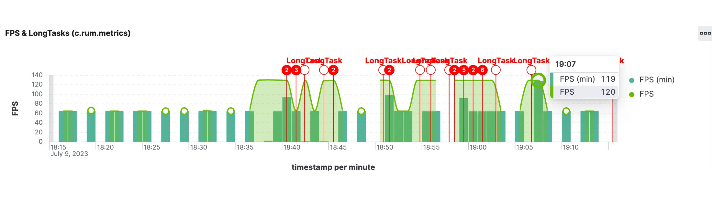

### Active sessions
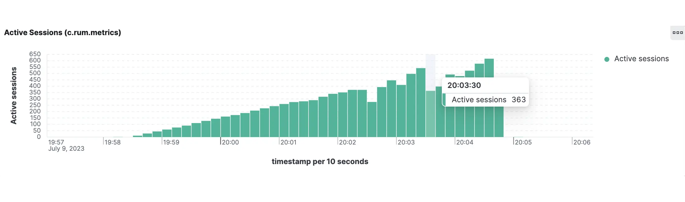

### WebPerf metrics
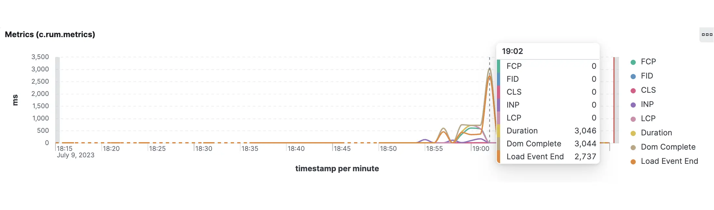

### Hero Elements
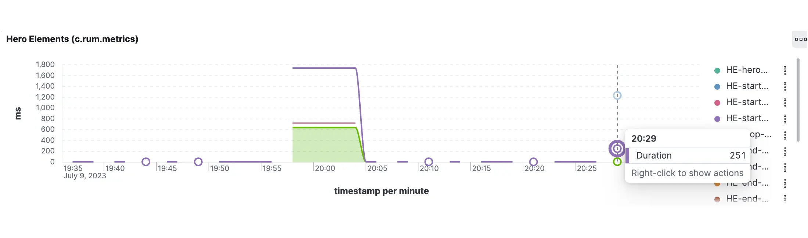

### Actions
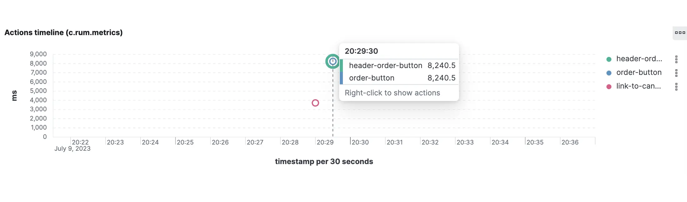

### Visits pages
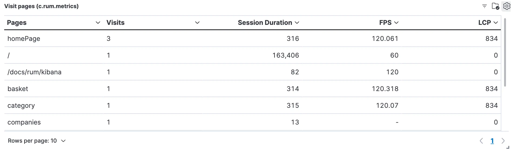

### Resources

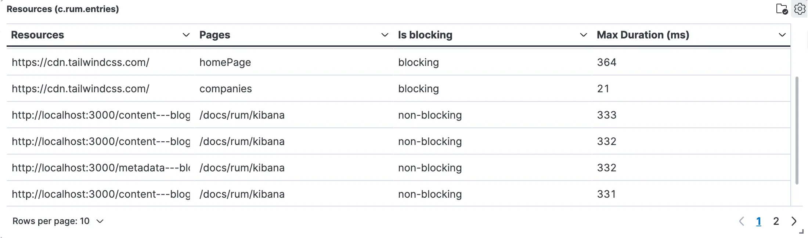

### Browser console
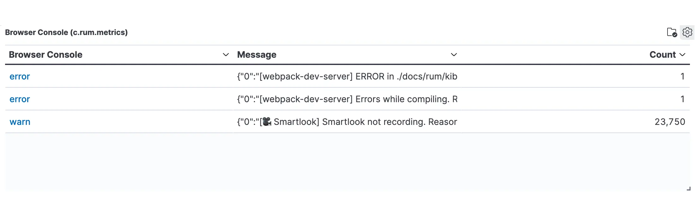

### Content Security Policy
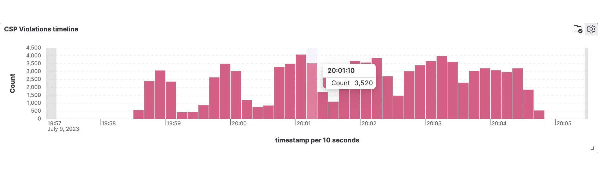

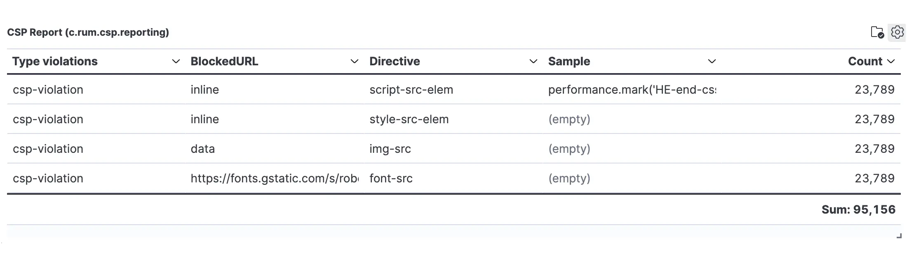

### Others
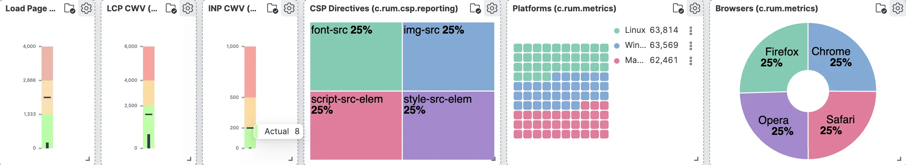

import FeedbackFooter from '../../src/components/FeedbackFooter';

<FeedbackFooter />