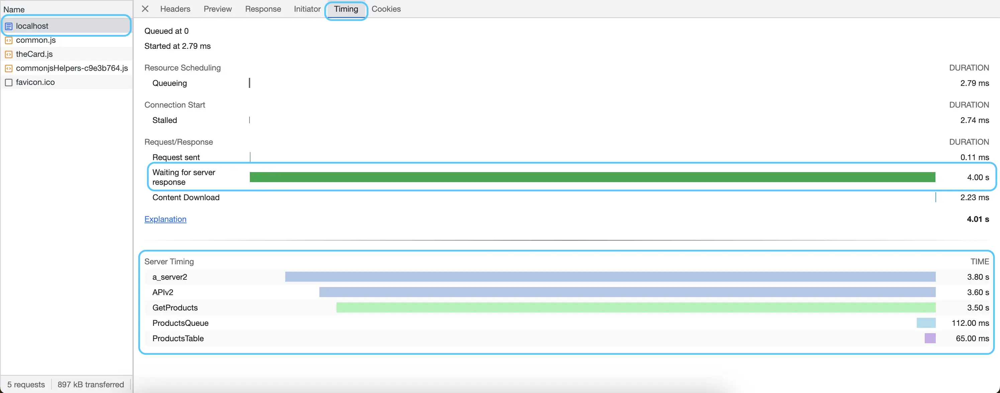
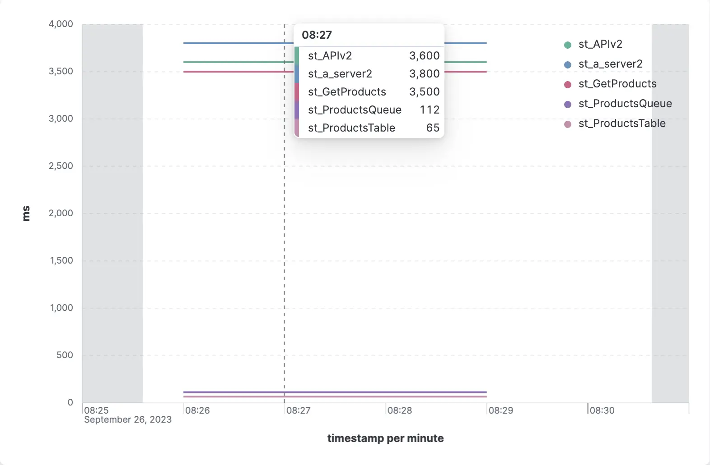

> ### What you’ll learn
- What is a RUM Client
- How to implement the RUM Client
- What data and metrics are collected
- How to setting the RUM Client
- How to tracking a user activities

## What is a RUM Client
RUM Client is a client part of the Canarytrace RUM. Is it a small piece of a javascript, which gathering data from a web browser about a web application and user behavior and send them into [RUM Server](./rumServer).

- RUM Client gathering data from a [WebApis](https://developer.mozilla.org/en-US/docs/Web/API) directly from the web browser. Thanks to this, are the metrics and measurements accurate - so, the web browser is a guarantor of the results and values.
- RUM Client gathering many metrics about your web application, about a client web browser, information about client device, about a user actions and behavior and errors. The obtained data are sent to the [RUM Server](./rumServer) for storage in the database and analysis.

:::note RUM Client does not slow down your application
Most of the data are provided by the web browser e.g. Google Chrome, which measures and obtains information about your web application for its own use. Canarytrace RUM only uses data from the browser, it does not measure anything itself.
:::

## How to start
:::tip
You must start the [RUM Server](./rumServer) before proceeding. Make sure, that [RUM Server](./rumServer) expose endpoint `/rum` and that it is available for your frontend.
:::

### Init script
For start of gathering data from your frontend, you must insert the Init JavaScript into your HTML template before `</head>` tag into every HTML template. That's all.
The Init JavaScript load the RUM Client script directly from `/rum` endpoint which is exposed the RUM Server.

```javascript title="Minimal configuration."
// Init JavaScript
<script>
  (function(w,d,u,a,o){
  w=w[o]=w[o];w=document.createElement(u);w.async=1;w.id=o;w.src=a
  o=d.getElementsByTagName(u)[0];o.parentNode.insertBefore(w,o)
  })(window,document,'script','https://your-domain.com/rum','CRUM')
</script>
```


```javascript title="Configuration with additional settings."
<head>
  <!-- your client scripts -->
  ...
  <!-- insert the Init JavaScript before </head> element -->
  <script>
    (function(w,d,u,a,o){
    w=w[o]=w[o];w=document.createElement(u);w.async=1;w.id=o;w.src=a
    o=d.getElementsByTagName(u)[0];o.parentNode.insertBefore(w,o)
    })(window,document,'script','https://your-domain.com/rum','CRUM')
    CRUM = {
      samplingRate: 3000,
      viewId: 'homePageManual',
      labels: 'env=production, versionApp=1',
      trackResources: false,
      trackHeroes: false,
      trackErrors: false,
      trackConsole: false,
    }
  </script>
</head>
```

:::tip Check, that RUM Client works properly.
Open the web page and DevTools on Network tab and you should see requests with name `rum`
:::

### Debugging
The RUM client works in silent mode, meaning that it only writes errors to the browser console. If you want to see the lifecycle of the RUM client and the data being sent to the RUM server, you can turn on debug mode. Add only query string into your address bar.

- `https://your-domain.com/?debug=1` Print the lifecycle of the RUM Client and the data which is being send to the RUM Server.
- `https://your-domain.com/?debug=dry` The same as `debug=1` but data is not being sent.


### Lifecycle


**Init phase**

The data collector in the RUM Client wait on `load` event. This event is run in time, when is whole page is loaded with all dependencies such as CSS, Javascript, iframes and images.
- Init phase: After loading the RUM Client JavaScript from the RUM Server, this script immediately runs gathering first events and metrics such as Core Web Vitals.
- First round: In the first round, after the `load` event, the data collector runs and data from the init phase, as well as new data from the first round, is sent to the RUM server.

**Sampling**
- The RUM Client works in loops by setting an interval, which is named sampling. During one sample, new metrics and data are collected. Thanks to sampling, the RUM Client can monitor browser events and user activities. After every sample ends, new data is saved to the RUM Server.
- The duration of one sample can be set by the `samplingRate` property. After one sample ends, a new sample starts. So, during the lifecycle of one page, the RUM Client can send many samples one by one to the RUM Server.
- Every sample contains data or metrics that are available during the currently running sample. For example, in sample 1 there may be data from network and HeroElements, while in sample 2 there may be data about page load or FPS, and subsequent samples may contain data about user events such as clicking on a button.


## Browser Data Collected

The RUM Client collects data and events at regular intervals during the user's session into to the queues. The RUM Client creates a payload of data and send to the RUM Server, which includes categorize data into sections by origin or topics of the data.

- `session` - Session of the user.
- `view` - Sources of the behavior of the web page and user activities.
- `attributes` - Browser and device.
- `audits` - Autonomous audits.
- `metrics` - How long does each phase of loading a web page take.

Here is an example of a complete payload which is sent in pieces by the sampler. In the real world, this payload contains metrics and values that are collected over time, as they become available.

```javascript title="Payload"
const payload = {
  session: {
    id: '123456',
    startTime: 1675377137759,
    lastLoop: 1675377354738,
    duration: 40,
  },
  view: {
    id: 'homepage',
    startTime: 1679327449180,
    href: 'https://www.your-domain.com/category?id=4016974',
    protocol: 'https:',
    host: 'www.your-domain.com',
    hostname: 'www.your-domain',
    port: '',
    pathname: '/category',
    search: '?id=4016974',
    hash: '', 
    origin: 'https://www.your-domain.com',
    referer: 'https://www.your-domain.com/contact-us',
    longTasks: [
		{
		  duration: 109,
		  name: "self",
		  startTime: 1516
		}
    ],
    resourceTypes: {
      "css": {
          "count": 14
      },
      "javascript": {
          "count": 23
      },
      "image": {
          "count": 57
      },
      "fetch": {
          "count": 15
      },
      "font": {
          "count": 6
      },
      "other": {
          "count": 1
      }
    },
    resources: [
      {
        "name": "https://fonts.googleapis.com/css?family=Roboto:300,400,400i,500,700",
        "entryType": "resource",
        "startTime": 538.4000000003725,
        "duration": 192.80000000074506,
        "initiatorType": "link",
        "nextHopProtocol": "h3",
        "renderBlockingStatus": "non-blocking",
        "workerStart": 0,
        "redirectStart": 0,
        "redirectEnd": 0,
        "fetchStart": 538.4000000003725,
        "domainLookupStart": 553.0999999996275,
        "domainLookupEnd": 553.0999999996275,
        "connectStart": 553.0999999996275,
        "secureConnectionStart": 553.3000000007451,
        "connectEnd": 655.8000000007451,
        "requestStart": 656,
        "responseStart": 728,
        "responseEnd": 731.2000000011176,
        "transferSize": 1087,
        "encodedBodySize": 787,
        "decodedBodySize": 10254,
        "responseStatus": 200,
        "serverTiming": []
      }
    ],
    fps: [
      {
        timeStamp: 18136.59999999404,
        fps: 119
      },
      {
        timeStamp: 18336.73399999414,
        fps: 120
      }
    ],
    marks: [
      {
        'name': 'HE-start-main-menu',
        'detail': 'Main menu loaded.',
        'startTime': 486
      },
      {
        'name': 'HE-start-catalog',
        'detail': 'Product catalog loaded.',
        'startTime': 788
      }
    ],
    console: [
      {
        "type": "warn",
        "timeStamp": 892483.7999999821,
        "value": {
          "0": "warn message"
        }
      }
    ],
    actions: [
      {
        "pointerType": "mouse",
        "type": "click",
        "target": "span",
        "timeStamp": 1410.7999999523163,
        "name": "header-order-button"
      }
    ],
    events: [
      {
        "addToBasket": {
          "product": "iPhone",
          "variant": [13,14],
          'soldout': false
        }
      }
    ],
    visibility: 'visible',
    usedMemory: 35494235
  },
  attributes: {
    labels: ['env=dev', 'versionApp=19'],
    browser: 'Firefox',
    browserVersion: '109',
    uaParser: 'userAgent',
    ua: 'Mozilla/5.0 (Windows NT 10.0; Win64; x64; rv:109.0) Gecko/20100101 Firefox/109.0'
    connection: {
      effectiveType: '4g', 
      rtt: 50, 
      downlink: 10, 
      saveData: false
    }
    device: {
      type: 'mobile',
      platform: 'Apple',
      memory: 8,
      cpu: 10,
      charging: true
    }
  },
  audits: {
    crossOriginIsolated: false
  },
  metrics: {
    fp: 0,
    fcp: 0,
    cls: 0,
    lcp: 0,
    fid: 3.8000000715255737,
    inp: 0,
    ttfb: 0,
    responseTime: 0,
    domContentLoadedEventStart: 0,
    domContentLoadedEventEnd: 0,
    domContentLoadedDuration: 0,
    renderDuration: 0,
    domComplete: 0,
    duration: 0
  }
}
```

### session 
Are the timestamps attributes indicates activity of the user. These values are sent with every payload to the RUM Server.

| Attribute name | Type | Description |
|--|--|--|
|`session.id`|`string`|UUID of the active user. This UUID is store to the browser.|
|`session.startTime`|`integer`|A timestamp is created when a user session begins. It is useful for determining the length of the session, and this value is stored in the browser.|
|`session.lastLoop`|`integer`|A timestamp is added to each loop of the collector. If `session.lastLoop` is older than five minutes (meaning it has not been updated in the last 5 minutes), a new `session.id` and `session.startTime` are created. These are stored in the browser.|
|`session.duration`|`integer`| This is the length of the user session in minutes.

**Session lifecycle**
- On the first visit to the page, a `session.id` and `session.startTime` are created, and these values are saved in the user's web browser. 
- The `session.lastLoop` is regularly updated in the loop by `crum.samplingRate`.
- On the next visit to the page, the `session.id` and `session.startTime` are loaded from the browser.
- The time from the `session.lastLoop` is read, and if it is older than `crum.newSessionAfter`, a new `session.id` and `session.startTime` are created.
- The timestamp in the `session.lastLoop` is not updated if the user closes the web page or if the page is hidden. This allows us to find out the number of active users and their session duration.

### view 
Metrics from the currently opened page. These values are sent with every payload to the RUM Server.

| Attribute name | Type | Description |
|--|--|--|
|`view.id`|`string`|Name of the opened page. e.g. 'home-page'. If the `viewId` is not set by `crum.viewId`, the RUM Client will use the currently visible pathname as the name of the page (e.g. `/product-a`). You can set the name whenewer thanks to crum function `CRUM.setViewId('string')`. |
|`view.startTime`|`integer`|A timestamp when the web page was opened. The `view.startTime` is after open the page always differently.
|`view.href`|`string`|The URL of the current page.|
|`view.protocol`|`string`|The protocol scheme of the URL, including the final ':'.|
|`view.host`|`string`|The host, that is the hostname, a ':', and the port of the URL.|
|`view.hostname`|`string`|The domain of the URL.|
|`view.port`|`string`|The port number of the URL.|
|`view.pathname`|`string`|An initial `/` followed by the path of the URL, not including the query string or fragment.|
|`view.search`|`string`|A string containing a `?` followed by the parameters or "querystring" of the URL.|
|`view.hash`|`string`|A string containing a `#` followed by the fragment identifier of the URL.|
|`view.origin`|`string`|The canonical form of the origin of the specific location.|
|`view.referer`|`string`|The URI of the page that linked to this page.|
|`view.visibility`|`string`|Returns `visible` or `hidden` indicating if the page is considered hidden or not. RUM Client record last status of the visibility because is important watching if is the page loaded in the `hidden` state. In the `hidden` state the browser stop some self functions and reduce performance for hidden tab. When a page is considered hidden, the web browser may suspend or limit certain background tasks or updates, such as animations, timers, or network requests, to conserve resources and improve performance. This behavior is intended to prevent hidden pages from consuming excessive CPU or battery power and affecting the user experience. However, some tasks or updates may still occur even when a page is hidden, depending on the browser implementation and configuration.|
|`view.longTasks`|`array`|Array of the tasks that occupy the UI thread for 50 milliseconds or more.|
|`view.resources`|`array`|Requests on resources, their timing and blocking/non-blocking states.|
|`view.resourceTypes`|`object`|List of the resource types and their count. e.g. JavaScript, images, CSS etc.|
|`view.marks`|`array`|List of the HeroElements.|
|`view.fps`|`array`|A frame rate is the speed at which the browser is able to recalculate, layout, and paint content on the display. A lower FPS indicates problems with the main thread and performance issues on the web page.|
|`view.console`|`array`|Catched message from the browser console such as `error`, `warn` and `debug`. It can be useful for debugging and monitoring web page behavior.|
|`view.usedMemory`|`integer`|The currently used memory of a web page, often referred to as memory usage, is a metric that indicates how much memory the browser is currently allocating to the web page. The value is reported in bytes. Monitoring memory usage is important for detecting memory leaks, which occur when a program or script uses more memory than necessary and fails to release it. Memory leaks can cause performance issues, crashes, or other unexpected behavior, and can be difficult to debug. By keeping track of the memory usage of a web page and comparing it to expected values, developers can identify and fix memory leaks and improve the overall performance of the page.|
|`view.actions`|`array`|List of the user actions e.g. click on button. The RUM Client searches for elements that have the attribute `crum-action="name"`. When using the `crum-send` attribute, the recorded actions is sent immediately, and additionally, recorded `view.events` are also sent.|
|`view.events`|`array`|List of the events, which can be add whole lifecycle of the web page. For adding new event plse use crum function `CRUM.addEvent()`.|

### attributes

Attributes about a client's web browser and device are useful information that can help you identify the conditions under which the user worked with your web page. These attributes represent the client's environment when they use a web page.

| Attribute name | Type | Description |
|--|--|--|
|`attributes.labels`|`array`|Labels can be added to a payload to mark data. These labels are useful for later analysis, sorting, and searching. 
|`attributes.browser`|`string`|A string containing the brand, for example, `Google Chrome` or other. In case your web application is being tested, for instance, via Playwright, this value will be `automated`.|
|`attributes.browserVersion`|`string`|A string containing the version. For example, `120`.|
|`attributes.uaParser`|`string`|Type of the source with browser and device identification. Value can be userAgent or userAgentData|
|`attributes.ua`|`string`|UserAgent string.|
|`attributes.connection.effectiveType`|`string`|The effective type of the connection meaning one of `slow-2g`, `2g`, `3g`, or `4g`. This value is determined using a combination of recently observed, round-trip time and downlink values.|
|`attributes.connection.rtt`|`integer`|The estimated effective round-trip time of the current connection, rounded to the nearest multiple of 25 milliseconds. This value is based on recently observed application-layer RTT measurements across recently active connections. It excludes connections made to a private address space. If no recent measurement data is available, the value is based on the properties of the underlying connection technology.|
|`attributes.connection.downlink`|`integer`|The effective bandwidth estimate in megabits per second, rounded to the nearest multiple of 25 kilobits per seconds. This value is based on recently observed application layer throughput across recently active connections, excluding connections made to a private address space. In the absence of recent bandwidth measurement data, the attribute value is determined by the properties of the underlying connection technology.|
|`attributes.connection.saveData`|`boolean`|Returns true if the user has set a reduced data usage option on the user agent.|
|`attributes.device.type`|`string`|The `mobile` or `desktop`.|
|`attributes.device.platform`|`string`|The platform brand information, e.g. `Apple`|
|`attributes.device.memory`|`integer`|The approximate amount of device memory in gigabytes.|
|`attributes.device.cpu`|`integer`|The number of logical processors available to run threads on the user's computer.|
|`attributes.device.charging`|`boolean`|The current charging state of the battery.|


### audits
An audit evaluates the properties of a webpage and the web browser used by user.

| Audit name | Type | Description |
|--|--|--|
|`audits.crossOriginIsolated`|`boolean`| Returns a boolean value that indicates whether the website is in a cross-origin isolation state. That state mitigates the risk of side-channel attacks.|

### metrics
Metrics are timelines with events triggered by a web browser, such as loading content, user interactivity, or rendering time of the frontend.

| Attribute name | Type | Description |
|--|--|--|
|`metrics.fp`|`integer`|First Paint - the first time any pixel becomes visible to the user.|
|`metrics.fcp`|`integer`|First Contentful Paint metric measures the time from when the page starts loading to when any part of the page's content is rendered on the screen.|
|`metrics.cls`|`integer`|Cumulative Layout Shift is a measure of the largest burst of layout shift scores for every unexpected layout shift that occurs during the entire lifespan of a page.|
|`metrics.lcp`|`integer`|Largest Contentful Paint metric reports the render time of the largest image or text block visible within the viewport, relative to when the page first started loading.|
|`metrics.fid`|`integer`|First Input Delay measures the time from when a user first interacts with a page (that is, when they click a link, tap on a button, or use a custom, JavaScript-powered control) to the time when the browser is actually able to begin processing event handlers in response to that interaction.|
|`metrics.inp`|`integer`|[Interaction to Next Paint](../glossary/webperf#inp) metric tracks most user interactions, and low INP means that the page will respond to most user interactions. |
|`metrics.domComplete`|`integer`|The time elapsed from the beginning of loading the page to the completion of loading all the elements on the page, including images, videos, and other content.|
|`metrics.domContentLoadedEventStart`|`integer`|The time immediately before the DOMContentLoaded event handler is triggered. Various JavaScript libraries and frameworks usually wait for this moment.|
|`metrics.domContentLoadedEventEnd`|`integer`|The time when the HTML document is fully parsed, all deferred scripts are loaded and executed. It does not wait for images, iframes, and completion of async scripts.|
|`metrics.domContentLoadedDuration`|`integer`|How long does it take to process the `DOMContentLoaded` event. (`domContentLoadedEventEnd - domContentLoadedEventStart`)|
|`metrics.renderDuration`|`integer`|The time between the `loadEventEnd` and `domContentLoadedEventStart` events represents the period from when the initial HTML document processing begins, until the point where the entire page is loaded and ready with all downloaded resources. (`loadEventEnd - domContentLoadedEventStart`)|
|`metrics.duration`|`integer`|The total time from navigation start to DOM processing completion.|
|`metrics.ttfb`|`integer`|The time it takes for the server to begin responding to a request.|
|`metrics.responseTime`|`integer`|The total amount of time it takes to fully received response from a server.|

### Entries


## Settings

You can insert the RUM client on every page you want to measure, and you can customize it differently for each page based on your preferences. Some pages may be more important than others, so you can name each page as you wish. For less important pages, you can collect only user visits, while for important pages, you can collect all data about user devices, activities, network traffic, etc.

```javascript title="Your HTML template"
<head>
  <!-- your client scripts -->
  ...
  <!-- insert before </head> element -->
  <script>
    (function(w,d,u,a,o){
    w=w[o]=w[o];w=document.createElement(u);w.async=1;w.id=o;w.src=a
    o=d.getElementsByTagName(u)[0];o.parentNode.insertBefore(w,o)
    })(window,document,'script','https://your-domain.com/rum','CRUM')

    // CRUM properties
    CRUM = {
      samplingRate: 3000,
      viewId: 'homePageManual',
      labels: 'env=production, versionApp=1',
      trackResources: false,
      trackHeroes: false,
      trackErrors: false,
      trackConsole: false,
    }
  </script>
</head>
```

### CRUM Properties

|Property|Description|
|-|-|
|`samplingRate`|The RUM Client collects data from Web APIs during a running sample and sends the data to the RUM Server at the end of the sample's lifecycle. The duration of one sample can be set by the `samplingRate` property. Once a sample ends, the RUM Client starts the next sample. Default value is 5000 ms.|
|`entriesRate`|The Entries refer to collections of requests made between a web browser and server. Some web applications may have a large number of requests which can cause problems for the RUM Client in sending them to the RUM Server. To handle this, the RUM Client splits the entries queue into smaller pieces and sends them one by one until the queue is empty. The RUM Client sends data from samples separately from the entries. Typically, the first 100 entries are the most important for your analysis. Default value is 500 ms.|
|`maxEntries`|Number of entries sent in a single request to the RUM Server from a queue of entries. If the payload size of these entries exceeds a certain limit, the RUM Server will reject the request and keep it in a pending state. Default value is 50.|
|`ignoreResources`|The collector will ignore entries that contain certain strings in their URLs. By default, the value `/rum` is used, so any requests with the name `rum` will be ignored. If you want to collect all requests, you can set the value to `no`. Default value is `/rum`.|
|`savingMode`|In saving mode, the RUM client compares the previous payload to the latest payload. If the latest payload does not contain any new data, then the payload will not be sent to the RUM server. Default value is `true`|
|`newSessionAfter`|After what period of user inactivity on the page should a new `session.id` and `session.startTime` be created? User inactivity means that the user closes the page and later reopens it. Default value is 300 ms|
|`stopCollectorAfter`|Stop the collector and sending payload to the RUM server in case, that a user is not actively using the page, although it is open, but hidden. The collector is re-run when the page will be again visible and is created a new `session.id` a `session.startTime`. If you want to collect data in multi-window applications, it is useful to set a higher value rather than a lower value. Default is 60 s
|`viewId`|Name of the opened page. E.g. `'home-page'`. If the `viewId` is not set, the RUM Client will use the currently visible pathname as the name of the page (e.g. `/product-a`)|
|`labels`|Labels can be added to a payload to mark data. These labels are useful for later analysis, sorting, and searching. An example label is `'env=production, versionApp=12'`. Labels can help to provide additional context and metadata about the data being collected, which can make it easier to understand and analyze the data later on.|
|`trackResources`|The RUM Client will be collect resources / entries. Default is `true`|
|`trackHeroes`|The RUM Client will be collect a HeroElement events. Default is `true`|
|`trackConsole`|The RUM Client will be collect the browser console message such as `debug`,`warn` and `error`. Collecting console messages can be useful for monitoring and troubleshooting purposes, as it can provide insight into any errors or issues that users may be encountering while using the website or application. Default is `true`|

### CRUM Functions

Thanks to CRUM Functions, you can add additional information into a running sample during a whole the lifecycle of the web application or during the user activities.

When the RUM Client starts after the `load` event, you can access the functions through the RUM object named `CRUM`.

|Function|Description|
|-|-|
|`CRUM.setViewId('string')`|Set a new `viewId`. Is useful especialy for the SPA applications to set a custom `view.id` that is associated with the performance data collected by the RUM Client. In a web application with soft navigation, where the page content changes dynamically without a full page reload, setting a custom `view.id` can help you distinguish between different views and track their performance separately.|
|`CRUM.addToLabels('env=UAT')`|Add another label. Label added via this function will be added into every samplers until to end of lifecycle actual page.|
|`CRUM.addEvent('addToBasket')`|Allows you to store arbitrary values during the lifecycle of a web application. For example, form contents, user actions, request results, etc. This function allows you to add custom events with associated data to the RUM monitoring data. For example, you could track when a user adds an item to their shopping cart, along with the details of the item they added. By adding custom events with relevant data, you can gain deeper insights into how users are interacting with your web application and identify areas for improvement.|

#### Examples
Open console in DevTools and try the following functions.

```javascript title=CRUM.addEvent()
// minimal, first parameter is mandatory
CRUM.addEvent('logout')

// add event with context. Second parameter is optional.
CRUM.addEvent('addToBasket', {
  'product': 'iPhone',
  'variant': [13,14],
  'soldout': false
})
```

```javascript title="CRUM.addToLabels()"
// add username from html into the labels
let userName = $x('//a[@id="lnkUserProfile"]/text()')[0].nodeValue
CRUM.addToLabels(`user=${userName}`)
```

## HeroElements

The HeroElements is the only method for accurately measuring when and what is displayed in the user's web browser on their device (mobile or desktop).
You can easily mark pieces of code in your HTML template, such as menus, lists of products, buttons, etc. You can also mark third-party JavaScript code, allowing you to know how long it takes to load the third-party scripts.

The `performance.mark` native browser API is used to measure HeroElements. When the browser's analyzer hits a mark, the mark and description are saved into the timeline. The RUM client collects these marks, and you can use any number of performance.mark on a single HTML template.

:::info
The name of the marks is optional but must start with the prefix `HE-`. Only marks with this prefix are collected.
:::


The RUM client collects these marks from the timeline and sends them to the RUM server. You can view the time of the marks on graphs.
- Collected marks are available in `view.marks`.

#### Syntax

`performance.mark('HE-any-name', {detail: 'description'})`
- `HE-any-name` is mandatory.
- `{detail: 'description'}` is optional.

```html title="Examples"
<!-- Third-party JavaScript is surrounded by performance.mark -->
<html>
...
<script>performance.mark('HE-start-tailwind')</script>
  <script src="https://cdn.tailwindcss.com"></script>
<script>performance.mark('HE-end-tailwind')</script>

<!-- You can use performance.mark to measure the moment when an element was loaded. -->

...
<body>

<!-- You can also use it to measure when the server responded. -->
<script>
	fetch("http://example.com/movies.json")
	  .then((response) => response.json())
	  .then((data) => {
	    performance.mark('HE-response-movies')
	    console.log(data)
	  });
</script>

<!-- You can use performance.mark in your events. -->
<script>
	document.addEventListener("scroll", function handler() {
	    //Remove the event listener so that it only triggers once
	    document.removeEventListener("scroll", handler);
	    // for timestamp for first scroll event
	    performance.mark('HE-first-scroll')
	});
</script>
...
```

## Tracking user activity 

RUM is superb for collecting information about devices, browsers, bugs, etc. on your production, but the most interesting value is what the user is doing.

### Actions

Actions is a method for recording the user's interactions with the page, such as clicking on a button. Add the attribute `crum-action` to your elements, and the RUM client will watch and record user actions, such as clicks.

New recorded actions are stored in the timeline and sent to the RUM server at the end of the sampling period. But if, for example, you have an action on the Login button, and after clicking on it, the browser starts a new navigation, then the payload sent from the RUM Client to the RUM Server may not need to be sent because the browser stops some actions from the original page, such as network activities.

For these cases, use the additional attribute `crum-send`, which instructs the RUM client to send new actions and events immediately.

- Collected actions are available in `view.actions`

#### Syntax

Attributes `crum-action="action-name"`, `crum-send`

```javascript title="Examples"
// Add the crum-action attribute and name to the element you want to monitor. The RUM client will then record clicks on this element.
<span crum-action="header-order-button">Order</span>

// Add the additional attribute crum-send to immediately send the recorded action.
<span crum-action="header-order-button" crum-send>Order</span>
```

### Events

The RUM Client can record various issues such as FPS drops, LongTasks, Durations, Console errors, etc. While this is useful information, it may lack context. For example, it's important to know if the user has many items in their view or only one or user type, how many dates they have stored in your systems or what components are being displayed etc.

Thanks to Events, you can store additional information about activities in a user's browser. This information provides context and helps you investigate what exactly happened from the user's point of view.

During the entire time that a user interacts with your page, whether it's loading or they are actively working on it, you can save interesting information by calling a function `CRUM.addEvent()`. You can call `CRUM.addEvent()` multiple times to save different events or information during a user's interaction with your page.

#### Syntax

`CRUM.addEvent('event-name', {items:10})`
- `event-name` is mandatory.
- The second parameter for context is optional.

```javascript title="Examples"
CRUM.addEvent('best-training', {
  'name': 'webPerf',
  'days': ['MON','THU'],
  'open': true,
})

// or

CRUM.addEvent('addToBasket')
```

## Server-Timing
Canarytrace RUM can observe your backend components, services, and their timings. Thanks to Canarytrace RUM, you can assess the speed of both your frontend and its components. However, it's equally important to understand the performance of your backend and its components.



By adding Server-Timing response header to your application, you can monitor both back-end and front-end performance in a unified view, and Canarytrace RUM collects both.

This is made easy with the HTTP response header named `Server-Timing`.
```http
Server-Timing: lb;dur=13;desc="Load Balancer", server-3;dur=338;desc="Server #3 Startup", db-read;dur=48;desc="Database Read", aws-download;dur=2469;desc="AWS Content Download", db-write;dur=71;desc="Database Write", templating;dur=61;desc="Templating plugin"
```

Canarytrace RUM stores the Server-Timing data directly in the `c.rum.entries-*` Elasticsearch index, making it available for visualization.



For more details, refer to our [Server-Timing](../glossary/webperf#server-timing) glossary.

## Limitations
The RUM client can obtain the most data from Google Chrome because this browser has many APIs and focuses on adopting new web standards and improving web performance.

Everything depends on the available APIs that each web browser offers. Google Chrome offers many APIs that provide important data about the browser, web app, and user activities. However, some browsers do not have certain APIs, and in these cases, the RUM Client returns empty values.


import FeedbackFooter from '../../src/components/FeedbackFooter';

<FeedbackFooter />