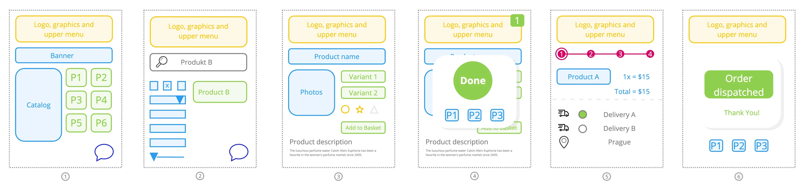
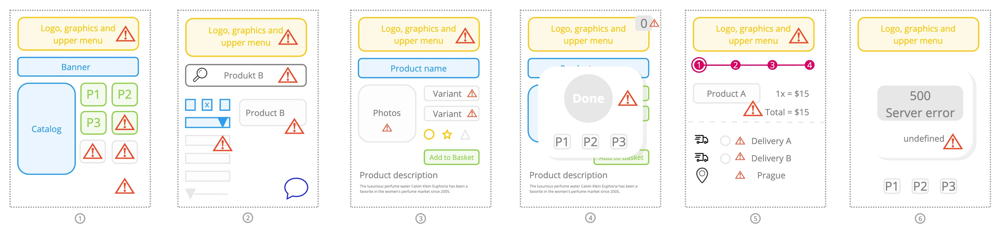
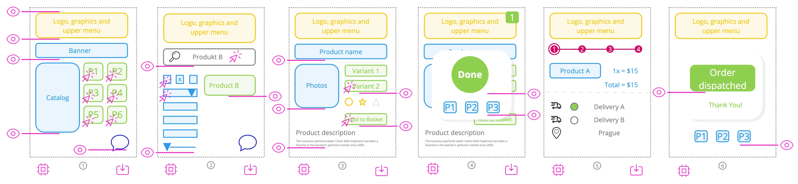

# Use Cases

This page will show you several cases when it is appropriate to use Canarytrace RUM, what is important for you, and how to use it.
You will better understand how Canarytrace RUM can assist you, envision the benefits, and explore the possibilities.
It is also crucial to know how to implement Canarytrace for your specific use case.

Understanding how real users interact with your web application and how your web application performs for them, identifying their issues, and recognizing typical user journeys are critically important for your business.

## E-commerce

**Why does your e-shop need Canarytrace RUM?**
1. The e-shop must rank high in search results.
2. The shopping customer must be satisfied with the purchasing experience.
3. The customer should not abandon the purchase process but complete the order and make the purchase.
4. The customer is content with the purchase and will shop again in the future.

This is important for you.


**What do you need to know?**
1. How fast is loading your e-shop?
2. Is the catalog loaded quickly and without errors?
3. Monitoring user actions and how smoothly our e-shop works?
4. Monitoring user experience and user journey.

This is important for you to know. Without this information, you don't know the satisfaction of your clients, and you can't improve your e-shop.


**How does Canarytrace RUM help our e-shop?**

Canarytrace RUM collects all important metrics directly from your clients' devices. You will obtain crucial information that answers the questions "**How satisfied are our clients with our e-shop?**" and "**Where do we have problems and what do we need to improve?**".

1. Canarytrace RUM collects all important metrics and additional information about client devices and technical parameters of your clients.
2. Canarytrace RUM collects information about when and how the content of your e-shop is displayed to end-users on their devices.
3. Canarytrace RUM captures clicks on buttons and additional user actions.
4. Canarytrace RUM tracks the user journey and user experience of your clients.

The Canarytrace RUM will help you gain insights into how users behave, what issues they encounter, and how their shopping experience is on your website. This data will aid you in improving user experience and increasing conversions.

:::info
Canarytrace does not collect any personal data. You can't identify any person.
:::

### Customer expectations 



**1. First load**
- I am on the correct e-shop. I see the logo, search bar, and categories.
- I can view products available for purchase.
- I see the product catalog and AdWords.
- If I encounter any issues, I can contact support via chat.

**2. Search for a product**
- I can search for a product by name, category, or other parameters.
- I can filter products using various criteria.
- In the search results, I see the products I have found.

**3. Product detail**
- I can view the product details and images.
- I can view the product description and price.
- I can see the product rating, reviews, and parameters.
- I can see the product variants.
- I can add the product to the cart.

**4. Add to cart**
- I can add the product to the cart, and the e-shop shows a confirmation.
- I can see additional products that may be useful to complement the product in the cart.

**5. Cart and order**
- I can view the cart and the products in it.
- I can see the total price and the shipping price of the products in the cart.
- I can see a step-by-step guide on how to complete the order.
- I can choose the delivery method and payment method.

**6. Order confirmation**
- I receive an order confirmation with the order number.

Satisfied customers expect this flow, and satisfied users become returning customers.

### Typical problems

On the other hand, customers can encounter problems that can lead to a bad user experience, and these issues can be difficult to detect if you do not use Canarytrace RUM. Such problems may be specific to certain devices, browsers, or operating systems, or they can be caused by some third-party services.



**1. Bad first impression**
- I have to wait unreasonably long for the e-shop to load.
- I click on a product, but nothing happens.
- Scrolling through the list of products is not smooth but it's jerky.
- The chat bot is not visible, so I can't contact support.

**2. A lot of work or waiting during product search**
- The loading of products is slow, which makes finding products very time-consuming.
- When I type the name of a product into the search input, the response is not smooth, and the search input is jerky.
- The filtering controls are not working properly or load slowly.

**3. Product detail**
- I have to wait for the product detail to load because the e-shop is slow.
- The variants of the product are not displayed correctly, or they load slowly, or their loading is blocked by some other service or script on e-shop.
- I am waiting for the images to load.

**4. Add to cart**
- I click on the button to add the product to the cart, but nothing happens.
- I am waiting for the confirmation of adding the product to the cart.

**5. Cart and order**
- I am waiting for the cart to load.
- I am waiting for the delivery service to load.
- I do not see my favorite delivery service, probably because a third-party service is not working properly.
- I can't choose the payment method because the payment gateway is not working properly.
- I can't select my address because the address service is not working properly.

**6. Order confirmation**
- I am waiting for the order confirmation to load.
- Oh no, my work is lost. The confirmation returned some error.

### Why is problem your problem?

- rychlost nacteni vs google ranking
- odkaz na studii Miliseconds make Milions


### How to start with the RUM

All problems mentioned above can be detected by Canarytrace RUM. You can begin using RUM by adding the following code named [`init script`](./rumClient#init-script) to every page or reusable component of your e-shop.

```javascript title="init script"
<script>
  (function(w,d,u,a,o){
  w=w[o]=w[o];w=document.createElement(u);w.async=1;w.id=o;w.src=a
  o=d.getElementsByTagName(u)[0];o.parentNode.insertBefore(w,o)
  })(window,document,'script','https://your-domain.com/rum','CRUM')
</script>
```
- More information about init script can be found in the [RUM Client](./rumClient#init-script) section.

That's really all. This is the first step, and in many cases, it is enough. The Canarytrace RUM will start collecting [all important data](./rumClient#browser-data-collected) from your clients' devices and send them to the Canarytrace RUM backend. You can view the data in the [Canarytrace RUM dashboard](./kibana).

- For successful integration, it is necessary to have a [Canarytrace RUM Server](./rumServer) running.

The Canarytrace RUM starts collecting data on pages where the user navigates, performance metrics, user-journeys, and information about the user's browser and device. This is enough for your first start. Thanks to this first phase, you will gather a lot of information about your e-shop and users, and thanks to this information, you will know how your e-shop works and what the user experience is like.

:::info What have we done?
- We now know the time when the user sees the important content of the pages.
- We now know the time when the data for our e-shop is received from the server.

Thanks the HeroElements we now have overview, how our e-shop works on clients devices, how fast is our server and how fast is displayed products.
:::

:::tip Development or production environment?
For the first time, you can start with Canarytrace RUM on your development environment. If you have your e-shop in multiple countries, it's a good idea to start implementing it in the smallest country to gain a first overview, learn about performance metrics, and gain initial experience.

If you do not have these options, no problem, you can start directly on your production environment.
:::

### More information better knowledge

If you have more information, you will know more important details about your e-shop and the satisfaction of your users. Now you can add features like [HeroElements](./rumClient#heroelements), [Actions](./rumClient#actions), and [Events](./rumClient#events).

[**HeroElements**](./rumClient#heroelements) can capture the time when arbitrary content is shown to the user's device. This can be used to measure the time when the user sees the important content of the page. For example, you can measure the time when the user views the product detail, the product list, or the cart.

[**Actions**](./rumClient#actions) capture user activities and the exact time when the user clicks on buttons or links. For example, you can measure the time when the user clicks on the button to add the product to the cart or when the user clicks on the button to complete the order, and others.

:::note Why is useful use Actions?
When a user clicks on a button, the e-shop executes certain procedures, such as loading data from the server, displaying a modal window, and so on. This is why it is essential to track button clicks. By doing so, we can measure the duration it takes to run the procedure and how long it takes to show the result to the user. This tracking allows us to monitor and optimize the performance and user experience on the e-shop.
:::

[**Events**](./rumClient#events) are useful for storing context. For example, the count of shown products, search results, filter settings, etc. Thanks to Canarytrace RUM, you have a lot of information about performance and user activities, but it's also helpful to know how many products users view, add to the cart, and buy, etc. Therefore, with the use of events, you will better understand the situation and the environment of the client, who is shopping in your e-shop.


### Extended implementation

Now, let's look at a real example where we can identify all possible problems experienced by our customers.



#### [init script](./rumClient#init-script)
Place the init script into the head section of every page or reusable component of your e-shop. The init script loads the Canarytrace RUM client and starts collecting data from the user's device.

Example: Add the init script to the head section on every page of your e-shop.
```javascript title="init script"
<script>
  (function(w,d,u,a,o){
  w=w[o]=w[o];w=document.createElement(u);w.async=1;w.id=o;w.src=a
  o=d.getElementsByTagName(u)[0];o.parentNode.insertBefore(w,o)
  })(window,document,'script','https://your-domain.com/rum','CRUM')
</script>
```

More information about init script can be found in the [RUM Client](./rumClient#init-script) section.

#### [HeroElements](./rumClient#heroelements)
Place HeroElements after every important content on the page. For example, you can place HeroElements after the header menu, AdWords, catalog, product list, chatbot button, search input, filtering settings, product photo, product variants, add to basket button, product description, confirmations, delivery services, payment methods, etc. Add HeroElements after all important content that you want to measure.

**Example:** Add the HeroElement code for measuring the precise time when the search input is displayed to the user:
```javascript title="Measure time, when is search input displayed" {2}
<input type="search" name="search" id="header-search" placeholder="Enter the product name, category, ...">
<script>performance.mark('HE-searchInput')</script>
```
In this example we add HeroElement measure code after the search input. The HeroElement code is a simple JavaScript code that marks the time when the search input is displayed to the user. The [RUM Client](./rumClient) collect all HeroElements and send them to the [RUM Server](./rumServer). The RUM Server stores the HeroElements and displays them in the [Canarytrace RUM dashboard](./kibana).

Thanks to HeroElements you will be know, when is displayed important content to the users on their devices. 

**Example 2:** Add the HeroElement code to measure the start of loading the list of products and the end to measure how long it takes to load the whole list of products.

```javascript title="Measure the time it takes to start loading the list of products and how long it takes to load the entire list." {1,8}
<script>performance.mark('HE-start-productList')</script>
<ul>
  <li>Product 1</li>
  <li>Product 2</li>
  <li>Product 3</li>
  <li>Product 4</li>
</ul>
<script> performance.mark('HE-end-productList')</script>
```

Consider what you need to know about what and when is displayed to the user on their device. Use HeroElements, and don't hesitate to have multiple of them on one page.

Nice, now we know when the user sees the important content of the page. But it can also be useful to know when data for the product list is received from the server. In this case, HeroElements is also valuable.

**Example 3:** Add the HeroElement code to measure response from the server.

```javascript title="Measure the time it takes to receive products from the server." {4}
fetch("https://your-domain.com/api/v1/products")
  .then((response) => response.json())
  .then((data) => {
    performance.mark('HE-productList-loaded')
    console.log(data)
  });
```

Consider what you need to know about loading data from your server to the frontend of your e-shop.

:::info What have we done?
- We now know the time when the user sees the important content of the pages.
- We now know the time when the data for our e-shop is received from the server.

Thanks the HeroElements we now have overview, how our e-shop works on clients devices, how fast is our server and how fast is displayed products.
:::

More information about HeroElements can be found in the [RUM Client](./rumClient#heroelements) section.


#### [Measure user activities](./rumClient#actions)

Measuring user actions is the next useful feature that helps us detect and track user activities on their real devices, such as button clicks. These user actions can trigger procedures in the user's browser and in our e-shop, like opening a product detail, adding items to the cart, fetching data from the server, or executing JavaScript to show modal windows.

These actions may increase memory and CPU usage in the user's browser and in our e-shop. If you have a high volume of visits and active users, these actions can cause performance problems and slow down your e-shop.

Tracking user actions allows us to detect and measure user activities on their real devices and helps us identify performance issues in our e-shop.

The second useful case for using actions is tracing user journeys and user behavior.

We want to track various actions in our e-shop, such as clicking on a product, clicking on a category in the menu, clicking on the chat button, clicking on the search input, clicking on filters, clicking on a product in the search results, clicking on photos, clicking on a variant, clicking on adding a product to the cart, clicking on a delivery method, clicking on a payment method, and clicking on the order button.

Starting to use [actions](./rumClient#actions) is easy; we only need to add the attribute `crum-action="optional-name"` to the HTML element, e.g., a button. The [RUM Client](./rumClient) automatically start tracking all elements, which have the `crum-action` attribute.

**Example:** Track when user click on the product in the product list.

```javascript title="Implementation the action" {2-5}
<ul>
  <li crum-action="product-1">Product 1</li>
  <li crum-action="product-2">Product 2</li>
  <li crum-action="product-3">Product 3</li>
  <li crum-action="product-4">Product 4</li>
</ul>
```

The RUM Client automatically tracking all clicks on elements and all these clicks are sent to the [RUM Server](./rumServer). The RUM Server stores all actions and displays them in the [Canarytrace RUM dashboard](./kibana).

:::info What have we done?
- Thanks to, that Canarytrace RUM collect a different metrics in the same time, we can compare user activities with the performance metrics, we can see, how requests was loaded from server and how long it takes to display products to the user or what smoothly our eshop shows result of the click to the user.
- We now know what the user is doing and when, what his journey is, and how long it takes to perform certain actions
:::

More information about actions can be found in the [RUM Client](./rumClient#actions) section.

#### [Events](./rumClient#events)
Events are useful for storing contexts. We have a lot of information about the client's devices and browsers; we have metrics, Actions, and HeroElements, but context is something that helps us understand why something is happening or what the user sees on their device.

Imagine that we have some problem with the performance of loading the products. We know what the user is searching for and the size of the response from the server, but we don't know what the user sees on their device. When we use Events, we can store information, such as the number of products the user sees or the types of delivery services they view.

Events are useful for storing additional information about what the user sees on their device or what actions the user is taking. In our e-shop, we can store the count of products on the homepage or after a search, the number of available variants, or the types of delivery services available.

An event is a small piece of JavaScript code that we incorporate into our e-shop code. The [RUM Client](./rumClient) waits and captures new events.

**Example:** Store the number of products displayed on the homepage, as seen on the user's device.

```javascript title="Implementation the event"
CRUM.addEvent('homepage-products', {
  'parfums': 10,
  'makeup': 20,
});
```

**Example 2:** Store the number available delivery services, which are seen on the user's device.

```javascript title="Implementation the event"
CRUM.addEvent('available-delivery', 3);
```

**Example 3:** Store the settings of filtering, which is seen on the user's device.

```javascript title="Implementation the event"
CRUM.addEvent('homepage-products', {
  'categories': ['Category A', 'Category B'],
  'sort': 'price',
  'price': {
    'from': 100,
    'to': 200,
  },
});
```

Consider, what is interesting to know about what the user sees on their device. Catched events are sent to the [RUM Server](./rumServer) and displayed in the [Kibana](./kibana).

:::info What have we done?
- Thanks to Events, we can store additional information about what the user sees on their device.
- Now we know how the user sets filters, how many products they see on the page after a search, how many delivery services they can choose from, and so on.
- Thanks to Events, we can compare user devices, user actions, and the smoothness of our e-shop, gaining insight into what the user sees.
:::

More information about events can be found in the [RUM Client](./rumClient#events) section.


### Analyzing client satisfaction

Great! We have implemented Canarytrace RUM in our e-shop and we are collecting a lot of data. It's time to analyze client satisfaction and identify opportunities to improve our e-shop.

#### What interests us, what do we want to know?
Let's go back to our first image and [Customer expectations](#customer-expectations)


### Technical analysis of the e-shop

import FeedbackFooter from '../../src/components/FeedbackFooter';

<FeedbackFooter />