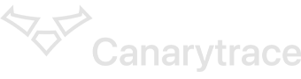

import Tabs from '@theme/Tabs';
import TabItem from '@theme/TabItem';
export const Highlight = ({children, color}) => (
  <span
    style={{
      backgroundColor: color,
      borderRadius: '2px',
      color: '#fff',
      padding: '0.2rem',
    }}>
    {children}
  </span>
);


## Examples styling

Nejaky text

### Code

```yaml {4}
version: "3.8"
services:
  selen:
    image: selenium/standalone-chrome:3.141.59-20200730
    ports:
      - "4444:4444"
      - "9222:9222"
    network_mode: "host"
    volumes:
    ...
```

<div style={{ padding: '20px', backgroundColor: 'tomato' }}>
  <h3>This is JSX</h3>
</div>

<Highlight color="#25c2a0">Docusaurus green</Highlight> and <Highlight color="#1877F2">Facebook blue</Highlight> are my favorite colors.

I can write **Markdown** alongside my _JSX_!

<Tabs
  defaultValue="linux"
  values={[
    { label: 'Linux', value: 'linux', },
    { label: 'Mac', value: 'mac', },
    { label: 'Windows', value: 'windows', },
  ]
}>
<TabItem value="linux">
Run Canarytrace installer

```js
docker run --name installer --net canary --rm quay.io/canarytrace/installer:7.3
```

</TabItem>
<TabItem value="mac">

```py
def hello_world():
  print 'Hello, world!'
```

</TabItem>
<TabItem value="windows">

```java
class HelloWorld {
  public static void main(String args[]) {
    System.out.println("Hello, World");
  }
}
```

</TabItem>
</Tabs>

```bash
  docker run
```

:::note
Check out repository for latest docker image https://quay.io/organization/canarytrace
:::

