> ### What you’ll learn
- What is a Kibana?
- What interpret graphs?
- How to build custom visualizations?

**Hlavní RUM Vizualizace**
- [x] Aktuálně aktivních session
- [x] Počet návštěv
- [x] 95%th LoadTime aktuální a trend
- [x] 95%th CVW
- [x] 95%th TTFB aktuální a trend
- [x] Frontend errors a trend
- [x] LongTasks a trend
- [x] TOP urls, browsers, devices(desktop, mobil), platforma(iOS, Android)

**Všechny pohledy**
- Hlavní RUM vizualizace
- Failing Resources
- Users most affected by issues
- Sessions and trends, js errors, time spent 
- High memory consuption views
- Performance monitoring
	- Seznam top stranek a u nich CVW, TTFB, errors a devices
	- Seznam stranek s velmi nízkým score
- Detail vybraného view/stránky
	- prakticky stejné jako performance monitoring
	- chyby, trendy atp

**Vizualizace**
- CVW
- Page Views by Version
- Total Errors by Version
- Ongoing Issues
- Top Browsers
- Top Devices
- Top Pages
- Total Sessions
- User Sessions
- Session Duration (avg)
- Count of resources grouped by type
- Slowest resources
- XHR and Fetch requests with status code >= 400
- XHR and Fetch requests grouped by method
- Resource timings

# Visualizations

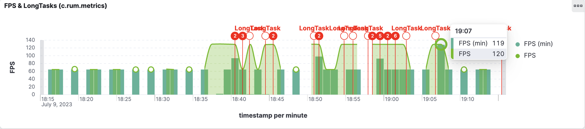

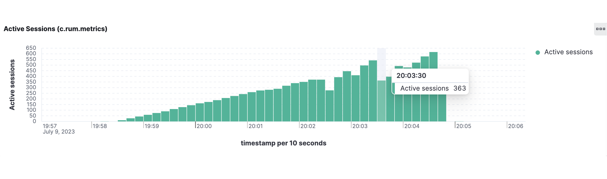

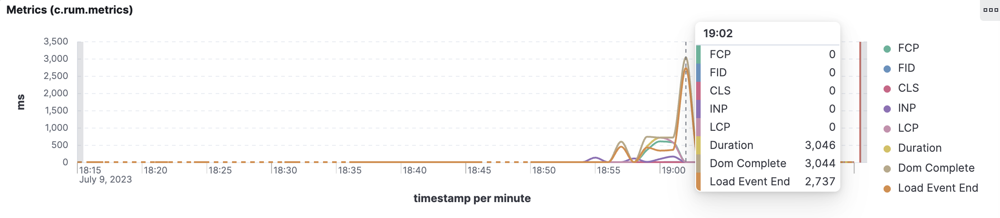

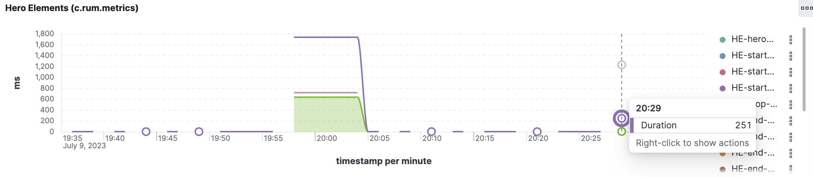

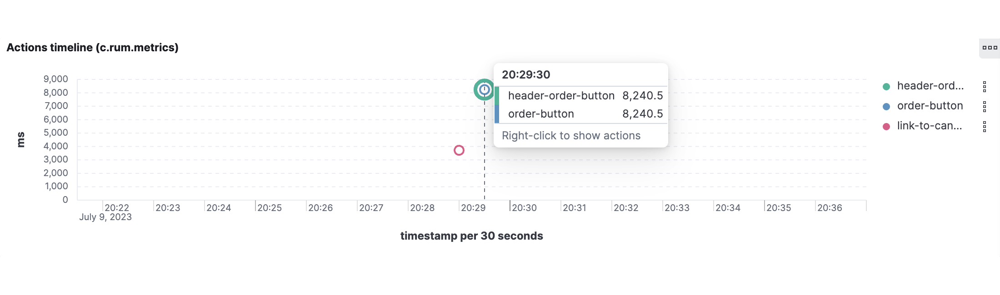

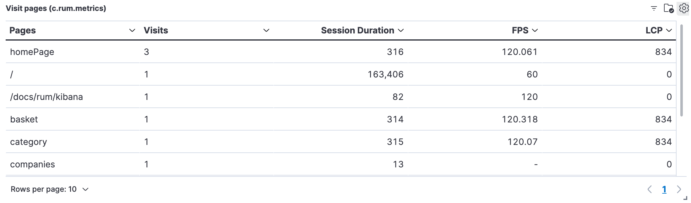

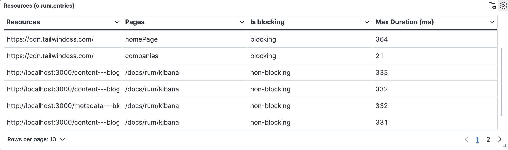

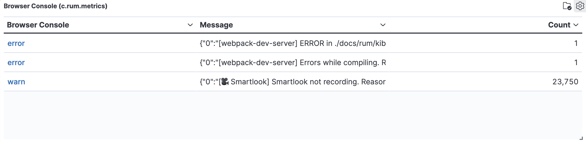

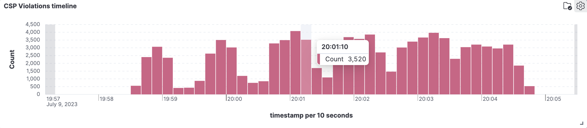

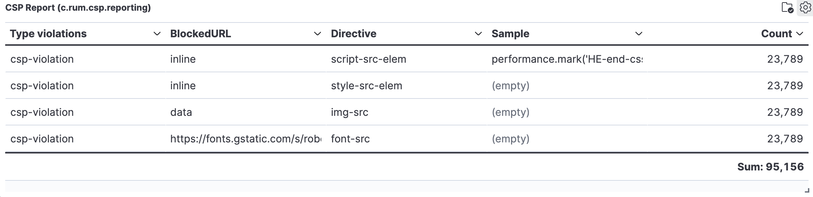

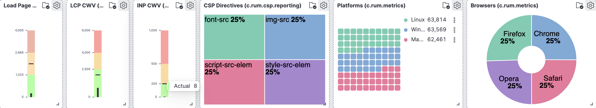

import FeedbackFooter from '../../src/components/FeedbackFooter';

<FeedbackFooter />