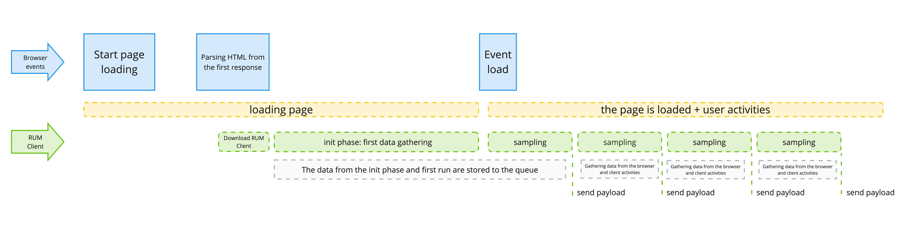

> ### What you’ll learn
- What is a RUM Client
- How to use of the RUM Client

## What is a RUM Client
RUM Client is a client part of the Canarytrace RUM. Is it a small piece of a javascript, which gathering data from a web browser about a web application and user behavior and send them into [RUM Server](doc/rum/rumServer).

- RUM Client gathering data from a [WebApis](https://developer.mozilla.org/en-US/docs/Web/API) directly from the web browser. Thanks to this, are the metrics and measurements accurate - so, the web browser is a guarantor of the results and values.
- RUM Client gathering many metrics about your web application, about a client web browser, information about client device, about a user actions and behavior and errors. The obtained data are sent to the [RUM Server](doc/rum/rumServer) for storage in the database and analysis.

:::note RUM Client does not slow down your application
Most of the data are provided by the web browser e.g. Google Chrome, which measures and obtains information about your web application for its own use. Canarytrace RUM only uses data from the browser, it does not measure anything itself.
:::

## How to start
:::tip
You must start the [RUM Server](doc/rum/rumServer) before proceeding. Make sure, that [RUM Server](doc/rum/rumServer) expose endpoint `/rum` and that it is available for your frontend.
:::

### Implementation
For start of gathering data from your frontend, you must insert the RUM Client javascript into your HTML template. That's all.
The RUM Client javascript insert before `</head>` tag into every HTML template.

Minimal configuration.
```javascript
<script>
  (function(w,d,u,a,o){
  w=w[o]=w[o];w=document.createElement(u);w.async=1;w.id=o;w.src=a
  o=d.getElementsByTagName(u)[0];o.parentNode.insertBefore(w,o)
  })(window,document,'script','https://your-domain.com/rum','CRUM')
  CRUM = {
    viewId: 'homePageManual',
    labels: 'env=production, versionApp=1'
  }
</script>
```


Configuration with additional settings.
```javascript
<head>
  <!-- your client scripts -->
  ...
  <!-- insert before </head> element -->
  <script>
    (function(w,d,u,a,o){
    w=w[o]=w[o];w=document.createElement(u);w.async=1;w.id=o;w.src=a
    o=d.getElementsByTagName(u)[0];o.parentNode.insertBefore(w,o)
    })(window,document,'script','https://your-domain.com/rum','CRUM')
    CRUM = {
      samplingRate: 3000,
      viewId: 'homePageManual',
      labels: 'env=production, versionApp=1',
      trackResources: false,
      trackHeroes: false,
      trackErrors: false,
      trackConsole: false,
    }
  </script>
</head>
```

:::tip Check, that RUM Client works properly.
Open the web page and DevTools on Network tab and you should see requests with name `rum`
:::

### Debugging
The RUM client works in silent mode, meaning that it only writes errors to the browser console. If you want to see the lifecycle of the RUM client and the data being sent to the RUM server, you can turn on debug mode. Add only query string into your address bar.

- `https://canarytrace.com/?debug=1` Print the lifecycle of the RUM Client and the data which is being send to the RUM Server.
- `https://canarytrace.com/?debug=dry` The same as `debug=1` but data is not being sent.


### Lifecycle



**Init phase**

The data collector in the RUM Client wait on `load` event. This event is run in time, when is whole page is loaded with all dependencies such as CSS, Javascript, IFrames and images.
- Init phase: After loading the RUM Client JavaScript from the RUM Server, this script immediately runs gathering first events and metrics such as Core Web Vitals.
- First round: In the first round, after the `load` event, the data collector runs and data from the init phase, as well as new data from the first round, is sent to the RUM server.

**Sampling**
- The RUM Client works in loops by setting an interval, which is named Sampling. During one sample, new metrics and data are collected. Thanks to sampling, the RUM Client can monitor browser events and user activities. After every sample ends, new data is saved to the RUM Server.
- The duration of one sample can be set by the `samplingRate` property. After one sample ends, a new sample starts. So, during the lifecycle of one page, the RUM Client can send many samples one by one to the RUM Server.
- Every sample contains data or metrics that are available during the currently running sample. For example, in sample 1 there may be data from network and Hero elements, while in sample 2 there may be data about page load or FPS, and subsequent samples may contain data about user events such as clicking on a button.

## Settings

**CRUM Properties**
> Umožňuje měnit nastavení, zapínat či vypínat funkce RUM Clienta, při jeho startu.
- [x] `samplingRate: 5000`  Nastavuje, jak často má collector sbírat z APIs webového browseru nové hodnoty a jak často se mají odesílat další získáné hodnoty do RUM Server. Default je 5000 ms
- [x] `entriesRate: 500` Entries se odesílají zvlášť, protože to může být kolikrát velký počet záznamů a přechodem na `sendBeacon` se entries odesílají v textové podobě. Cílem je entries co nejdříve odeslat na server ale ne jako celé pole ale po kusech. Default je 500 ms
- [x] `maxEntries: 50` Kolik entries se mají v jednom requestu odeslat. `Default je 50`. Pokud by byla překročena únosná hodnota, server by jí nepřijal a zůstal by ve stavu pending.
- [x] `ignoreResources: '/rum'` Collector bude ignorovat resources, které v url obsahují uvedený řetězec. Default je `/rum`. Pokud chcete sbírat všechny resources, použijte hodnotu `no`.
- [x] `savingMode: true` V úsporném režimu se porovnává poslední a aktuální payload. Pokud jsou stejné, nebude payload odeslán. Default je `true`. Vypnout úsporný režim lze pomocí `savingMode: false`
- [x] `newSessionAfter: 300` Po jaké době nečinnosti uživatele na stránce má být vytvořené nové `session.id` a `session.startTime`. Default je 300s. Tato vlastnost je použita, pokud uživatel stránku zavře a znovu otevře. Limit pro vytvoření nové `session.id` a `session.startTime` pro pouze skrytou stránku nastavuje vlastnost `stopCollectorAfter`.
- [x] `stopCollectorAfter: 60` Po jaké době se má zastavit sběr dat a odesílání na RUM Server v případě nečinnosti uživatele. Stránku uživatel aktivně nepoužívá, je sice otevřená, ale je skryta. Default je 60s. Collector se znovu spustí, když je stránka opět viditelná. Při znovuspuštění Collectoru je nastaveno nové `session.id` a `session.startTime`. Je užitečné nastavit spíše vyšší než nižší hodnotu, pokud chcete sbírat data o webovém prohlížeči a o webové aplikaci, která se načítá na pozadí.
- [x] `viewId: 'production-home-page'` Jak má RUM Client pojmenovat aktuální stránku. Pokud se nepoužije, bude vzgenerováno UUID.
- [x] `labels: 'env=production, versionApp=1'` Umožňuje k datům odesílaným do RUM serveru přidat příznaky, které se společně s daty uloží do Elasticsearch. Ideální pro označování dat a událostí.
- [x] `trackResources` sbírá requesty odesíláné webovým prohlížečem. Default is `true`
- [x] `trackHeroes` sbírá HeroElements události. Default is `true`
- [ ] `trackErrors` sbírá informace o chybách ve webové aplikaci. Default is `true`
- [x] `trackConsole` sbírá události vytisknuté do console webového prohlížeče. Default is `true` 

**CRUM Functions**
> Umožňuje pomocí funkcí nastavit RUM Clienta.
- [x] `CRUM.setViewId('string')` umožňuje nastavit vlastní pojmenování `view`.
- [x] `CRUM.addToLabels('env=UAT')` umožňuje libovolně přidávat další label.
- [x] `CRUM.addEvent()` umožňuje ukládat libovolné hodnoty během životního cyklu webové aplikace. Například, obsah formulářů, uživatelské akce, výsledky práce requestů atp.
Example:

```javascript
// add events
CRUM.addEvent('addToBasket', {
  'product': 'iPhone',
  'variant': [13,14],
  'vendor': 'apple'
})

// add username from html into labels
let userName = $x('//a[@id="lnkUserProfile"]/text()')[0].nodeValue
CRUM.addToLabels(`user=${userName}`)
```

- [ ] CRUM.trackOnlyOrigin

### WebAPIs
> [! Ověřování api]
> Každé použité api je potřeba ověřit, že funkce nebo api je v daném browseru podporováno, pokud ne, tak hlásit přes RUM Server jako chybu.
> Jako je třeba [[Performance API#Resource Timing API]] a velikost bufferu pro [[PerformanceEntry]]
> - [[Web API Check]]
> - 22 APIs 

- [[Page Visibility API]] pro získání informace o tom, jestli je stránka viditelná nebo ne.
- document.hidden vrací true nebo false
-  [[🧪 PerformanceLongTaskTiming]] experimentální api, nefunguje ve FF
- [[Document.referrer]] podpora ve všech prohlizecich.
- [[navigator.getBattery]] pouze v chrome. Poskytuje informaci o tom, jestli se zařízení nabíjí nebo ne.
- [[PerformanceMark]] podporují všechny prohlížeče.
- [[PerformanceObserver]] podporují všechny prohlížeče.
- [[PerformanceEntry]] vrací list zdrojů a dalších entries jako jsou paiting, mark, document atp.
- [[Window.location]] poskytuje detaily o URL a její části
- [[WebVitals RUM implementace]] poskytuje Core Web Vitals metriky.
- [[🧪 navigator.connection]] poskytuje informace o připojení systému.
- navigator.deviceMemory vrací velikost paměti zařízení v gigabytech.
- hardwareConcurrency vrací počet logických procesorů dostupných pro spouštění podprocesů v počítači uživatele.
- localStorage
- [[🧪 performance.measureUserAgentSpecificMemory()]]
- [[⭕ Performance.memory]]
- [[UserAgent a detekce zařízení]] navigator.userAgentData
- [[UserAgent a detekce zařízení]] navigator.userAgent
- crossOriginIsolated vrací `true` pokud je web cross-origin isolation state.
- console.error, console.warn, console.debug
- window.addEventListener
- [[FPS]] a requestAnimationFrame

## Limitations
The RUM client can obtain the most data from Google Chrome because this browser has many APIs and focuses on adopting new web standards and improving web performance.

Everything depends on the available APIs that each web browser offers. Google Chrome offers many APIs that provide important data about the browser, web app, and user activities. However, some browsers do not have certain APIs, and in these cases, the RUM Client returns empty values.