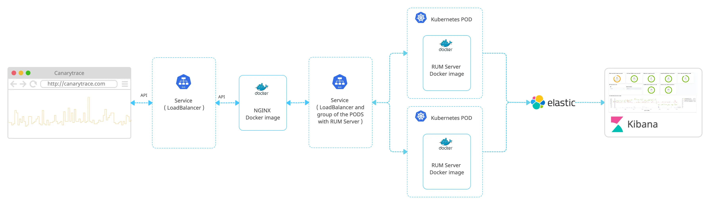

> ### What you’ll learn
- What is a RUM Client
- How to implement the RUM Client
- What data and metrics are collected
- How to setting the RUM Client
- How to tracking a user activities


## What is a RUM Server
The RUM Server is a backend part of the Canarytrace RUM (Real User Monitoring). It is responsible for receiving and processing data from the RUM Clients and storing that data in Elasticsearch for later analysis.

Once the RUM Server is up, you can configure the RUM Client to start sending data to the RUM Server. This typically involves adding a small piece of code to your website or application that initializes the RUM client and configures it to send data to the server.

## Architecture

Here is an example of how the Canarytrace RUM can be used in a production environment


### RUM Docker image

The RUM Server is distributed via a Docker image and exposes several API endpoints, including one for getting the RUM Client JavaScript, another for receiving data from the RUM Client, and additional endpoints for the browser CSP reporter. The RUM Server stores incoming data to an Elasticsearch database.

### NGINX Docker image

NGINX provides HTTP/2, compresses communication, and adds custom headers such as Access-Control-Allow-Origin. It also handles the OPTIONS method in case of a pre-flight request. You do not need to use it if you have your own solutions for exposing APIs to a frontend.

### Elasticsearch and Kibana

[Elasticsearch](https://www.elastic.co/elasticsearch/) is a database for the data collected by Canarytrace RUM. [Kibana](https://www.elastic.co/kibana/) is a web interface for viewing and searching this data in Elasticsearch, as well as for creating graphs, visualizations, and dashboards.

:::info
To continue reading this documentation, we assume that your Elasticsearch and Kibana are set up and ready to use.
- Elasticsearch documentation https://www.elastic.co/guide/en/elasticsearch/reference/8.7/index.html
- You can use a Elasticsearch cloud service https://www.elastic.co/cloud
- Alternatively, you can run Elasticsearch and Kibana on your local machine for testing purposes.
```bash title="Run Elasticsearch and Kibana in a Docker"
# Run Elasticsearch
docker run --name elasticsearch --net canary --rm -d -p 9200:9200 -p 9300:9300 -e "discovery.type=single-node" -e ES_SETTING_XPACK_SECURITY_ENABLED=false -e ES_SETTING_ACTION_DESTRUCTIVE__REQUIRES__NAME=false docker.elastic.co/elasticsearch/elasticsearch:8.4.1 bin/elasticsearch -Enetwork.host=0.0.0.0

# Run Kibana
docker run --name kibana --net canary --rm -d -p 5601:5601 docker.elastic.co/kibana/kibana:8.4.1
```
:::

:::info
Canarytrace RUM is designed to work with the latest versions of Elasticsearch and Kibana, specifically version 8 and higher.
:::

### Endpoints

The RUM Server expose a few REST API endpoints which are used by the RUM Client.

|Method|Endpoint|Description|
|-|-|-|
|`GET`|`/rum`|The init script calls this endpoint to obtain the RUM client|
|`POST`|`/rum`|The RUM client sends payloads to this endpoint.|
|`GET`|`/health`|This endpoint returns `Canarytrace RUM is ready!` if the RUM server is ready to use.|
|`POST`|`/rum/report-uri`|Endpoint for sending the Content Security Policy report from older browsers.|
|`POST`|`/rum/reporting-api`|Endpoint for sending the Content Security Policy Report from Google Chrome.|


### Security

:::info Data is kept within your system and not shared with third-party destinations
One major advantage is that the data collected by the RUM Client and stored via the RUM Server remains in your environment. The RUM Server does not send the collected data to any undefined destination.
::: 

## Docker image
The RUM Server is distributed via a Docker image, so you can deploy the RUM Server on various platforms such as localhost, cloud environments, Kubernetes, etc.
- This approach enables run the RUM Server as a plug-and-play solution in just a few minutes.
- You can run the RUM Server anywhere you need it, so the data from a particular country stays within that country.
- Thanks to the fact that the RUM Server runs on Docker, you can run multiple instances depending on the number of visits to your production.

:::tip Please always use a latest Docker image
- List of Docker image tags https://quay.io/repository/canarytrace/rum?tab=tags
:::

- Download the Docker image containing the RUM Server.
- Please do not permanently use our Docker repository with RUM Server for your production environments. 
- Always push downloaded the Docker image with the RUM Server to your Docker repository.
```bash
docker pull quay.io/canarytrace/rum:2.8.6
```

- Run and test on your localhost.
```bash title="Run Docker image"
docker run --name rum --rm -it -p 3000:3000 -e ELASTIC_CLUSTER -e ELASTIC_HTTP_AUTH -e LICENSE quay.io/canarytrace/rum:2.8.6
```
- `ELASTIC_CLUSTER` e.g. http://localhost:9200
- `ELASTIC_HTTP_AUTH` e.g. username:password. Remove if isn't used.
- `LICENSE` put your licence.
- Open `http://localhost:3000/health` address in your browser and you should see "Canarytrace RUM is a ready!".

```bash title="Log"
    ____  __  ____  ___
   / __ \/ / / /  |/  /
  / /_/ / / / / /|_/ / 
 / _, _/ /_/ / /  / /  
/_/ |_|\____/_/  /_/   
                       
Canarytrace RUM: https://canarytrace.com
Node.js: v18.15.0

2023-04-28T16:27:41.323Z RUM server listening on port 3000
2023-04-28T16:27:47.049Z GET /  
2023-04-28T16:27:51.318Z Queue size: 0, send into Elasticsearch when size of queue is min. 2
2023-04-28T16:27:54.696Z GET /health  
2023-04-28T16:27:54.758Z GET /favicon.ico  
...
```

Congratulations, the RUM Server is ready.


## Kubernetes
The Kubernetes environment is a preferred option for running the RUM Server. You can use our example deployment or deployment with [NGINX](https://www.nginx.com/).

To run the RUM Server, you need a Kubernetes deployment that includes the Docker image, resources, configurations, and additional parameters. We provide a deployment that you can use as is or modify to your preferences.

### Resources

The resource requirements depend on the amount of data that the RUM Client sends to the RUM Server, including the number of captured requests, user actions, events, and so on.
If you have a big traffic, you can run the RUM Server in a more instancies.


:::info How many resources we need?
- Start with the RUM Server on your minor pages or on an environment with lower visits.
- Measure used resources by the RUM Server on your Kubernetes cluster. If the RUM Server use 85% resources, please run the second instance ensure optimal performance. Alternatively, you could optimize the amount of data arriving from the RUM Client.
- [Resource units in Kubernetes](https://kubernetes.io/docs/concepts/configuration/manage-resources-containers/#resource-units-in-kubernetes)
:::

To deploy the RUM Server on Kubernetes, there are several requirements that need to be met. Here is specifying the appropriate resource requests and limits.

|Resources|CPU Request|CPU Limits|Memory requests|Memory limits|
|-|-|-|-|-|
|The RUM Server|`100m`|`500m`|`300Mi`|`800Mi`|
|NGINX|`100m`|`500m`|`300Mi`|`800Mi`|
|Total|`200m`|`1000m`|`600Mi`|`1600Mi`|

### Deployment

All deployment objects necessary for running the RUM Server are packaged and distributed inside the Docker image. This includes any required configuration files, scripts, and dependencies needed for the deployment process.

#### Download the deployments scripts from the Docker image

```bash title="Download deployments scripts from docker image"
docker run --rm -it --entrypoint /bin/mv -v $(pwd):/deployments quay.io/canarytrace/rum:2.8.6 /opt/canary-rum/deployments/ /deployments/
```

```bash title="Print directory deployments"
ls -lah deployments 
drwxr-xr-x@ 5 rdpanek  staff   160B 28 dub 03:59 .
drwxr-xr-x  4 rdpanek  staff   128B 29 dub 07:46 ..
-rw-r--r--@ 1 rdpanek  staff   2,0K 28 dub 03:59 deployment.yaml
-rw-r--r--@ 1 rdpanek  staff   2,0K 28 dub 03:59 nginx-config.yaml
-rw-r--r--@ 1 rdpanek  staff   185B 28 dub 03:59 secret.yaml
```

All Kubernetes objects can be deployed using the `kubectl -n` command, followed by the name of the namespace and the `create` option. For example, to deploy a `secret.yaml` file, you would use the command `kubectl -n canarytrace create -f secret.yaml`.

#### Full example with NGINX
All of these objects can be used in production for deploying and managing the RUM Server

- `canarytrace-namespace.yaml` Create your own namespace in Kubernetes. All objects will be created in the namespace `canarytrace`.
- `nginx-config.yaml` Configuration for the NGINX web server.
- `secret.yaml` Contains auth to the Elasticsearch, as well as a license for using the RUM Server.
- `deployment.yaml` The deployment includes Docker images, configurations for the RUM Server, and resource requirements. It also utilizes a LoadBalancer.

**Without NGINX**

If you have your own NGINX or other solutions for providing HTTP2, you can use the deployment alone without NGINX.
Remove the NGINX Docker image and configuration from deployment.yaml, and then deploy it.

#### Deployment

```yaml title="canarytrace-namespace.yaml"
apiVersion: v1
kind: Namespace
metadata:
  name: canarytrace
  labels:
    name: canarytrace
```

```yaml title="nginx-config.yaml"
apiVersion: v1
kind: ConfigMap
metadata:
  name: rum-nginx-config
  namespace: canarytrace
data:
  config: |
    events { }

    http {
      gzip on;
      gzip_comp_level 6;
      gzip_vary on;
      gzip_types text/plain text/css application/json application/x-javascript application/javascript text/xml application/xml application/rss+xml text/javascript image/svg+xml application/vnd.ms-fontobject application/x-font-ttf font/opentype;

      server {
        listen 80;
        server_name localhost;
        return 301 https://localhost$request_uri;
      }

      keepalive_timeout  65;

      server {
        listen 443 ssl http2;
        server_name localhost;

        ssl_certificate /ssl/crt;
        ssl_certificate_key /ssl/privkey;
        
        access_log /var/log/nginx/data-access.log combined;

        location / {

          # Tell client that this pre-flight info is valid for 20 days
          if ($request_method = 'OPTIONS') {
            add_header 'Access-Control-Max-Age' 1728000;
            add_header 'Content-Type' 'text/plain; charset=utf-8';
            add_header 'Content-Length' 0;
            add_header 'Access-Control-Allow-Origin' *;
            add_header 'Access-Control-Allow-Headers' *;
            return 204;
          }

          add_header 'Access-Control-Allow-Origin' *;
          add_header 'Access-Control-Allow-Headers' 'DNT,User-Agent,X-Requested-With,If-Modified-Since,Cache-Control,Content-Type,Range';

          proxy_read_timeout 2;
          proxy_connect_timeout 2;
          proxy_send_timeout 2;

          proxy_pass http://localhost:3000/;
          proxy_set_header X-Real-IP  $remote_addr;
          proxy_set_header X-Forwarded-For $remote_addr;
          proxy_set_header Host $host;
          proxy_set_header X-Forwarded-Proto $scheme;
          proxy_redirect http://localhost:3000/ $scheme://$http_host/;
          proxy_http_version 1.1;
          proxy_set_header Upgrade $http_upgrade;
          proxy_buffering off;
        }
      }
    }
```

```yaml title="secret.yaml"
apiVersion: v1
kind: Secret
metadata:
  name: canarytrace-secret
  namespace: canarytrace
type: Opaque
stringData:
  elastic.cluster: ""
  elastic.http.auth: "elastic:XYZ"
  license: ""
```

:::tip Please always use a latest Docker image
- List of Docker image tags https://quay.io/repository/canarytrace/rum?tab=tags
:::

```yaml title="deployment.yaml"
apiVersion: v1
kind: Service
metadata:
  name: rum
  namespace: canarytrace
spec:
  type: LoadBalancer
  ports:
  - name: https
    port: 443
    targetPort: 443
  selector:
    name: rum
---
apiVersion: apps/v1
kind: Deployment
metadata:
  name: rum
  namespace: canarytrace
spec:
  replicas: 1
  selector:
    matchLabels:
      name: rum
  template:
    metadata:
      labels:
        name: rum
    spec:
      containers:
      - name: rum
        image: quay.io/canarytrace/rum:2.8.6
        imagePullPolicy: IfNotPresent
        ports:
          - containerPort: 3000
        env:
        - name: ENV_PRINT
          value: "allow"
        - name: LABELS
          value: "production"
        - name: ELASTIC_CLUSTER
          valueFrom:
            secretKeyRef:
              name: canarytrace-secret
              key: elastic.cluster
        - name: ELASTIC_HTTP_AUTH
          valueFrom:
            secretKeyRef:
              name: canarytrace-secret
              key: elastic.http.auth
        - name: LICENSE
          value: "XYZ"
        resources:
          requests:
            memory: "300Mi"
            cpu: "100m"
          limits:
            memory: "800Mi"
            cpu: "500m"
      - name: nginx
        image: nginx:1.23.1
        imagePullPolicy: IfNotPresent
        volumeMounts:
        - name: rum-crt
          readOnly: true
          mountPath: "/ssl/"
        - name: rum-nginx-config
          mountPath: /etc/nginx/nginx.conf
          subPath: config
          readOnly: true
        ports:
          - containerPort: 443
        resources:
          requests:
            memory: "300Mi"
            cpu: "100m"
          limits:
            memory: "800Mi"
            cpu: "500m"
      volumes:
        - name: canarytrace-secret
          secret:
            secretName: secret
        - name: rum-crt
          secret:
            secretName: rum-crt
        - name: rum-nginx-config
          configMap:
            name: rum-nginx-config
            items:
              - key: config
                path: config
```


### Log
Logování RUM serveru poskytuje informace o dotazech na APIs.

**Syntaxe posílání dat**
`dateTime | method | endpoint | href | size` a informace o odesílání dat do Elasticsearch. 

Example
```bash
2023-04-02T10:39:28.191Z RUM server listening on port 3000
2023-04-02T10:39:30.175Z POST /rum https://www.alza.cz/ 0.765kB
2023-04-02T10:39:31.470Z GET /rum  
2023-04-02T10:39:34.112Z POST /rum https://www.alza.cz/ 1.665kB
2023-04-02T10:39:34.647Z POST /rum https://www.alza.cz/ 33.259kB
2023-04-02T10:39:38.192Z Queue size: 1, send into Elasticsearch when size of queue is min. 2
2023-04-02T10:39:39.147Z POST /rum https://www.alza.cz/ 1.862kB
2023-04-02T10:39:39.660Z POST /rum https://www.alza.cz/ 33.357kB
2023-04-02T10:39:44.148Z POST /rum https://www.alza.cz/ 1.195kB
2023-04-02T10:39:44.670Z POST /rum https://www.alza.cz/ 32.982kB
2023-04-02T10:39:48.193Z Queue size: 3, save data into Elasticsearch.
2023-04-02T10:39:49.138Z POST /rum https://www.alza.cz/ 1.197kB
2023-04-02T10:39:49.665Z POST /rum https://www.alza.cz/ 32.634kB
2023-04-02T10:39:54.160Z POST /rum https://www.alza.cz/ 1.197kB
2023-04-02T10:39:54.658Z POST /rum https://www.alza.cz/ 34.288kB
2023-04-02T10:39:58.195Z Queue size: 2, save data into Elasticsearch.
2023-04-02T10:39:59.145Z POST /rum https://www.alza.cz/ 1.197kB
2023-04-02T10:39:59.666Z POST /rum https://www.alza.cz/ 44.387kB
2023-04-02T10:40:04.172Z POST /rum https://www.alza.cz/ 1.197kB
2023-04-02T10:40:04.677Z POST /rum https://www.alza.cz/ 6.846kB
2023-04-02T10:40:08.196Z Queue size: 2, save data into Elasticsearch.
2023-04-02T10:40:09.182Z POST /rum https://www.alza.cz/ 1.197kB
2023-04-02T10:40:09.684Z POST /rum https://www.alza.cz/ 1.388kB
2023-04-02T10:40:14.196Z POST /rum https://www.alza.cz/ 1.197kB
2023-04-02T10:40:14.679Z POST /rum https://www.alza.cz/ 1.346kB
2023-04-02T10:40:18.197Z Queue size: 2, save data into Elasticsearch.
2023-04-02T10:40:19.179Z POST /rum https://www.alza.cz/ 1.197kB
2023-04-02T10:40:19.687Z POST /rum https://www.alza.cz/ 1.374kB
2023-04-02T10:40:24.234Z POST /rum https://www.alza.cz/ 1.197kB
2023-04-02T10:40:24.688Z POST /rum https://www.alza.cz/ 1.387kB
```

## Settings
Nastavení a vlastnosti se provádí pomocí environment variables.

- `SERVER_PORT` RUM Server port, default is `3000`
- `BODY_PARSER_LIMIT` limit for size of the payload from RUM Client, default is `10mb`
- `MIN_QUEUE_SIZE` how much payloads stored in the RUM Server to be sent to Elasticsearch. Default is `2` . If you increase this queue size, RUM server will not sent data much frequently and size of bulk of data for store into Elasticsearch will be higher. 
- `STORE_BULK_INTERVAL` how often will be data send into Elasticsearch, Default is: one per `10000` ms.
- `ELASTIC_CLUSTER` path to your Elasticsearch cluster. e.g. `https://XYZ.eu-central-1.aws.cloud.es.io:9243`
- `ELASTIC_HTTP_AUTH` username and password, e.g. `elastic:password`
- `ELASTIC_TIMEOUT` default is `5000` ms
- `ELASTIC_OBSERVABILITY` Print all Elasticsearch configuration and payloads. Default is `false`
- `INDEX_PREFIX` Default is `c.` for Elasticsearch indices, e.g. `c.rum.metrics-*`
- `MIN_PTIME` Print information about time spent for store data. Default is `300` ms
- `LABELS`