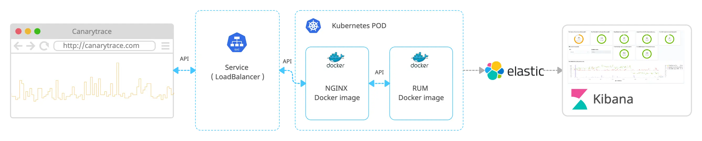

> ### What you’ll learn
- What is a RUM Server?
- How the RUM Server run?
- How to set up the RUM Server?

## What is a RUM Server
The RUM Server is a backend part of the Canarytrace RUM (Real User Monitoring). It is responsible for receiving and processing data from the RUM Clients and storing that data in [Elasticsearch](./elasticsearch.md) for later analysis.

Once the RUM Server is up, you can configure the [RUM Client](./rumClient.md) to start sending data to the RUM Server. This typically involves adding a small piece of code to your website or application that initializes the [RUM client](./rumClient.md) and configures it to send data to the server.

## Architecture

Here is an example of how the Canarytrace RUM can be used in a production environment


### RUM Docker image

The RUM Server is distributed via a Docker image and exposes several API endpoints, including one for getting the [RUM Client](./rumClient.md) JavaScript, another for receiving data from the [RUM Client](./rumClient.md), and additional endpoints for the browser CSP reporter. The RUM Server stores incoming data to an [Elasticsearch](./elasticsearch.md) database.

### NGINX Docker image

[NGINX](https://www.nginx.com/) provides HTTP/2, compresses communication, and adds custom headers such as Access-Control-Allow-Origin. It also handles the OPTIONS method in case of a pre-flight request. You do not need to use it if you have your own solutions for exposing APIs to a frontend.

### Services
Services provide a load balancer between PODs running the RUM Server and expose an external IP for public use. You can run one or more PODs with the RUM Server depending on the traffic your pages receive. Running more PODs with the RUM Server can collect more data from the [RUM Client](./rumClient.md).

### Elasticsearch and Kibana

[Elasticsearch](https://www.elastic.co/elasticsearch/) is a database for the data collected by Canarytrace RUM. [Kibana](https://www.elastic.co/kibana/) is a web interface for viewing and searching this data in [Elasticsearch](./elasticsearch.md), as well as for creating graphs, visualizations, and dashboards.

:::info
To continue reading this documentation, we assume that your Elasticsearch and Kibana are set up and ready to use.
- Elasticsearch documentation https://www.elastic.co/guide/en/elasticsearch/reference/8.7/index.html
- You can use a Elasticsearch cloud service https://www.elastic.co/cloud
- Canarytrace RUM is designed to work with the latest versions of Elasticsearch and Kibana, specifically version 8 and higher.
- Alternatively, you can run Elasticsearch and Kibana on your local machine for testing purposes.
:::

### Endpoints

The RUM Server expose a few REST API endpoints which are used by the RUM Client.

|Method|Endpoint|Description|
|-|-|-|
|`GET`|`/rum`|The init script calls this endpoint to obtain the [RUM Client](./rumClient.md)|
|`POST`|`/rum`|The [RUM Client](./rumClient.md) sends payloads to this endpoint.|
|`GET`|`/health`|This endpoint returns `Canarytrace RUM is ready!` if the RUM server is ready to use.|
|`POST`|`/rum/report-uri`|Endpoint for sending the Content Security Policy report from older browsers.|
|`POST`|`/rum/reporting-api`|Endpoint for sending the Content Security Policy Report from Google Chrome.|


### Security

:::info Data is kept within your infrastructure and not shared with third-party destinations
One major advantage is that the data collected by the RUM Client and stored via the RUM Server remains in your environment. The RUM Server does not send the collected data to any undefined destination.
::: 

## Content Security Policy

Content Security Policy (CSP) is a security standard used to prevent various types of attacks, such as cross-site scripting (XSS) and data injection attacks, by allowing the website administrators to specify the trusted sources of content that the website can load or execute.

The CSP works by defining a set of rules that dictate which types of resources are allowed to be loaded or executed by the website. This includes scripts, stylesheets, images, and other resources.

CSP allows website administrators to specify a list of trusted sources, which can be used to whitelist trusted resources, as well as define policies for how the website handles various types of content, such as inline scripts or external resources. By using CSP, websites can protect themselves against a variety of security vulnerabilities, and help to ensure that their users are safe from attacks.

:::tip You can learn more about
- [Content Security Policy (CSP)](https://developer.mozilla.org/en-US/docs/Web/API/Reporting_API)
- [CSP: report-to](https://developer.mozilla.org/en-US/docs/Web/HTTP/Headers/Content-Security-Policy/report-to)
- [CSP: report-uri](https://developer.mozilla.org/en-US/docs/Web/HTTP/Headers/Content-Security-Policy/report-uri)
:::

If you define a Content Security Policy (CSP) for your website and a violation of the policy occurs, the web browser will detect the violation and log an error in the console. If you have configured a reporting endpoint, the browser will send a CSP report to the endpoint when a violation occurs. The reporting API for CSP violations is offered by the RUM Server.

The [RUM Client](./rumClient.md) does not set up or manage CSP / that is entirely up to the web browser.

```javascript title="Stored report about CSP violation"
// The caught and stored report is stored in the Elasticsearch index c.rum.csp.reporting-*.
{
  "age": 26336,
  "body": {
    "blockedURL": "inline",
    "disposition": "report",
    "documentURL": "https://your-website.com",
    "effectiveDirective": "script-src-elem",
    "lineNumber": 50,
    "originalPolicy": "default-src http://localhost:3000/ style-src https://cdn.tailwindcss.com/ 'report-sample'; report-uri https://your-website.com/rum/report-uri; report-to reporting-api",
    "referrer": "",
    "sample": "document.addEventListener(\"scroll\", func",
    "sourceFile": "https://your-website.com",
    "statusCode": 200
  },
  "type": "csp-violation",
  "url": "https://your-website.com",
  "user_agent": "Mozilla/5.0 (Macintosh; Intel Mac OS X 10_15_7) AppleWebKit/537.36 (KHTML, like Gecko) Chrome/111.0.0.0 Safari/537.36",
  "timestamp": "2023-04-14T06:02:31.015Z"
}
```

CSP violation reports are collected by the RUM Server, not by the RUM Client. The web browser has its own mechanism for detecting violations and sending reports to the reporting API exposed by the RUM Server.

### Reporting api setup

By default, the RUM Server exposes two [endpoints](./rumServer#endpoints) for the reporting API.
- `/rum/report-uri` is [deprecated](https://developer.mozilla.org/en-US/docs/Web/HTTP/Headers/Content-Security-Policy/report-uri), but it is still used by some web browsers, including Firefox, Safari, Firefox for Android, and Safari for iOS, to report CSP violations.
- `/rum/reporting-api` for CSP report from web browser: Google Chrome, Edge, Opera, Chrome Android, Opera Android, Samsung Internet and WebView Android. [Documentation](https://developer.mozilla.org/en-US/docs/Web/HTTP/Headers/Content-Security-Policy/report-to#browser_compatibility)

To activate CSP and reporting, you must add two headers to your response on the main document or request.

|Header|Descriptions|
|-|-|
|`Content-Security-Policy-Report-Only`|Add your CSP rules and endpoints to the reporting API. [Documentation](https://developer.mozilla.org/en-US/docs/Web/HTTP/Headers/Content-Security-Policy-Report-Only)|
|`report-to`|Add endpoint to the reporting API. [Documentation](https://developer.mozilla.org/en-US/docs/Web/HTTP/Headers/Content-Security-Policy/report-to)|

- Please use `Content-Security-Policy-Report-Only` instead of `Content-Security-Policy`. The first option allows reporting of violations, while the second option only enforces your rules without sending CSP reports.
- Use both headers.

```javascript title="Example"
Content-Security-Policy-Report-Only: default-src http://localhost:3000/ style-src https://cdn.tailwindcss.com/ 'report-sample'; report-uri https://your-domain.com/rum/report-uri; report-to reporting-api
Report-To: reporting-api="https://your-domain.com/rum/reporting-api"
```

These endpoints `https://your-domain.com/rum/report-uri` and `https://your-domain.com/rum/reporting-api` are exposed by the RUM Server on your domain.


## Docker image
The RUM Server is distributed via a Docker image, so you can deploy the RUM Server on various platforms such as localhost, cloud environments, Kubernetes, etc.
- This approach enables run the RUM Server as a plug-and-play solution in just a few minutes.
- You can run the RUM Server anywhere you need it, so the data from a particular country stays within that country.
- Thanks to the fact that the RUM Server runs on Docker, you can run multiple instances depending on the number of visits to your production.

:::tip Please always use a latest Docker image
- List of Docker image tags https://quay.io/repository/canarytrace/rum?tab=tags
:::

- Download the Docker image containing the RUM Server.
- Please do not permanently use our Docker repository with RUM Server for your production environments. 
- Always push downloaded the Docker image with the RUM Server to your Docker repository.

```bash
docker pull quay.io/canarytrace/rum:latest
```

- Run and test on your localhost.
```bash title="Run Docker image"
docker run --name rum --rm -it -p 3000:3000 -e ELASTIC_CLUSTER -e ELASTIC_HTTP_AUTH -e LICENSE quay.io/canarytrace/rum:latest
```
- `ELASTIC_CLUSTER` e.g. http://localhost:9200
- `ELASTIC_HTTP_AUTH` e.g. username:password. Remove if isn't used.
- `LICENSE` put your licence.
- Open `http://localhost:3000/health` address in your browser and you should see "Canarytrace RUM is a ready!".

```bash title="Log"
    ____  __  ____  ___
   / __ \/ / / /  |/  /
  / /_/ / / / / /|_/ / 
 / _, _/ /_/ / /  / /  
/_/ |_|\____/_/  /_/   
                       
Canarytrace RUM: https://canarytrace.com
Node.js: v18.15.0

2023-04-28T16:27:41.323Z RUM server listening on port 3000
2023-04-28T16:27:47.049Z GET /  
2023-04-28T16:27:51.318Z Queue size: 0, send into Elasticsearch when size of queue is min. 2
2023-04-28T16:27:54.696Z GET /health  
2023-04-28T16:27:54.758Z GET /favicon.ico  
...
```

Congratulations, the RUM Server is ready.


## Kubernetes
The [Kubernetes](https://kubernetes.io/) environment is a preferred option for running the RUM Server. You can use our example deployment or deployment with [NGINX](https://www.nginx.com/).

To run the RUM Server, you need a Kubernetes deployment that includes the Docker image, resources, configurations, and additional parameters. We provide a deployment that you can use as is or modify to your preferences.

### Resources

The resource requirements depend on the amount of data that the [RUM Client](./rumClient.md) sends to the RUM Server, including the number of captured requests, user actions, events, and so on.
If you have a big traffic, you can run the RUM Server in a more instancies.


:::info How many resources we need?
- Start with the RUM Server on your minor pages or on an environment with lower visits.
- Measure used resources by the RUM Server on your Kubernetes cluster. If the RUM Server use 85% resources, please run the second instance ensure optimal performance. Alternatively, you could optimize the amount of data arriving from the [RUM Client](./rumClient.md).
- If you have significantly more visits than the RUM Server can process, your frontend will not be affected.
- [Resource units in Kubernetes](https://kubernetes.io/docs/concepts/configuration/manage-resources-containers/#resource-units-in-kubernetes)
:::

To deploy the RUM Server on Kubernetes, there are several requirements that need to be met. Here is specifying the appropriate resource requests and limits.

|Resources|CPU Request|CPU Limits|Memory requests|Memory limits|
|-|-|-|-|-|
|One instance of the RUM Server|`800m`|`1500m`|`800Mi`|`1000Mi`|
|NGINX|`100m`|`500m`|`300Mi`|`800Mi`|
|Total|`900m`|`2000m`|`1100Mi`|`1800Mi`|

### Deployment

All deployment objects necessary for running the RUM Server are packaged and distributed inside the Docker image. This includes any required configuration files, scripts, and dependencies needed for the deployment process.

#### Download the deployments scripts from the Docker image

```bash title="Download deployments scripts from docker image"
docker run --rm -it --entrypoint /bin/mv -v $(pwd):/deployments quay.io/canarytrace/rum:latest /opt/canary-rum/deployments/ /deployments/
```

```bash title="Print directory deployments"
ls -lah deployments 
-rw-r--r--@ 1 rdp  staff   2,6K  8 čvc 11:43 deployment.yaml
-rw-r--r--@ 1 rdp  staff    92B  8 čvc 11:43 namespace.yaml
-rw-r--r--@ 1 rdp  staff   2,0K  8 čvc 11:43 nginx-config.yaml
-rw-r--r--@ 1 rdp  staff   189B  8 čvc 11:43 secret.yaml
```

All Kubernetes objects can be deployed using the `kubectl -n` command, followed by the name of the namespace and the `create` option. For example, to deploy a `secret.yaml` file, you would use the command `kubectl -n canarytrace create -f secret.yaml`.

#### Full example with NGINX
All of these objects can be used in production for deploying and managing the RUM Server and deploy it in order:

1. `namespace.yaml` Create your own [namespace in Kubernetes](https://kubernetes.io/docs/concepts/overview/working-with-objects/namespaces/). All objects will be created in the namespace `canarytrace`.
2. `nginx-config.yaml` [Configuration for the NGINX](https://www.plesk.com/blog/various/nginx-configuration-guide/) web server.
3. `secret.yaml` [Secret](https://kubernetes.io/docs/concepts/configuration/secret/) contains auth to the [Elasticsearch](./rumClient.md), as well as a license for using the RUM Server.
4. `deployment.yaml` The deployment includes [Kubernetes Deployments](https://kubernetes.io/docs/concepts/workloads/controllers/deployment/) Docker images, configurations for the RUM Server, NGINX, [Services](https://kubernetes.io/docs/concepts/services-networking/service/), and resource requirements. It also utilizes a LoadBalancer.

:::note
Please open the `secret.yaml` and `deployment.yaml` files and make the necessary changes before deploying them to the Kubernetes cluster. Update the `secret.yaml` file with your correct secrets and in the `deployment.yaml` file, update the version of the RUM Server and its configuration according to your preferences.
:::

```bash title=Example
# create namespace
kubectl create -f namespace.yaml
# deploy your cert for NGINX
kubectl -n canarytrace create secret generic rum-crt --from-file=crt=./certificates/your-cert.crt --from-file=privkey=./certificates/your_privkey.pem 
# create config for NGINX in canarytrace namespace
kubectl -n canarytrace -f nginx-config.yaml
# create secret in canarytrace namespace
kubectl -n canarytrace -f secret.yaml
# create deployment in canarytrace namespace
kubectl -n canarytrace -f deployment.yaml
```

#### Check

You have created four objects in your Kubernetes cluster. If everything is okay, you can verify this by checking the running Kubernetes pods and printing their status.

Your `deployment.yaml` file contains definitions for both the RUM Server and NGINX. Therefore, when you deploy it in Kubernetes, it runs two Docker images. If the deployment is successful, the status of the `rum-****` [Pod](https://kubernetes.io/docs/concepts/workloads/pods/) should be Running, and in the READY column, it should show 2 running Docker containers out of two in total.

```bash title="Check your pod named rum"
kubectl -n canarytrace get pods
NAME                                         READY   STATUS      RESTARTS   AGE
rum-app-5c8b9d76fb-5dqnz                     1/1     Running     0          18h
rum-app-5c8b9d76fb-fz7dv                     1/1     Running     0          18h
rum-nginx-66cb99d7f4-nhjnk                   1/1     Running     0          20h
```

The deployment created two pods with the RUM Server and one pod with NGINX.

```bash title="Check your services"
kubectl -n canarytrace get svc
NAME            TYPE           CLUSTER-IP      EXTERNAL-IP       PORT(S)         AGE
nginx-service   LoadBalancer   10.245.158.80   <your-ip-address> 443:31207/TCP   20h
rum-service     ClusterIP      10.245.165.92   <none>            3000/TCP        20h
```

The deployment created two services: one to handle requests and redirect them to NGINX, serving as a reverse proxy, and a second service functioning as a group of PODs with the RUM Server.

If your deployment is successful, you can open your favorite browser and navigate to https://your-ip-address/health, which will return: Canarytrace RUM is ready.

**Without NGINX**

If you have your own NGINX or other solutions for providing HTTP2, you can use the deployment alone without NGINX.
Remove the NGINX Docker image, NGINX configuration and `nginx-service` service from `deployment.yaml`, and then deploy it.


### Log
The RUM Server logs all interesting information. This includes access to your pages, endpoints, and the size of the payload received from the [RUM Client](./rumClient.md).

#### Syntax
`dateTime | method | endpoint | href | size` and information about the queue with payloads received from the [RUM Client](./rumClient.md) and how they are sent to [Elasticsearch](./elasticsearch.md).

```bash title="The RUM Server log"
2023-04-02T10:39:28.191Z RUM server listening on port 3000
2023-04-02T10:39:31.470Z GET /rum  
2023-04-02T10:39:34.112Z POST /rum https://www.your-comain.com/companies 1.665kB
2023-04-02T10:39:34.647Z POST /rum https://www.your-comain.com/companies 33.259kB
2023-04-02T10:39:38.192Z Queue size: 1, send into Elasticsearch when size of queue is min. 2
2023-04-02T10:39:39.147Z POST /rum https://www.your-comain.com/orders 1.862kB
2023-04-02T10:39:39.660Z POST /rum https://www.your-comain.com/orders 33.357kB
2023-04-02T10:39:44.148Z POST /rum https://www.your-comain.com/orders 1.195kB
2023-04-02T10:39:44.670Z POST /rum https://www.your-comain.com/orders 32.982kB
2023-04-02T10:39:48.193Z Queue size: 3, save data into Elasticsearch.
...
```

- A line that starts with `GET` indicates that there is an initialization script on a certain page that calls the RUM Client.
- A line that starts with `POST` indicates that the RUM Client is sending a payload to the RUM Server.
- A line that starts with `Queue size...` provides information about the required size of the queue with payloads waiting to be sent to Elasticsearch, or it provides information, that queue with payload was stored in Elasticsearch.

## Settings
Nastavení a vlastnosti se provádí pomocí environment variables.
All parameters of the RUM Server can be changed via environment variables directly in the `deployment.yaml` file.

|Property|Default value|Description|
|-|-|-|
|`SERVER_PORT`|`3000`|The RUM Server port.|
|`BODY_PARSER_LIMIT`|`10mb`|There is a limit for the size of the payload that can be received from the RUM Client.|
|`MIN_QUEUE_SIZE`|`2`|This parameter determines the maximum number of payloads that can be stored in the RUM Server's queue to be sent to Elasticsearch. Increasing this queue size will reduce the frequency of data transmission to Elasticsearch, resulting in larger request with bulk data sizes being stored in Elasticsearch.|
|`STORE_BULK_INTERVAL`|`10000`|The frequency of data transmission to Elasticsearch, in milliseconds.|
|`ELASTIC_CLUSTER`||Path to your Elasticsearch cluster. e.g. `https://XYZ.eu-central-1.aws.cloud.es.io:9243`|
|`ELASTIC_HTTP_AUTH`||The username and password required to access your Elasticsearch cluster, e.g. `elastic:password`.|
|`ELASTIC_TIMEOUT`|`5000`|In ms.|
|`ELASTIC_OBSERVABILITY`|`false`|To print all Elasticsearch configuration and payloads, set the `allow` value to activate this feature.|
|`INDEX_PREFIX`|`c.`|Prefix for the name conventions used for Elasticsearch indices, such as `c.rum.metrics-*`.|
|`LABELS`||You can add a string that will be included in the arrived payload from the RUM Client and added to the `.labels` property. E.g. `environment=development` or `app14`.|
|`ENV_PRINT`|`false`|Print all environment variables. Set the `allow` value for activate this feature.|


import FeedbackFooter from '../../src/components/FeedbackFooter';

<FeedbackFooter />